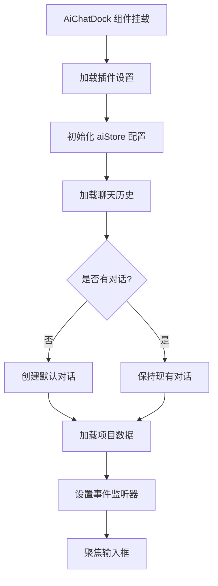
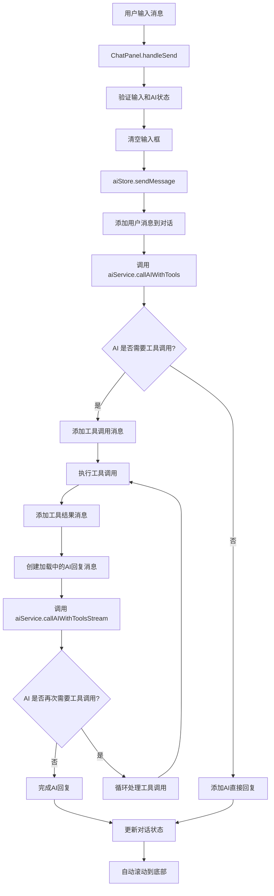
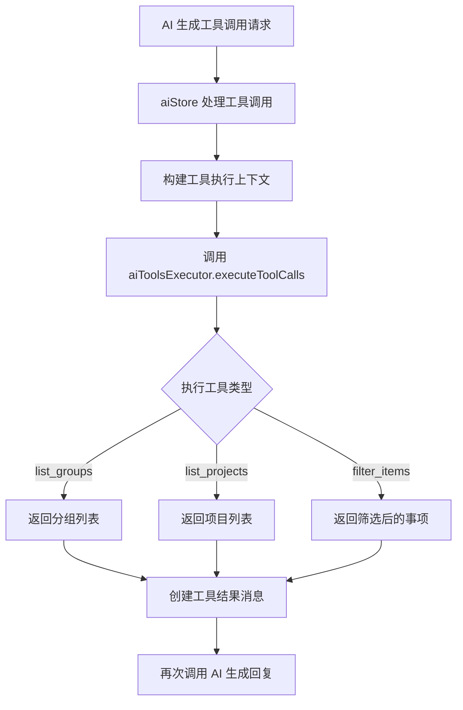
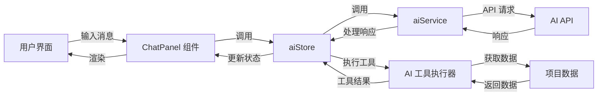

# AI 对话实现流程图分析

## 整体架构

基于对代码的分析，AI 对话功能的实现采用了以下架构：

1. **前端组件层**：负责用户界面和交互
2. **状态管理层**：管理AI配置、对话状态和消息历史
3. **服务层**：处理AI API调用和工具执行
4. **数据层**：管理子弹笔记数据

## 详细流程分析

### 1. 初始化流程

### 2. 消息发送与处理流程

### 3. 工具调用流程

### 4. 数据流向

## 核心组件和功能

### 1. 前端组件

- **AiChatDock.vue**：主容器，包含头部工具栏和 ChatPanel
- **ChatPanel.vue**：聊天面板，显示消息列表和输入区域
- **ChatInput.vue**：处理用户输入
- **ChatMessage.vue**：显示单条消息
- **ConversationSelect.vue**：对话选择下拉框

### 2. 状态管理

- **aiStore.ts**：
  - 管理AI供应商配置
  - 管理对话历史
  - 处理消息发送和工具调用
  - 提供状态查询和操作方法

### 3. 服务层

- **aiService.ts**：
  - 封装AI API调用
  - 支持流式响应
  - 处理工具调用逻辑
- **aiToolsExecutor.ts**：
  - 执行工具调用
  - 处理工具结果
- **aiTools.ts**：
  - 定义可用工具

### 4. 关键功能

- **多轮对话**：支持连续对话，保持上下文
- **工具调用**：AI可以调用工具查询子弹笔记数据
- **流式响应**：AI回复实时显示，提升用户体验
- **对话管理**：支持创建、切换、删除对话
- **自动保存**：配置和聊天记录自动保存

## 技术特点

1. **模块化设计**：清晰的组件和服务分离
2. **响应式状态管理**：使用Pinia管理状态
3. **流式处理**：支持AI响应的实时流式展示
4. **工具调用能力**：AI可以主动查询用户数据
5. **防抖自动保存**：避免频繁保存操作
6. **跨上下文通信**：使用BroadcastChannel确保数据同步

## 代码优化建议

1. **错误处理增强**：
   - 增加更多的错误处理和用户提示
   - 对网络错误和API错误进行更细致的分类

2. **性能优化**：
   - 大型对话的消息渲染性能优化
   - 工具调用结果的缓存机制

3. **用户体验**：
   - 添加消息发送状态指示
   - 实现消息编辑和撤回功能
   - 增加对话搜索功能

4. **安全性**：
   - 对API密钥进行更安全的存储
   - 添加请求速率限制

## 总结

该AI对话实现采用了现代前端架构，结合了流式响应、工具调用等先进特性，为用户提供了一个功能完整、体验良好的AI助手。通过清晰的分层设计和模块化结构，代码具有良好的可维护性和扩展性。

核心流程围绕消息发送、AI处理、工具调用和响应展示展开，形成了一个完整的对话闭环，同时支持多轮对话和上下文保持，为用户提供了智能化的子弹笔记管理体验。