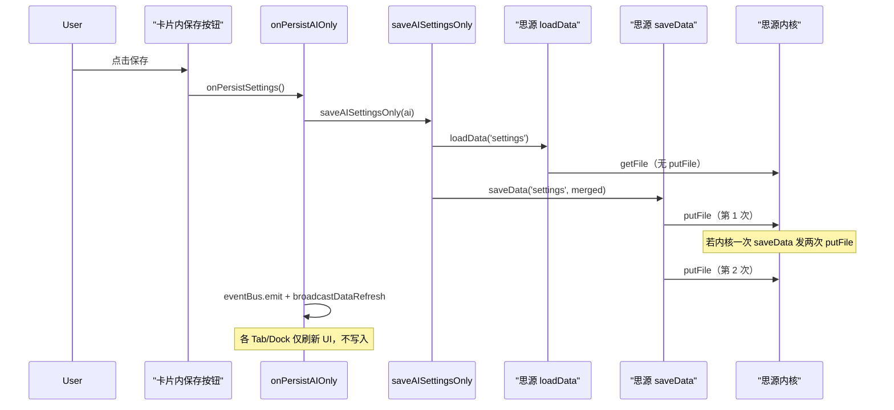

# 点击 AI 配置「保存」后的调用链与两次 putFile 分析

## 1. 从点击「保存」到我们代码里的写入

```
用户点击卡片内「保存」
  → aiConfig.ts 里 saveBtn 的 click 回调
    → e.preventDefault() / stopPropagation() / stopImmediatePropagation()
    → 校验表单、更新内存里的 provider
    → await onPersistSettings?.()
```

`onPersistSettings` 在 [src/settings/index.ts](src/settings/index.ts) 中即 `onPersistAIOnly`：

```ts
const onPersistAIOnly = async () => {
  await plugin.saveAISettingsOnly(plugin.getSettings().ai ?? { providers: [], activeProviderId: null });
  const s = plugin.getSettings();
  eventBus.emit(Events.DATA_REFRESH, s);
  broadcastDataRefresh(s as object);
};
```

因此**我们这边只调用一次** `saveAISettingsOnly`。

---

## 2. saveAISettingsOnly 内部（仅一次 saveData）

[src/index.ts](src/index.ts) 中：

```ts
public async saveAISettingsOnly(aiData: { ... }) {
  const data = await this.loadData('settings');   // 思源 API：读文件，对应 getFile
  const merged = data ? { ...data, ai: { ... } } : { ... };
  await this.saveData('settings', merged);         // 思源 API：写文件，对应 putFile
  this.lastAISettingsSaveTime = Date.now();
}
```

- `loadData('settings')`：思源插件 API，内部应是 **getFile**，不会产生 putFile。
- `saveData('settings', merged)`：思源插件 API，内部会发 **putFile**。我们**只调用一次** `saveData`。

结论：**在我们自己的调用链里，一次点击只会触发一次 `saveData('settings', ...)`。**

---

## 3. 会触发 saveData / saveSettings 的所有位置

| 位置 | 方法 | 触发方式 |
|------|------|----------|
| [src/index.ts](src/index.ts) | `saveSettings()` | 内部 `saveData('settings', settings)`；被 confirmCallback、updateSettings、文档树菜单等调用 |
| [src/index.ts](src/index.ts) | `saveAISettingsOnly()` | 内部 `loadData` + `saveData('settings', merged)`；**仅**被 `onPersistAIOnly` 调用（即卡片内「保存」） |
| [src/index.ts](src/index.ts) | `saveAISettings()` | 内部 `saveData('settings', settings)`；被 aiStore 等调用（非本次设置页保存路径） |
| [src/settings/index.ts](src/settings/index.ts) | `confirmCallback` | 底部「保存」点击后由思源设置面板调用 → `plugin.saveSettings()` |

本次路径只有：**卡片内「保存」 → onPersistAIOnly → saveAISettingsOnly → 一次 saveData**。

---

## 4. DATA_REFRESH 是否会再触发写入？

`onPersistAIOnly` 里会：

- `eventBus.emit(Events.DATA_REFRESH, s)`
- `broadcastDataRefresh(s)`

订阅 `DATA_REFRESH` 的只有各 Tab/Dock 的 `handleDataRefresh`（CalendarTab、AiChatDock、TodoDock、GanttTab、ProjectTab）。这些 handler 只做：

- `loadFromPlugin()` 或 `$patch(payload)` 更新本地 store
- **没有任何一处**调用 `saveToPlugin()`、`saveSettings()` 或 `saveData()`。

因此 **DATA_REFRESH 不会导致第二次写入**。

---

## 5. 结论：两次 putFile 的来源

- 我们已确认：**去掉卡片内「保存」的 `onPersistSettings` 后，一次 putFile 都不会出现** → 说明思源设置面板的 confirmCallback（底部「保存」）**没有**被这次点击触发。
- 我们这边**一次点击只调用一次** `saveAISettingsOnly`，其内部**只调用一次** `saveData('settings', merged)`。

因此，**两次 putFile 不是我们调用了两次 saveData**，而是：

- **思源内核/前端的 `saveData(storageName, content)` 实现里，一次调用可能触发了两次 putFile**（例如：先写主文件再写备份/索引，或同一数据写两个路径）。

要确认需要查看思源笔记前端/插件里对 `saveData` 的实现（通常不在插件仓库内）。插件侧无法再减少调用次数，当前 400ms 内跳过 `saveSettings` 的 guard 可保留，用于防止将来若有其他路径同时触发 confirmCallback 时的重复写入。

---

## 6. 调用链简图（mermaid）


