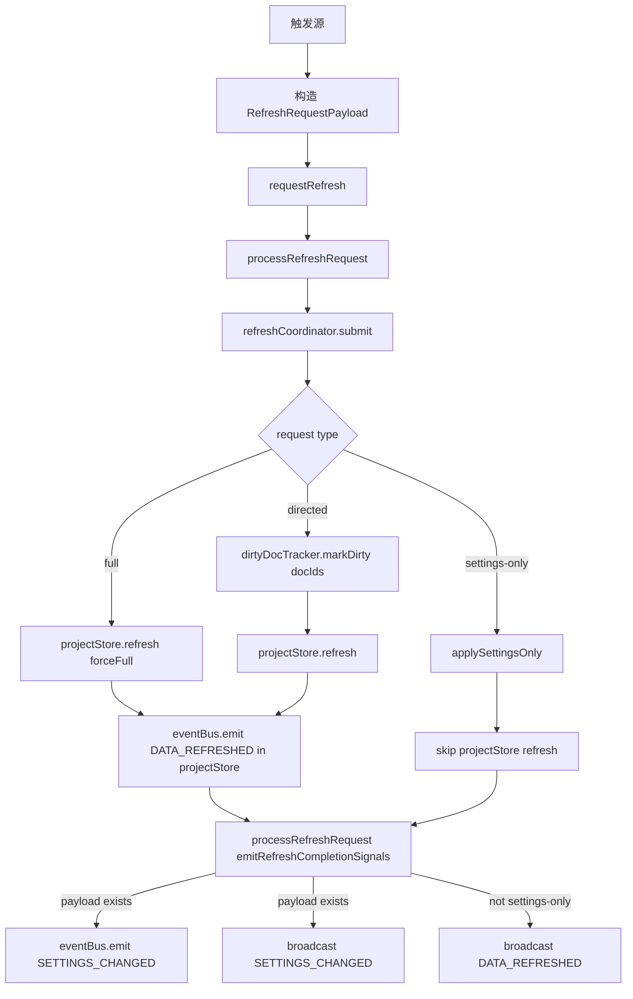
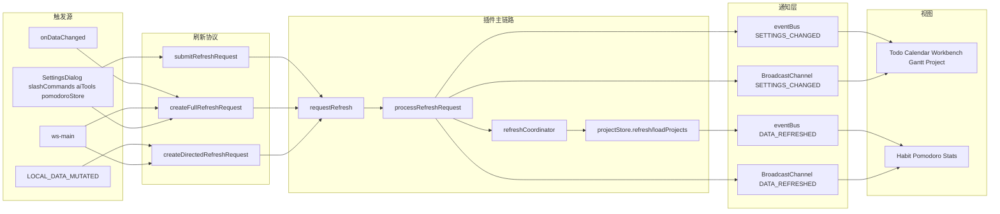

# Data Sync Flow

本文整理当前插件内的数据同步逻辑，重点覆盖：

- 刷新请求如何被创建与合并
- 哪些事件会触发数据刷新
- `eventBus` 与 `BroadcastChannel` 如何分工
- 哪些视图监听 `SETTINGS_CHANGED`，哪些监听 `DATA_REFRESHED`
- 当前实现中的几个重要注意点

基于当前实现整理，主要参考：

- `src/index.ts`
- `src/utils/refreshRequests.ts`
- `src/utils/eventBus.ts`
- `src/services/refreshCoordinator.ts`
- `src/stores/projectStore.ts`
- `src/utils/refreshChannelGuard.ts`

## 1. 模块分工

### `src/utils/refreshRequests.ts`

负责“刷新协议”本身：

- `RefreshRequestPayload`
- `RefreshReasons`
- `createFullRefreshRequest()`
- `createDirectedRefreshRequest()`
- `createSettingsOnlyRefreshRequest()`
- `submitRefreshRequest()`
- ws-main 相关 helper

它解决的是“要刷什么、为什么刷、怎么描述这次刷新”。

### `src/utils/eventBus.ts`

负责“事件通道”：

- 进程内 `eventBus`
- 事件名 `Events`
- 跨上下文 `BroadcastChannel`
  - `broadcastSettingsChanged()`
  - `broadcastDataRefreshed()`
  - `broadcastPluginUnloading()`

它解决的是“消息怎么发、发到哪里去”。

### `src/services/refreshCoordinator.ts`

负责“合并与串行执行刷新”：

- 同时收到多个 request 时合并
- 避免并发刷新
- 优先级为 `full > directed > settings-only`
- 合并 payload

### `src/stores/projectStore.ts`

负责“真正的数据重建”：

- `loadProjects()` 初始加载
- `refresh()` 后台刷新
- `refreshDirtyDocs()` 定向刷新
- `refreshFull()` 全量刷新

这里是真正重算项目、事项、habit/todo 数据的地方。

## 2. 刷新请求类型

当前只有三种刷新请求：

### `settings-only`

只表示“设置变了”，不要求重跑项目扫描。

典型用途：

- 仅需要视图按新设置重绘

### `directed`

表示“部分文档变了”，附带 `docIds`。

典型用途：

- 本地块内容修改后，根据 `blockId -> docId` 解析出所属文档
- `ws-main savedoc`
- `ws-main transactions` 中属性变更

### `full`

表示“整份数据需要完整刷新”。

典型用途：

- `onDataChanged()`
- `removeDoc`
- `moveDoc`
- `refreshdoc`
- 无法解析 rootIDs 的兜底场景

## 3. 主刷新链路



补充说明：

1. `projectStore.refresh()` 结束后，会在当前上下文直接 `eventBus.emit(Events.DATA_REFRESHED, ...)`
2. `processRefreshRequest()` 在 coordinator 完成后，再补发：
   - 同上下文 `SETTINGS_CHANGED`
   - 跨上下文 `SETTINGS_CHANGED`
   - 跨上下文 `DATA_REFRESHED`
3. `processRefreshRequest()` 本身不会再本地 emit `DATA_REFRESHED`

## 4. 触发源分类

### A. 插件主类直接触发

#### `onDataChanged()`

- 入口：`src/index.ts`
- 请求：`full`
- reason：`onDataChanged`

这是思源数据索引完成后触发的全量刷新入口。

#### `Events.LOCAL_DATA_MUTATED`

- 入口：`registerEventListeners()`
- 请求：优先 `directed`
- 解析逻辑：`blockId -> projectStore.getItemByBlockId(blockId) -> docId`
- 失败兜底：
  - `local-mutation-missing-block-id`
  - `local-mutation-unresolved-doc`

#### `Events.REFRESH_REQUEST_SUBMITTED`

- 入口：`registerEventListeners()`
- 来源：其他模块调用 `submitRefreshRequest()`
- 行为：统一进入 `requestRefresh()`

### B. `ws-main` 触发

#### 文档删除 `removeDoc`

- 先执行 `handleDocRemove()`
- 再发 `full`
- reason：`removeDoc`

`handleDocRemove()` 还会同步：

- 删除关联 skill
- 清理关联番茄钟

#### 全量刷新命令

定义在 `WS_MAIN_FULL_REFRESH_COMMANDS`：

- `txerr`
- `refreshdoc`
- `createdailynote`
- `moveDoc`

这些命令全部走 `full` 刷新。

#### 定向刷新命令

`savedoc` 和部分 `transactions/updateAttrs` 走 `handleDirectedRefresh()`：

- 优先从事件中提取 `rootIDs`
- 如果拿到 `rootIDs`，构造 `directed`
- 如果拿不到，降级成 `full`

根因字符串：

- 正常：`createWsMainDirectedRefreshReason(cmd)`
- 失败兜底：`createMissingRootIdsRefreshReason(cmd)`

### C. 其他模块提交刷新请求

典型来源：

- `SettingsDialog.vue`
- `slashCommands.ts`
- `aiToolsExecutor.ts`
- `pomodoroStore.ts`

这些模块不直接操作 coordinator，而是统一调用：

```ts
submitRefreshRequest(createFullRefreshRequest(...))
```

这样所有请求最终仍汇入 `index.ts`。

## 5. coordinator 合并规则

`createRefreshCoordinator()` 的核心目标是：把短时间内连续到来的刷新请求压成一串可串行执行的批次。

### 合并行为

- `payload`：浅合并
- `directed.docIds`：并入 `Set`
- 只要出现任何 `full`，本批次就升级为 `full`

### 执行顺序

一次 drain 中，按快照执行：

1. `full`
2. `directed`
3. `settings-only`

准确说，不是显式排序，而是快照中只会执行一种主路径：

- `full` 优先
- 否则 `directed`
- 否则 `settings-only`

### 结果

- 避免并发刷新
- 避免连续 `savedoc` 造成多次重复扫描
- 多个定向刷新会合并成一次带多个 `docIds` 的刷新

## 6. `projectStore` 在同步中的角色

### `loadProjects()`

用于首次加载：

- 显示 loading
- 分批流式装载
- 当前实现按批次提交 `projects`，避免大目录下逐条 `push` 带来的高频响应式更新
- 完成后 `eventBus.emit(DATA_REFRESHED)`
- 写 MCP cache

### `refresh()`

用于后台刷新：

- 如果 `dirtyDocTracker` 里有文档且未 `forceFull`
  - 走 `refreshDirtyDocs()`
- 否则
  - 走 `refreshFull()`
- 完成后 `eventBus.emit(DATA_REFRESHED)`
- 写 MCP cache

这意味着“当前上下文内的数据完成通知”实际由 `projectStore` 发出，而不是由 `index.ts` 发出。

## 6.1 三条刷新路径对照

当前 `projectStore` 里和“数据重建”相关的主要有三条路径：

| 路径 | 入口 | 是否首次加载 | 是否显示全屏 loading | 数据写入方式 |
| --- | --- | --- | --- | --- |
| `loadProjects()` | 插件 `onload()` 初始加载 | 是 | 是 | 分批追加写入 |
| `refreshFull()` | `refresh()` 在 full path 下调用 | 否 | 否 | 完整构建后一次性替换 |
| `refreshDirtyDocs()` | `refresh()` 在 directed path 下调用 | 否 | 否 | 仅更新脏文档对应项目 |

### `loadProjects()`

特点：

- 只用于首次加载
- 使用 `loading = true`
- 现在会按批次把解析结果写入 `projects`
- 目的是让首批数据更早可见，同时降低大目录下逐项响应式更新的开销

### `refreshFull()`

特点：

- 用于非首次的全量刷新
- 通过 `refresh()` 进入
- 使用 `refreshing = true`
- 不显示首次加载那种全屏 loading
- 仍然是先完整构建 `nextProjects`，再 `applyProjects(nextProjects)` 一次性替换

这意味着本次优化不会改变非首次全量刷新的替换策略。

### `refreshDirtyDocs()`

特点：

- 用于定向刷新
- 只重建脏文档对应的数据
- 避免整个项目列表被全量替换

## 6.2 Loading 与 Refreshing 的区别

这两个状态在当前实现里语义不同：

### `loading`

- 代表首次加载中
- 主要由 `loadProjects()` 使用
- Todo 列表 / 移动端列表会根据它决定是否显示首次加载态

### `refreshing`

- 代表后台刷新中
- 主要由 `refresh()` 使用
- 不走首次加载的全屏 loading 逻辑

也因此，这次“首次全量刷新分批展示”的优化只影响 `loading` 场景，不影响 `refreshing` 场景。

## 7. 同上下文与跨上下文分工

### 同上下文

走 `eventBus`。

典型用途：

- 当前 Tab / Dock / 组件立即响应
- `projectStore` 刷新完成后通知本上下文视图

### 跨上下文

走 `BroadcastChannel(DATA_REFRESH_CHANNEL)`。

典型用途：

- Dock 在 iframe 或其他上下文时，收不到主上下文 `eventBus`
- 主插件卸载时，通知旧上下文关闭 channel

`createRefreshChannelGuard()` 处理三件事：

- 防 stale plugin instance
- 收到 `PLUGIN_UNLOADING` 后关闭 channel
- 只转发 `SETTINGS_CHANGED` / `DATA_REFRESHED`

## 8. 视图监听分流

### 主要监听 `SETTINGS_CHANGED` 的视图

这些视图更偏“设置驱动重排 / 重筛选 / 重建派生数据”：

- `WorkbenchTab.vue`
- `QuadrantTab.vue`
- `ProjectTab.vue`
- `GanttTab.vue`
- `DesktopTodoDock.vue`
- `CalendarTab.vue`
- `AiChatDock.vue`
- `MobileTodoPanel.vue`

### 主要监听 `DATA_REFRESHED` 的视图

这些视图更偏“底层事项数据已变，需要重新取数”：

- `PomodoroStatsTab.vue`
- `PomodoroDock.vue`
- `DesktopHabitDock.vue`
- `MobileHabitPanel.vue`
- `WorkbenchHabitView.vue`
- `HabitWidgetDetailDialog.vue`

## 9. 设置保存链路

`SettingsDialog.vue` 当前是一个比较特殊的入口：

1. `updateSettings()`
2. `saveSettings()`
3. patch `settingsStore`
4. `submitRefreshRequest(createFullRefreshRequest(..., settings))`
5. 直接 `eventBus.emit(Events.SETTINGS_CHANGED, settings)`

这表示它现在同时走了两条路径：

- 一条是“立即本地通知 UI”
- 一条是“正式 refresh request 流程”

后者在刷新完成后还会再次发出：

- `SETTINGS_CHANGED`
- Broadcast `SETTINGS_CHANGED`

所以设置保存场景当前不是单一触发点，而是“即时通知 + 刷新完成通知”并存。

## 10. 当前实现中的关键注意点

### 1. `DATA_REFRESHED` 本地和跨上下文来源不同

本地：

- `projectStore.loadProjects()`
- `projectStore.refresh()`

跨上下文：

- `processRefreshRequest() -> broadcastDataRefreshed()`

### 2. `SETTINGS_CHANGED` 可能出现双发

尤其在设置保存场景：

- `SettingsDialog.vue` 直接 emit 一次
- `processRefreshRequest()` 完成后再 emit / broadcast 一次

这不是 bug 描述，而是当前行为事实，文档需要据此理解调用链。

### 3. `settings-only` 不会触发 `broadcastDataRefreshed()`

它只会：

- 视情况发 `SETTINGS_CHANGED`
- 不会发 `DATA_REFRESHED`

### 4. `directed` 是否真的走定向，最终还受 `dirtyDocTracker` 影响

coordinator 只负责把 request 交给 `runDirectedRefresh(docIds)`，实际是否命中定向路径要看：

- `dirtyDocTracker.markDirty(docIds)`
- `projectStore.refresh()` 时 `dirtyDocTracker.getDirtyDocs()`

### 5. refresh 失败会回退到 full refresh

`projectStore.refresh()` 在异常场景下会 fallback 到 `refreshFull()`。

## 11. 推荐阅读顺序

如果后续有人要继续改同步逻辑，建议按这个顺序读：

1. `src/utils/refreshRequests.ts`
2. `src/services/refreshCoordinator.ts`
3. `src/index.ts`
4. `src/stores/projectStore.ts`
5. `src/utils/eventBus.ts`
6. `src/utils/refreshChannelGuard.ts`

## 12. 一张简化图


