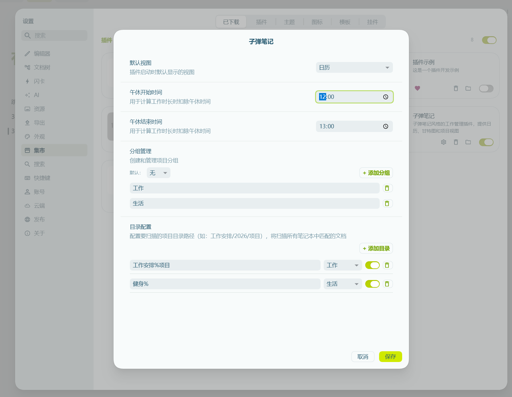

# Configuration

This document introduces the various configuration options for the Task Assistant plugin.

## Settings Interface

Open settings: SiYuan Settings → Plugins → Task Assistant → Settings

The settings interface is divided into two columns:
- **Left menu**: Quick navigation to configuration sections
- **Right content**: Specific configuration options

Supports search functionality for quick location of settings.

---

## Directory Configuration

Directory configuration determines which documents the plugin scans to extract task information.

> 🆕 **v0.12.2 New**: Scan scope settings (Full Scan / Configured Directories Only), resolves the issue where tasks disappear after configuring directories.

### Scan Scope (New in v0.12.2)

The plugin supports two scanning modes, switchable at the top of "Directory Configuration":

| Mode | Icon | Description | Use Case |
|------|------|-------------|----------|
| **Scan Entire Workspace** | 🌐 | Scan all documents containing task markers. Directory config is only used for grouping. | Daily use, recommended |
| **Scan Configured Directories Only** | 📁 | Only scan documents in directories configured below. | Large workspaces, performance optimization |

#### Relationship Between Scan Scope and Directory Configuration

- **Full Scan Mode** (default): Scan all documents, configured directories are used for **grouping only**
  - All tasks are visible
  - Projects matching directory config will appear in corresponding groups
  - Unmatched projects appear as "Uncategorized"

- **Configured Directories Only Mode**: Only scan configured directories, same behavior as before v0.12.2
  - Only tasks in configured directories are shown
  - Tasks in other documents are not scanned

#### Notes for Upgrading Users

After upgrading from older versions to v0.12.2:
- Default switches to "Full Scan Mode", previously disappeared tasks will reappear
- To restore original behavior, manually switch to "Scan Configured Directories Only" mode

### Add Scan Directory

1. Ensure scan mode is "Configured Directories Only" (in Full Scan mode, directory config is only for grouping)
2. Click "Add Directory" in the "Directory Configuration" area
3. Enter directory path (e.g., `Work/2026/Projects`)
4. Select group (optional)
5. Save settings



### Directory Configuration Items

| Item | Description |
|------|-------------|
| Path | Relative path to the document directory |
| Group | Default group for projects in this directory |
| Enabled | Whether to enable scanning/grouping for this directory |

### Path Format

- Use relative paths, relative to the SiYuan notebook root directory
- Support multi-level directories, separated by `/`
- Path should not start or end with `/`

### Examples

| Path | Description |
|------|-------------|
| `Work/2026/Projects` | Scan documents in specified directory |
| `Work` | Scan Work and all its subdirectories |
| `Journal` | Scan Journal directory |

---

## Group Management

Grouping helps you organize and filter projects.

### Default Group

Set a default group, new directories will automatically belong to this group.

### Create Group

1. Open plugin settings
2. Click "Add Group" in the "Group Management" area
3. Enter group name (e.g., "Frontend Projects", "Backend Projects")
4. Assign directories to groups

### Group Usage

- Filter by group in Project List
- View by group in Gantt chart
- Organize and categorize different types of projects

---

## Pomodoro

Settings related to Pomodoro focus timer.

### Interface Settings

| Setting | Description | Default |
|---------|-------------|---------|
| Floating Pomodoro Button | Show floating button in bottom-right corner during focus | Off |
| Status Bar Timer | Show countdown panel in status bar (with pause/resume controls) during focus | Off |
| Status Bar Progress | Show progress bar at bottom of page during focus | Off |

### Record Storage Mode

Storage location for Pomodoro records:

| Mode | Description |
|------|-------------|
| Under item block (child block) | Create child block under item to store records |
| Item block custom attribute | Store in block's custom attributes |

### Auto Complete Focus

- **Auto complete Pomodoro when item is done**: Automatically end associated Pomodoro when marking item as done in todo panel

### Minimum Focus Time

Alert user when focus duration is below this value (minutes), range 1-60 minutes, default 5 minutes.

### Auto Extend Settings

Automatically extend focus time when countdown ends:

| Setting | Description | Default |
|---------|-------------|---------|
| Auto Extend | When countdown ends and dialog is not operated, automatically extend countdown to continue focus | Off |
| Wait Time (seconds) | How many seconds to wait after dialog pops up before triggering auto extend | 30 seconds |
| Extend Minutes | Countdown minutes added each time auto extend is triggered | 5 minutes |
| Maximum Extend Count | Dialog will remain open after reaching maximum count | 3 times |

---

## Calendar

Display settings for calendar view.

### Default View

Default view when opening calendar:

- Month View
- Week View
- Day View
- List View

### Pomodoro Display

| Setting | Description | Default |
|---------|-------------|---------|
| Show Pomodoro Time Blocks | Show Pomodoro focus periods on calendar day view timeline | On |
| Show Total Focus Time | Show total focus duration on the right side of item bars | On |

---

## Lunch Break

Lunch break time is used to deduct lunch period when calculating work hours, affecting task duration display in the Gantt chart.

### Configuration

1. Open plugin settings
2. Find "Lunch Break" setting
3. Set start and end time (default 12:00-13:00)

### Calculation Rule

When item time range spans lunch break period, lunch time is automatically deducted:

```
Item: 09:00 ~ 14:00
Lunch: 12:00 ~ 13:00
Actual work hours: 4 hours (not 5 hours)
```

---

## Slash Commands

Custom slash command shortcuts.

### Built-in Commands

The plugin provides the following built-in slash commands:

| Command | Function |
|---------|----------|
| `/today` | Mark as today's item |
| `/tomorrow` | Mark as tomorrow's item |
| `/date` | Select date |
| `/done` | Mark as completed |
| `/abandon` | Mark as abandoned |
| `/calendar` | Open calendar |
| `/calendarday` | Open calendar day view |
| `/calendarweek` | Open calendar week view |
| `/calendarmonth` | Open calendar month view |
| `/calendarlist` | Open calendar list view |
| `/gantt` | Open Gantt chart |
| `/focus` | Start focus |
| `/todo` | Open todo dock |
| `/projectdir` | Set as project directory |
| `/task` | Mark as task |
| `/detail` | View detail |

### Custom Commands

You can add custom slash commands:

1. Click "Add Command"
2. Enter command name (e.g., "Quick mark today")
3. Enter trigger commands (e.g., `/my`)
4. Select action
5. Save

---

## AI Service Configuration

Configure large language model service for intelligent conversation with Task Assistant.

### Enable AI Chat

Enable AI conversation panel to interact with AI assistant.

### Add Provider

1. Click "Add Provider"
2. Enter configuration name (e.g., "Kimi-Personal")
3. Select provider or choose "Custom"
4. Enter API URL
5. Enter API Key
6. Add models and check to enable
7. Save

### Model Management

- Can add multiple models
- Check models to enable
- Set default model

### Conversation Settings

- **Show tool call details**: Show detailed information and execution results of AI tool calls in conversation

---

## MCP Configuration

Used to let MCP-compatible AI assistants (e.g. Trae, Cursor) access task and pomodoro data.

### Configuration steps

1. Open SiYuan Settings → Plugins → Task Assistant, click "Copy MCP Config" in the "MCP Configuration" section
2. Add this server in your AI client's MCP settings and replace `SIYUAN_TOKEN` in the config with your SiYuan API Token (SiYuan → Settings → About → API Token)
3. For multiple workspaces, you can change `SIYUAN_API_URL` if needed (default `http://127.0.0.1:6806`)

For detailed steps and tool descriptions, see [MCP AI Assistant](./mcp.md).

---

## FAQ

### Q: Why can't I see task data?

Please check:
1. Is scan scope setting correct (Full Scan mode should show all tasks)
2. Does directory path match actual folder structure (Configured Directories Only mode)
3. Do project documents contain `#task` marker
4. Do work items have valid date format (`@YYYY-MM-DD`)

### Q: How do I scan multiple directories?

Add multiple directory paths in directory configuration. Each directory can be assigned to different groups.

### Q: Do I need to restart after modifying directory?

No. The plugin will automatically rescan after saving settings.

### Q: How do I view scan results?

You can see all scanned projects and tasks in the Project List view.

### Q: What's the purpose of groups?

Groups are used to organize and filter projects:
- Filter by group in Project List
- View by group in Gantt chart
- Manage project categorization with scan scope
