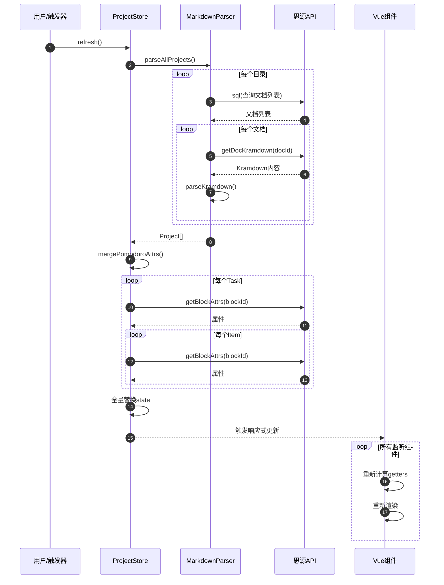
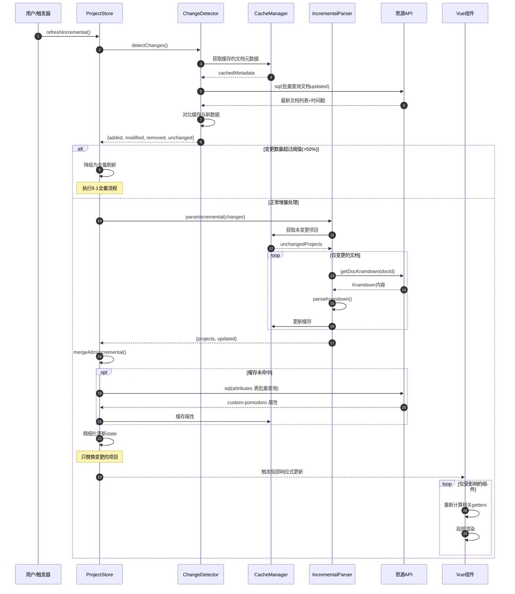
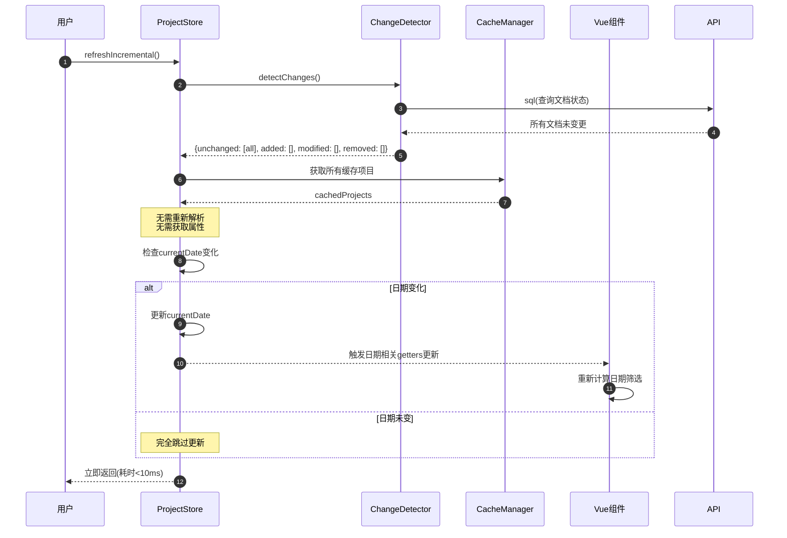
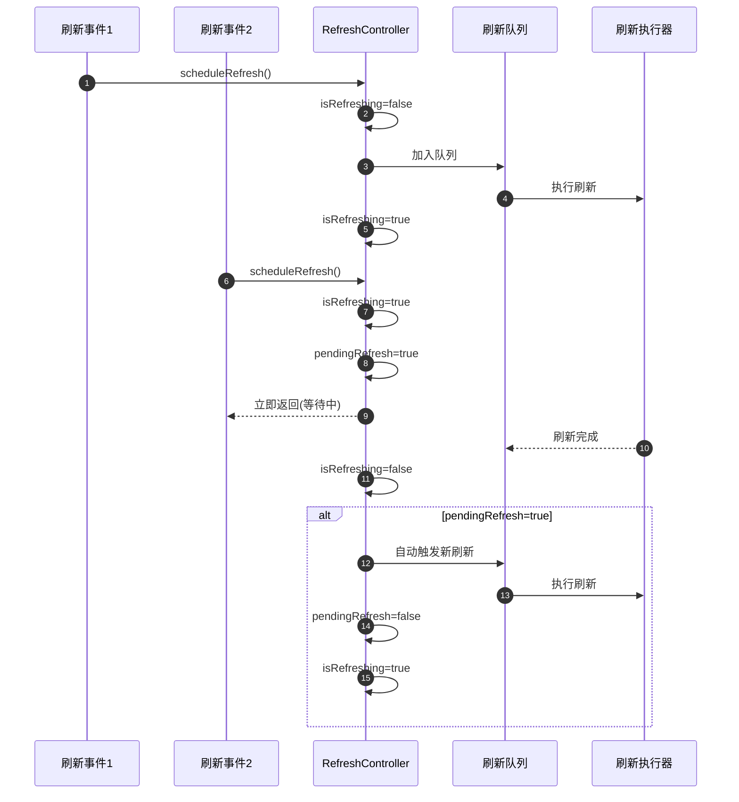

# 性能优化方案：增量更新机制

## 一、问题背景

当前 `projectStore.refresh()` 方法每次刷新时都会执行全量更新：

```typescript
async refresh(_plugin: any, directories: ProjectDirectory[]) {
  const parser = new MarkdownParser(directories);
  const projects = await parser.parseAllProjects();  // 全量解析
  await this.mergePomodoroAttrs(projects, _plugin);   // 全量获取属性
  const items = parser.getAllItemsFromProjects(projects);
  const calendarEvents = DataConverter.projectsToCalendarEvents(projects);
  // ... 全量替换 state
}
```

### 1.1 性能瓶颈

| 瓶颈点 | 影响 | 触发频率 |
|--------|------|----------|
| 重新解析所有文档 | O(N) 文档读取 | 每次刷新 |
| 全量获取块属性 | O(M) API 调用（M=task+item 数量） | 每次刷新 |
| 重新生成派生数据 | 全量计算 | 每次刷新 |
| 触发 Vue 响应式更新 | 大量组件重渲染 | 每次刷新 |

### 1.2 典型场景

- 用户有 50 个项目文档
- 每个项目平均 10 个任务，每个任务 5 个事项
- 每次刷新需要：
  - 50 次 `getDocKramdown` API 调用
  - 约 300 次 `getBlockAttrs` API 调用
  - 全量重新计算 items、calendarEvents

## 二、优化目标

1. **减少不必要的 API 调用**：只获取变更的文档
2. **减少不必要的解析**：复用未变更的数据
3. **减少不必要的渲染**：精细化更新状态
4. **保持数据一致性**：确保增量更新后数据完整

## 三、方案设计

### 3.1 整体架构

```
┌─────────────────────────────────────────────────────────────┐
│                      增量更新架构                            │
├─────────────────────────────────────────────────────────────┤
│  事件源: ws-main (transactions/savedoc) / DATA_REFRESH       │
│         │                                                    │
│  ┌──────▼──────┐     ┌──────────────┐     ┌─────────────┐   │
│  │  Change     │────►│  Incremental │────►│  State      │   │
│  │  Detector   │     │  Updater     │     │  Merger     │   │
│  │ (文档updated │     │  (增量解析)   │     │  (状态合并)  │   │
│  │  +rootIDs)  │     │              │     │             │   │
│  └─────────────┘     └──────────────┘     └─────────────┘   │
│         │                    │                    │          │
│         ▼                    ▼                    ▼          │
│  ┌─────────────────────────────────────────────────────┐    │
│  │              Cache Layer (缓存层)                     │    │
│  │  • Document Cache (文档内容缓存)                      │    │
│  │  • Attribute Cache (属性缓存，SQL 批量获取)            │    │
│  │  • Parse Result Cache (解析结果缓存)                   │    │
│  └─────────────────────────────────────────────────────┘    │
└─────────────────────────────────────────────────────────────┘
```

### 3.2 核心机制

#### 3.2.1 文档级别变更检测

**主要来源**：利用思源笔记的 `updated` 字段检测文档内容是否变更。

**重要限制**：子块 `setBlockAttrs` 后，文档块（type='d'）的 `updated` **不会**更新。因此必须结合 ws-main 事件做属性变更检测（见 3.2.1.1）。

```typescript
interface DocumentCache {
  docId: string;
  updated: number;        // 文档更新时间戳
  hash: string;           // 内容哈希（可选）
  project: Project;       // 解析结果
  parsedAt: number;       // 解析时间
}

class ChangeDetector {
  // 检测哪些文档需要更新
  async detectChanges(
    directories: ProjectDirectory[],
    cache: Map<string, DocumentCache>
  ): Promise<{
    added: string[];      // 新增文档
    modified: string[];   // 修改文档
    removed: string[];    // 删除文档
    unchanged: string[];  // 未变更文档
  }>;
}
```

**SQL 查询优化**：

```sql
-- 批量获取文档更新时间
SELECT id, updated FROM blocks
WHERE type = 'd'
AND id IN (/* 当前目录下的所有文档ID */)
```

**空目录场景**（`directories.length === 0`）：使用 `getAllDocs()` 扫描含 `#任务/#task` 的文档时，需用 SQL 获取当前文档列表及 `updated`，与缓存对比得到 added/modified/removed。

#### 3.2.1.1 ws-main 属性变更定向刷新

当 ws-main 收到 `transactions` 或 `savedoc` 时，从 `detail.context.rootIDs`（注意大写 IDs）直接获取受影响的文档 ID 数组，仅刷新这些文档，而非全量刷新。

| 字段 | 路径 | 说明 |
|------|------|------|
| 受影响文档 ID | `detail.context.rootIDs` | 数组，需刷新的文档 |
| 变更块 ID | `detail.data[i].doOperations[j].id` | 具体变更的块 |
| 操作类型 | `op.action` | `update`、`updateAttrs` 等 |

**实现要点**：在 `transactions` 含 `updateAttrs` 或收到 `savedoc` 时，提取 `rootIDs`，使对应文档的 attrCache 失效或按文档维度做增量刷新。

**关键设计：双路径协调机制**

| 刷新触发源 | ChangeDetector 行为 | 属性获取行为 |
|-----------|-------------------|------------|
| 定时/手动刷新 | 基于 `updated` 字段对比 | 仅更新 `modified` 文档的属性 |
| ws-main 事件 | 将 `rootIDs` 强制加入 `modified` 列表 | 强制重新获取这些文档的属性 |

**问题场景**：
```
1. 用户对块 B (属于文档 A) setBlockAttrs
2. ws-main 触发 → attrCache[A] 失效
3. ChangeDetector 对比发现文档 A 的 updated 未变 → 判为 unchanged
4. 如果跳过处理，attrCache 将永远为空，导致数据丢失
```

**解决方案**：
```typescript
class RefreshCoordinator {
  // ws-main 事件标记需要强制刷新的文档
  private dirtyDocIds: Set<string> = new Set();

  // ws-main 触发时调用
  markDirty(docIds: string[]) {
    docIds.forEach(id => this.dirtyDocIds.add(id));
  }

  // ChangeDetector 检测前调用
  getForceModifiedDocs(): string[] {
    return Array.from(this.dirtyDocIds);
  }

  // 刷新完成后调用
  clearDirty(docIds: string[]) {
    docIds.forEach(id => this.dirtyDocIds.delete(id));
  }
}

// 在 ChangeDetector.detectChanges() 中：
async detectChanges(
  directories: ProjectDirectory[],
  cache: Map<string, DocumentCache>,
  forceModified: string[]  // 来自 RefreshCoordinator.getForceModifiedDocs()
): Promise<ChangeDetectionResult> {
  // 正常对比逻辑
  const { added, modified, removed, unchanged } = await this.compareWithCache(...);

  // 强制修改的文档，从 unchanged 移到 modified
  const forceModifiedSet = new Set(forceModified);
  const finalUnchanged = unchanged.filter(id => !forceModifiedSet.has(id));
  const finalModified = [...modified, ...unchanged.filter(id => forceModifiedSet.has(id))];

  return {
    added,
    modified: finalModified,
    removed,
    unchanged: finalUnchanged
  };
}
```

**时序保证**：
- ws-main 事件 → 立即 `markDirty()` + 触发 `scheduleRefresh()`
- 下一次刷新 → `detectChanges()` 读取 `dirtyDocIds` → 强制加入 `modified`
- `mergeIncremental()` 正常处理 `modified` 文档 → 重新获取属性
- 刷新完成 → `clearDirty()` 清理已处理的文档

#### 3.2.2 增量解析器

```typescript
class IncrementalMarkdownParser {
  private cache: Map<string, DocumentCache>;

  async parseProjectsIncremental(
    directories: ProjectDirectory[],
    changes: ChangeDetectionResult
  ): Promise<{
    projects: Project[];
    updated: string[];     // 实际更新的文档ID
  }> {
    // 1. 复用未变更的解析结果
    const unchangedProjects = changes.unchanged.map(id =>
      this.cache.get(id)!.project
    );

    // 2. 只解析变更的文档
    const modifiedProjects: Project[] = [];
    for (const docId of [...changes.added, ...changes.modified]) {
      const project = await this.parseSingleDocument(docId);
      if (project) {
        modifiedProjects.push(project);
        // 更新缓存
        this.cache.set(docId, {
          docId,
          updated: Date.now(),
          project,
          parsedAt: Date.now()
        });
      }
    }

    // 3. 从缓存中移除已删除的文档
    for (const docId of changes.removed) {
      this.cache.delete(docId);
    }

    // 4. 按 directories 和文档原始顺序合并，避免打乱 UI 显示顺序
    const merged = this.mergeInOriginalOrder(
      directories,
      changes,
      unchangedProjects,
      modifiedProjects
    );

    return {
      projects: merged,
      updated: [...changes.added, ...changes.modified]
    };
  }
}
```

#### 3.2.3 属性增量合并

**优先方案**：用 SQL 查询 `attributes` 表一次性获取番茄钟属性，替代逐块调用 `getBlockAttrs`。已验证：`custom-*` 属性在 attributes 表与 getBlockAttrs 中**完全一致**（`id`、`updated` 来自 blocks.ial，不在 attributes 表）。

```typescript
class PomodoroAttrMerger {
  private attrCache: Map<string, {
    blockId: string;
    attrs: Record<string, string>;
    fetchedAt: number;
  }>;
  // 反向映射：docId -> 该文档下所有 blockIds
  // 用于文档删除时快速定位并清理 attrCache
  private docToBlocksMap: Map<string, Set<string>> = new Map();

  // 维护 docId 到 blockIds 的映射关系
  private updateDocBlocksMap(docId: string, blockIds: string[]) {
    const currentSet = this.docToBlocksMap.get(docId) || new Set();
    const newSet = new Set(blockIds);

    // 找出被移除的 blockIds，从 attrCache 中删除
    for (const blockId of currentSet) {
      if (!newSet.has(blockId)) {
        this.attrCache.delete(blockId);
      }
    }

    this.docToBlocksMap.set(docId, newSet);
  }

  // 文档删除时清理缓存
  clearDocCache(docId: string) {
    const blockIds = this.docToBlocksMap.get(docId);
    if (blockIds) {
      for (const blockId of blockIds) {
        this.attrCache.delete(blockId);
      }
      this.docToBlocksMap.delete(docId);
    }
  }

  async mergeIncremental(
    projects: Project[],
    updatedDocIds: string[],
    plugin: any
  ): Promise<void> {
    // 只获取变更文档中的 task/item blockIds
    const blocksToFetch: string[] = [];

    for (const project of projects) {
      // 更新 docId 到 blockIds 的映射（用于后续缓存清理）
      const projectBlockIds: string[] = [];

      for (const task of project.tasks) {
        if (task.blockId) {
          projectBlockIds.push(task.blockId);
          if (task.blockId && !this.attrCache.has(task.blockId)) {
            blocksToFetch.push(task.blockId);
          }
        }
        for (const item of task.items) {
          if (item.blockId) {
            projectBlockIds.push(item.blockId);
            if (item.blockId && !this.attrCache.has(item.blockId)) {
              blocksToFetch.push(item.blockId);
            }
          }
        }
      }

      // 维护反向映射关系
      this.updateDocBlocksMap(project.id, projectBlockIds);
    }

    if (blocksToFetch.length === 0) return;

    // 一次 SQL 替代数百次 getBlockAttrs 调用
    await this.fetchAttrsBySql(blocksToFetch);
  }

  // 思源块 ID 格式为 20 位字母数字，严格校验防止注入
  private validateBlockId(id: string): boolean {
    return /^[a-z0-9]{14,26}$/.test(id);
  }

  private async fetchAttrsBySql(blockIds: string[]): Promise<void> {
    // 过滤非法 ID，避免 SQL 注入
    const safeIds = blockIds.filter(id => this.validateBlockId(id));
    if (safeIds.length !== blockIds.length) {
      console.warn('[PomodoroAttrMerger] Filtered invalid blockIds:', blockIds.filter(id => !this.validateBlockId(id)));
    }
    if (safeIds.length === 0) return;

    const placeholders = safeIds.map(id => `'${id}'`).join(',');
    const attrPrefix = 'custom-pomodoro'; // 可配置
    const result = await sql(`
      SELECT block_id, name, value FROM attributes
      WHERE block_id IN (${placeholders})
      AND name LIKE '${attrPrefix}%'
    `);

    // 按 block_id 聚合成 attrs 对象
    const byBlock = new Map<string, Record<string, string>>();
    for (const row of result) {
      if (!byBlock.has(row.block_id)) {
        byBlock.set(row.block_id, {});
      }
      byBlock.get(row.block_id)![row.name] = row.value;
    }

    for (const [blockId, attrs] of byBlock) {
      this.attrCache.set(blockId, { blockId, attrs, fetchedAt: Date.now() });
    }
    // 无属性的 block 也缓存空对象，避免重复查询
    for (const blockId of blockIds) {
      if (!this.attrCache.has(blockId)) {
        this.attrCache.set(blockId, { blockId, attrs: {}, fetchedAt: Date.now() });
      }
    }
  }
}
```

**降级方案**：若 SQL 不可用，可用 p-limit 控制并发调用 getBlockAttrs（需添加 p-limit 依赖或自定义实现）。

#### 3.2.4 精细化状态更新

```typescript
// 不再全量替换，而是精细化更新
class StateUpdater {
  updateProjectsIncremental(
    state: ProjectState,
    newProjects: Project[],
    changes: ChangeDetectionResult
  ): void {
    // 1. 删除已移除的项目
    if (changes.removed.length > 0) {
      const removedSet = new Set(changes.removed);
      state.projects = state.projects.filter(p => !removedSet.has(p.id));
    }

    // 2. 更新修改的项目（保持引用稳定）
    for (const project of newProjects) {
      const index = state.projects.findIndex(p => p.id === project.id);
      if (index >= 0) {
        // 替换现有项目
        state.projects[index] = project;
      } else {
        // 添加新项目
        state.projects.push(project);
      }
    }

    // 3. 增量更新 items（只更新变更项目相关的事项）
    this.updateItemsIncremental(state, newProjects, changes);

    // 4. 增量更新 calendarEvents
    this.updateCalendarEventsIncremental(state, newProjects, changes);
  }

  private updateItemsIncremental(
    state: ProjectState,
    newProjects: Project[],
    changes: ChangeDetectionResult
  ): void {
    const changedProjectIds = new Set([
      ...changes.added,
      ...changes.modified,
      ...changes.removed
    ]);

    // 1. 移除已变更/删除项目的事项
    state.items = state.items.filter(
      item => !changedProjectIds.has(item.project?.id || '')
    );

    // 2. 添加新解析的事项
    const newItems = this.extractItemsFromProjects(newProjects);
    state.items.push(...newItems);
  }
}
```

### 3.3 缓存策略

#### 3.3.1 多级缓存

```typescript
interface CacheManager {
  // L1: 内存缓存（当前会话）
  memory: {
    documents: Map<string, DocumentCache>;
    attrs: Map<string, AttributeCache>;
  };

  // L2: LocalStorage（跨会话，小数据）
  local: {
    docMetadata: Array<{id: string, updated: number}>;
    lastRefresh: number;
  };

  // L3: IndexedDB（大数据，可选）
  indexedDB?: {
    parseResults: Map<string, Project>;
  };
}
```

#### 3.3.2 缓存失效策略

| 场景 | 处理方式 | 实现方法 |
|------|----------|----------|
| 文档更新时间变化 | 重新解析该文档 | `detectChanges()` 判定为 modified |
| ws-main 收到 transactions/savedoc | 从 `context.rootIDs` 获取受影响文档，加入 `dirtyDocIds` 强制刷新 | `RefreshCoordinator.markDirty()` |
| 文档删除（changes.removed） | 调用 `clearDocCache(docId)` 清理该文档下所有 block 的缓存 | `PomodoroAttrMerger.clearDocCache()` |
| 手动强制刷新 | 清空所有缓存，全量更新 | `clearCache()` 清空 attrCache + docToBlocksMap |
| 超过最大缓存时间 | LRU 淘汰 | 遍历 attrCache 移除最旧的条目 |
| 内存压力 | 淘汰最久未使用的缓存 | 按 `fetchedAt` 排序移除 |

### 3.4 并发控制

```typescript
class RefreshController {
  private isRefreshing = false;
  private pendingRefresh = false;
  private pendingResolve?: () => void;
  private refreshQueue: Promise<void> = Promise.resolve();

  async scheduleRefresh(
    directories: ProjectDirectory[],
    force: boolean = false
  ): Promise<void> {
    // 如果正在刷新，标记待刷新，返回一个等待完成的 Promise
    if (this.isRefreshing) {
      this.pendingRefresh = true;
      // 关键修复：返回一个在下次刷新完成时 resolve 的 Promise
      return new Promise((resolve) => {
        this.pendingResolve = resolve;
      });
    }

    // 队列化刷新请求
    const refreshPromise = this.refreshQueue.then(async () => {
      this.isRefreshing = true;
      try {
        await this.performIncrementalRefresh(directories, force);
      } finally {
        this.isRefreshing = false;
        // 如果有等待中的 resolve，执行它
        if (this.pendingResolve) {
          this.pendingResolve();
          this.pendingResolve = undefined;
        }
        // 检查是否有待处理的刷新
        if (this.pendingRefresh) {
          this.pendingRefresh = false;
          // 递归调用，确保链式处理
          await this.scheduleRefresh(directories, false);
        }
      }
    });

    this.refreshQueue = refreshPromise;
    return refreshPromise;
  }
}
```

## 四、实现步骤

### Phase 1: 基础变更检测

1. 添加 `ChangeDetector` 类
2. 修改 `MarkdownParser` 支持增量解析
3. 添加文档元数据缓存
4. 空目录场景：单独处理 getAllDocs 的变更检测

### Phase 1.5: SQL 批量获取属性

1. 实现 `fetchAttrsBySql`，用 SQL 替代 getBlockAttrs
2. 属性按 block_id 聚合并写入 attrCache

### Phase 2: 属性缓存 + 增量合并

1. 添加 `PomodoroAttrMerger` 类
2. 实现属性缓存机制
3. 与 Phase 1.5 的 SQL 方案集成

### Phase 2.5: 属性变更定向刷新

1. 在 ws-main 监听中解析 `detail.context.rootIDs`
2. 收到 transactions/savedoc 时，仅刷新 rootIDs 中的文档
3. 使对应文档的 attrCache 失效

### Phase 3: 精细化状态更新

1. 修改 `projectStore` 的 `refresh` 方法
2. 实现 `StateUpdater` 类
3. 项目合并时保持原始顺序（mergeInOriginalOrder）
4. 优化派生数据计算

### Phase 4: 持久化缓存（建议推迟评估）

**注意**：思源是 Electron 应用，L1 内存缓存在整个 App 生命周期内有效。Project 对象包含复杂类型（Date、Map 等），序列化/反序列化开销较大。建议先实现 L1，评估实际效果后再决定是否引入 L2/L3。

1. 评估 L1 内存缓存的实际命中率
2. 如确需跨会话缓存，优先使用 LocalStorage 存储文档元数据（updated 时间戳）
3. IndexedDB 存储完整 Project 数据需考虑版本迁移和兼容性，暂缓实现

## 五、API 变更

### 5.1 新增接口

```typescript
// types/performance.ts

interface IncrementalRefreshOptions {
  force?: boolean;           // 强制全量刷新
  maxConcurrency?: number;   // 最大并发数
  cacheTimeout?: number;     // 缓存超时时间
  fullRefreshThreshold?: number;  // 变更超过此比例时降级全量刷新，默认 0.5
}

interface RefreshResult {
  success: boolean;
  updated: number;           // 更新的文档数
  added: number;             // 新增的文档数
  removed: number;           // 删除的文档数
  unchanged: number;         // 未变更的文档数
  duration: number;          // 耗时(ms)
}

// projectStore 新增方法
interface ProjectStoreActions {
  // 增量刷新（默认）
  refreshIncremental(
    plugin: any,
    directories: ProjectDirectory[],
    options?: IncrementalRefreshOptions
  ): Promise<RefreshResult>;

  // 强制全量刷新
  refreshFull(plugin: any, directories: ProjectDirectory[]): Promise<void>;

  // 清空缓存
  clearCache(): void;
}
```

### 5.2 向后兼容

- `refresh()` 方法默认使用增量更新
- 添加配置项 `performance.incrementalRefresh: boolean`（默认 true）
- 保留全量刷新能力用于调试

## 六、性能预期

### 6.1 优化效果对比

| 指标 | 优化前 | 优化后 | 提升 |
|------|--------|--------|------|
| 文档解析 | 全量 O(N) | 增量 O(变更数) | 90%+ |
| 属性获取 | O(M) getBlockAttrs | 1 次 SQL 批量查询 | 95%+ |
| 刷新耗时（典型场景） | 2000ms | 200ms | 10x |
| 内存占用 | 稳定 | +10%（缓存） | 可接受 |

### 6.2 极端场景处理

- **首次加载**：全量解析，建立缓存
- **大量变更**：超过阈值（默认 50%）时自动降级为全量刷新；建议阈值可配置（`performance.fullRefreshThreshold`）
- **缓存失效**：优雅降级到全量刷新

## 七、监控与调试

### 7.1 性能监控

```typescript
interface PerformanceMetrics {
  refreshCount: number;
  avgRefreshTime: number;
  cacheHitRate: number;
  apiCallCount: number;
}

// 开发模式下输出性能日志
console.log('[Performance] Refresh metrics:', metrics);
```

### 7.2 调试支持

**仅在开发环境注册**，生产环境不暴露内部 API：

```typescript
// 全局调试对象（开发模式限定）
if (process.env.NODE_ENV === 'development' || import.meta.env?.DEV) {
  window.__BULLET_JOURNAL_DEBUG__ = {
    clearCache: () => store.clearCache(),
    forceFullRefresh: () => store.refreshFull(),
    getCacheStats: () => cacheManager.getStats(),
    enableDetailedLogging: (enabled: boolean) => { ... },
    // 新增：查看当前 dirtyDocIds
    getDirtyDocs: () => refreshCoordinator.getForceModifiedDocs()
  };
}
```

**安全说明**：
- 生产构建工具（Vite/Webpack）会剔除 `process.env.NODE_ENV === 'development'` 代码块
- 思源插件使用 Vite 时，通过 `import.meta.env.DEV` 判断
- 确保 `__BULLET_JOURNAL_DEBUG__` 不会在生产环境泄露 store 内部状态

## 八、风险评估

| 风险 | 概率 | 影响 | 缓解措施 |
|------|------|------|----------|
| 缓存不一致 | 中 | 高 | 完善的失效策略、版本校验 |
| 内存泄漏 | 低 | 中 | LRU 淘汰、定期清理 |
| 并发问题 | 中 | 中 | 队列化刷新、状态锁 |
| 降级失败 | 低 | 高 | 完善的异常处理、自动降级 |

## 八.1 测试验证（已确认）

控制台测试脚本 `docs/prd/console-test-ws-main.js` 验证结论：

| 验证项 | 结论 |
|--------|------|
| 文档 updated 与子块属性 | 子块 `setBlockAttrs` 后，文档块 `updated` **不会**更新，必须实现 ws-main 定向刷新 |
| transactions 结构 | `detail.context.rootIDs`（大写 IDs）为受影响文档 ID 数组；`detail.data[i].doOperations[j].id` 为变更块 ID |
| attributes 表与 getBlockAttrs | `custom-*` 属性在两者中**完全一致**；用 SQL 查 attributes 表替代 getBlockAttrs 可行 |

## 八.2 测试用例

### 变更检测

| 用例 | 前置条件 | 操作 | 预期结果 |
|------|----------|------|----------|
| TC-D01 | 有缓存，文档 A 未修改 | 刷新 | ChangeDetector 返回 A 在 unchanged |
| TC-D02 | 有缓存，文档 A 内容已修改 | 刷新 | ChangeDetector 返回 A 在 modified |
| TC-D03 | 有缓存，新增文档 B | 刷新 | ChangeDetector 返回 B 在 added |
| TC-D04 | 有缓存，文档 C 已删除 | 刷新 | ChangeDetector 返回 C 在 removed |
| TC-D05 | 有缓存，仅对文档 A 内某块 setBlockAttrs | ws-main 触发 | 从 rootIDs 解析出 A，仅刷新 A |
| TC-D06 | directories 为空 | 刷新 | 使用 getAllDocs 逻辑，正确检测 added/modified/removed |

### 增量解析

| 用例 | 前置条件 | 操作 | 预期结果 |
|------|----------|------|----------|
| TC-P01 | 50 文档，仅 1 个修改 | 增量刷新 | 只解析 1 个文档，复用 49 个缓存 |
| TC-P02 | 50 文档，25 个修改 | 增量刷新 | 变更超过 50%，降级为全量刷新 |
| TC-P03 | 有缓存，合并 unchanged + modified | 增量刷新 | 项目顺序与原始 directories 一致 |

### 属性获取

| 用例 | 前置条件 | 操作 | 预期结果 |
|------|----------|------|----------|
| TC-A01 | 变更文档含 10 个 task/item block | 增量合并 | 1 次 SQL 查询，结果与 getBlockAttrs 的 custom-* 一致 |
| TC-A02 | block 无番茄钟属性 | 增量合并 | attrCache 中该 block 存空对象，不重复查询 |
| TC-A03 | ws-main 收到 updateAttrs | 定向刷新 | 对应文档的 attrCache 失效，重新获取属性 |

### 状态更新

| 用例 | 前置条件 | 操作 | 预期结果 |
|------|----------|------|----------|
| TC-S01 | 有 3 个项目，删除 1 个 | 增量刷新 | state.projects 剩 2 个，items/calendarEvents 同步移除 |
| TC-S02 | 有 3 个项目，修改 1 个 | 增量刷新 | 仅被修改项目引用更新，未变更项目引用不变（减少重渲染） |
| TC-S03 | 增量刷新完成 | 检查 getters | getDisplayItems、getFilteredCalendarEvents 等返回正确数据 |

### 并发与降级

| 用例 | 前置条件 | 操作 | 预期结果 |
|------|----------|------|----------|
| TC-C01 | 正在刷新中 | 再次触发刷新 | pendingRefresh=true，首次完成后自动执行第二次 |
| TC-C02 | 缓存损坏或异常 | 增量刷新 | 降级为全量刷新，不抛错 |
| TC-C03 | 首次加载（无缓存） | 刷新 | 全量解析，建立缓存 |

## 九、时序图

### 9.1 全量更新流程（优化前）



### 9.2 增量更新流程（优化后）



### 9.3 缓存命中场景



### 9.4 并发控制流程



## 十、问题修复汇总

针对审查发现的问题，已在文档中补充以下解决方案：

| 问题 | 位置 | 解决方案 |
|------|------|----------|
| SQL 注入风险 | 3.2.3 | 增加 `validateBlockId()` 白名单校验（`/^[a-z0-9]{14,26}$/`），过滤非法 ID 后再拼接 SQL |
| ws-main 与增量刷新路径协调 | 3.2.1.1 | 新增 `RefreshCoordinator` 类，维护 `dirtyDocIds` 集合；ws-main 触发时 `markDirty()`，`detectChanges()` 将 dirty 文档强制加入 modified 列表，确保属性被重新获取 |
| RefreshController Promise 语义 | 3.4 | 修复 `pendingRefresh=true` 时返回 `undefined` 的问题，改为返回 `new Promise()` 并在下次刷新完成后 resolve |
| docId→blockIds 反向映射 | 3.2.3 | 在 `PomodoroAttrMerger` 中新增 `docToBlocksMap` 和 `updateDocBlocksMap()`/`clearDocCache()` 方法，维护文档到块 ID 的映射关系 |
| 调试对象环境守卫 | 7.2 | 添加 `process.env.NODE_ENV === 'development'` 判断，确保生产环境不暴露调试 API |

## 十一、相关文件

**新增文件**：
- `src/parser/incrementalParser.ts` - 增量解析器
- `src/utils/changeDetector.ts` - 变更检测（含 `RefreshCoordinator`）
- `src/utils/cacheManager.ts` - 缓存管理
- `src/types/performance.ts` - 性能相关类型

**修改文件**：
- `src/stores/projectStore.ts` - 主状态管理
- `src/parser/markdownParser.ts` - Markdown 解析器
- `src/index.ts` - ws-main 监听，解析 `context.rootIDs` 做定向刷新

- `src/stores/projectStore.ts` - 主状态管理
- `src/parser/markdownParser.ts` - Markdown 解析器
- `src/parser/incrementalParser.ts` - 新增：增量解析器
- `src/utils/changeDetector.ts` - 新增：变更检测
- `src/utils/cacheManager.ts` - 新增：缓存管理
- `src/types/performance.ts` - 新增：性能相关类型
- `src/index.ts` - 修改 onWsMain：解析 `context.rootIDs` 做定向刷新
- `docs/prd/console-test-ws-main.js` - 控制台测试脚本（验证 rootIDs、attributes 一致性）
- `src/**/*.test.ts` 或 `tests/` - 单元/集成测试（覆盖 8.2 测试用例）
