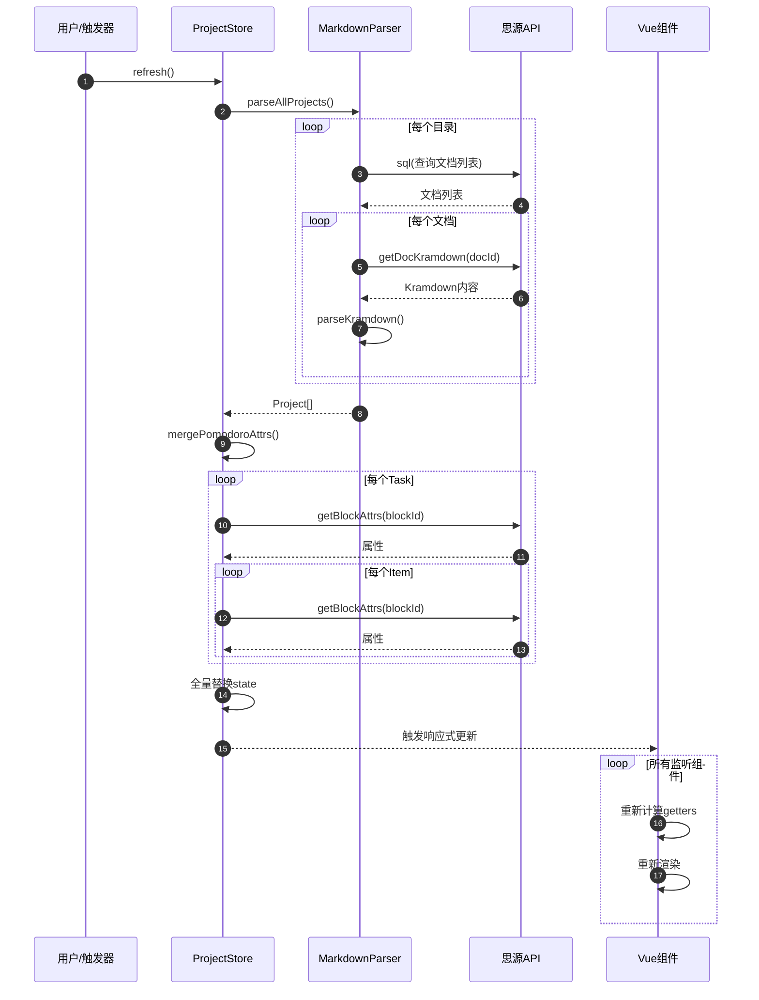
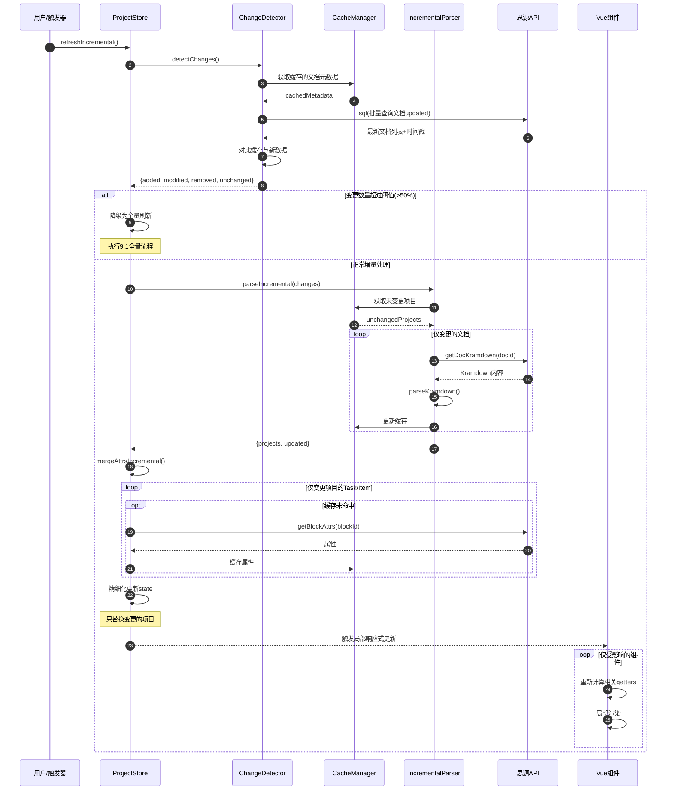
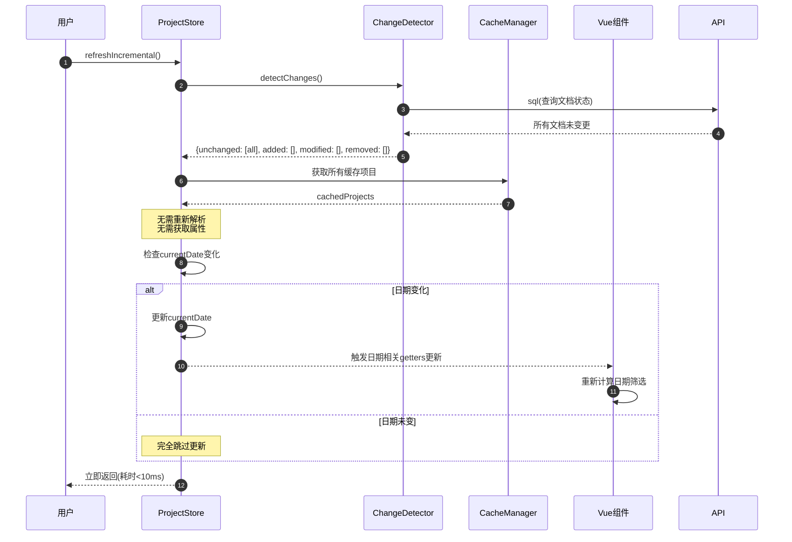
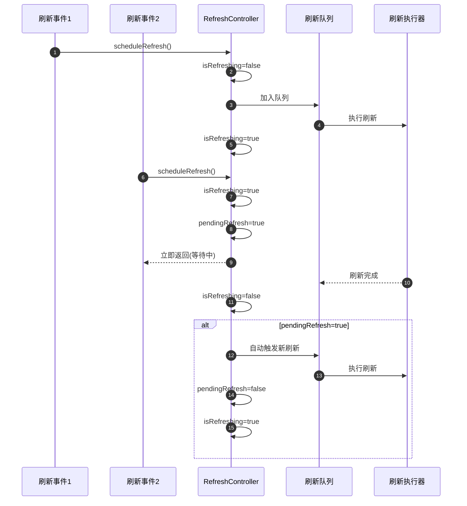

# 性能优化方案：增量更新机制

## 一、问题背景

当前 `projectStore.refresh()` 方法每次刷新时都会执行全量更新：

```typescript
async refresh(_plugin: any, directories: ProjectDirectory[]) {
  const parser = new MarkdownParser(directories);
  const projects = await parser.parseAllProjects();  // 全量解析
  await this.mergePomodoroAttrs(projects, _plugin);   // 全量获取属性
  const items = parser.getAllItemsFromProjects(projects);
  const calendarEvents = DataConverter.projectsToCalendarEvents(projects);
  // ... 全量替换 state
}
```

### 1.1 性能瓶颈

| 瓶颈点 | 影响 | 触发频率 |
|--------|------|----------|
| 重新解析所有文档 | O(N) 文档读取 | 每次刷新 |
| 全量获取块属性 | O(M) API 调用（M=task+item 数量） | 每次刷新 |
| 重新生成派生数据 | 全量计算 | 每次刷新 |
| 触发 Vue 响应式更新 | 大量组件重渲染 | 每次刷新 |

### 1.2 典型场景

- 用户有 50 个项目文档
- 每个项目平均 10 个任务，每个任务 5 个事项
- 每次刷新需要：
  - 50 次 `getDocKramdown` API 调用
  - 约 300 次 `getBlockAttrs` API 调用
  - 全量重新计算 items、calendarEvents

## 二、优化目标

1. **减少不必要的 API 调用**：只获取变更的文档
2. **减少不必要的解析**：复用未变更的数据
3. **减少不必要的渲染**：精细化更新状态
4. **保持数据一致性**：确保增量更新后数据完整

## 三、方案设计

### 3.1 整体架构

```
┌─────────────────────────────────────────────────────────────┐
│                      增量更新架构                            │
├─────────────────────────────────────────────────────────────┤
│                                                             │
│  ┌──────────────┐     ┌──────────────┐     ┌─────────────┐ │
│  │  Change      │────►│  Incremental │────►│  State      │ │
│  │  Detector    │     │  Updater     │     │  Merger     │ │
│  │  (变更检测)   │     │  (增量解析)   │     │  (状态合并)  │ │
│  └──────────────┘     └──────────────┘     └─────────────┘ │
│         │                    │                    │         │
│         ▼                    ▼                    ▼         │
│  ┌─────────────────────────────────────────────────────┐   │
│  │              Cache Layer (缓存层)                    │   │
│  │  • Document Cache (文档内容缓存)                     │   │
│  │  • Attribute Cache (属性缓存)                        │   │
│  │  • Parse Result Cache (解析结果缓存)                  │   │
│  └─────────────────────────────────────────────────────┘   │
│                                                             │
└─────────────────────────────────────────────────────────────┘
```

### 3.2 核心机制

#### 3.2.1 文档级别变更检测

利用思源笔记的 `updated` 字段检测文档是否变更：

```typescript
interface DocumentCache {
  docId: string;
  updated: number;        // 文档更新时间戳
  hash: string;           // 内容哈希（可选）
  project: Project;       // 解析结果
  parsedAt: number;       // 解析时间
}

class ChangeDetector {
  // 检测哪些文档需要更新
  async detectChanges(
    directories: ProjectDirectory[],
    cache: Map<string, DocumentCache>
  ): Promise<{
    added: string[];      // 新增文档
    modified: string[];   // 修改文档
    removed: string[];    // 删除文档
    unchanged: string[];  // 未变更文档
  }>;
}
```

**SQL 查询优化**：

```sql
-- 批量获取文档更新时间
SELECT id, updated FROM blocks
WHERE type = 'd'
AND id IN (/* 当前目录下的所有文档ID */)
```

#### 3.2.2 增量解析器

```typescript
class IncrementalMarkdownParser {
  private cache: Map<string, DocumentCache>;

  async parseProjectsIncremental(
    directories: ProjectDirectory[],
    changes: ChangeDetectionResult
  ): Promise<{
    projects: Project[];
    updated: string[];     // 实际更新的文档ID
  }> {
    // 1. 复用未变更的解析结果
    const unchangedProjects = changes.unchanged.map(id =>
      this.cache.get(id)!.project
    );

    // 2. 只解析变更的文档
    const modifiedProjects: Project[] = [];
    for (const docId of [...changes.added, ...changes.modified]) {
      const project = await this.parseSingleDocument(docId);
      if (project) {
        modifiedProjects.push(project);
        // 更新缓存
        this.cache.set(docId, {
          docId,
          updated: Date.now(),
          project,
          parsedAt: Date.now()
        });
      }
    }

    // 3. 从缓存中移除已删除的文档
    for (const docId of changes.removed) {
      this.cache.delete(docId);
    }

    return {
      projects: [...unchangedProjects, ...modifiedProjects],
      updated: [...changes.added, ...changes.modified]
    };
  }
}
```

#### 3.2.3 属性增量合并

```typescript
class PomodoroAttrMerger {
  private attrCache: Map<string, {
    blockId: string;
    attrs: Record<string, string>;
    fetchedAt: number;
  }>;

  async mergeIncremental(
    projects: Project[],
    updatedDocIds: string[],
    plugin: any
  ): Promise<void> {
    // 只获取变更文档中的 task/item 属性
    const blocksToFetch: string[] = [];

    for (const project of projects) {
      // 只处理变更的项目
      if (!updatedDocIds.includes(project.id)) continue;

      for (const task of project.tasks) {
        if (task.blockId && !this.attrCache.has(task.blockId)) {
          blocksToFetch.push(task.blockId);
        }

        for (const item of task.items) {
          if (item.blockId && !this.attrCache.has(item.blockId)) {
            blocksToFetch.push(item.blockId);
          }
        }
      }
    }

    // 批量获取属性（如果思源支持批量 API）
    // 或并行获取（控制并发数）
    await this.fetchAttrsBatch(blocksToFetch, plugin);
  }

  private async fetchAttrsBatch(
    blockIds: string[],
    plugin: any,
    concurrency: number = 10
  ): Promise<void> {
    // 使用 p-limit 控制并发
    const limit = pLimit(concurrency);

    await Promise.all(
      blockIds.map(blockId =>
        limit(async () => {
          try {
            const attrs = await getBlockAttrs(blockId);
            this.attrCache.set(blockId, {
              blockId,
              attrs,
              fetchedAt: Date.now()
            });
          } catch (e) {
            console.warn(`Failed to fetch attrs for ${blockId}`);
          }
        })
      )
    );
  }
}
```

#### 3.2.4 精细化状态更新

```typescript
// 不再全量替换，而是精细化更新
class StateUpdater {
  updateProjectsIncremental(
    state: ProjectState,
    newProjects: Project[],
    changes: ChangeDetectionResult
  ): void {
    // 1. 删除已移除的项目
    if (changes.removed.length > 0) {
      const removedSet = new Set(changes.removed);
      state.projects = state.projects.filter(p => !removedSet.has(p.id));
    }

    // 2. 更新修改的项目（保持引用稳定）
    for (const project of newProjects) {
      const index = state.projects.findIndex(p => p.id === project.id);
      if (index >= 0) {
        // 替换现有项目
        state.projects[index] = project;
      } else {
        // 添加新项目
        state.projects.push(project);
      }
    }

    // 3. 增量更新 items（只更新变更项目相关的事项）
    this.updateItemsIncremental(state, newProjects, changes);

    // 4. 增量更新 calendarEvents
    this.updateCalendarEventsIncremental(state, newProjects, changes);
  }

  private updateItemsIncremental(
    state: ProjectState,
    newProjects: Project[],
    changes: ChangeDetectionResult
  ): void {
    const changedProjectIds = new Set([
      ...changes.added,
      ...changes.modified,
      ...changes.removed
    ]);

    // 1. 移除已变更/删除项目的事项
    state.items = state.items.filter(
      item => !changedProjectIds.has(item.project?.id || '')
    );

    // 2. 添加新解析的事项
    const newItems = this.extractItemsFromProjects(newProjects);
    state.items.push(...newItems);
  }
}
```

### 3.3 缓存策略

#### 3.3.1 多级缓存

```typescript
interface CacheManager {
  // L1: 内存缓存（当前会话）
  memory: {
    documents: Map<string, DocumentCache>;
    attrs: Map<string, AttributeCache>;
  };

  // L2: LocalStorage（跨会话，小数据）
  local: {
    docMetadata: Array<{id: string, updated: number}>;
    lastRefresh: number;
  };

  // L3: IndexedDB（大数据，可选）
  indexedDB?: {
    parseResults: Map<string, Project>;
  };
}
```

#### 3.3.2 缓存失效策略

| 场景 | 处理方式 |
|------|----------|
| 文档更新时间变化 | 重新解析该文档 |
| 手动强制刷新 | 清空缓存，全量更新 |
| 超过最大缓存时间 | LRU 淘汰 |
| 内存压力 | 淘汰最久未使用的缓存 |

### 3.4 并发控制

```typescript
class RefreshController {
  private isRefreshing = false;
  private pendingRefresh = false;
  private refreshQueue: Promise<void> = Promise.resolve();

  async scheduleRefresh(
    directories: ProjectDirectory[],
    force: boolean = false
  ): Promise<void> {
    // 防抖：如果正在刷新，标记待刷新
    if (this.isRefreshing) {
      this.pendingRefresh = true;
      return;
    }

    // 队列化刷新请求
    this.refreshQueue = this.refreshQueue.then(async () => {
      this.isRefreshing = true;
      try {
        await this.performIncrementalRefresh(directories, force);
      } finally {
        this.isRefreshing = false;
        // 检查是否有待处理的刷新
        if (this.pendingRefresh) {
          this.pendingRefresh = false;
          await this.scheduleRefresh(directories, false);
        }
      }
    });

    return this.refreshQueue;
  }
}
```

## 四、实现步骤

### Phase 1: 基础变更检测

1. 添加 `ChangeDetector` 类
2. 修改 `MarkdownParser` 支持增量解析
3. 添加文档元数据缓存

### Phase 2: 属性增量获取

1. 添加 `PomodoroAttrMerger` 类
2. 实现属性缓存机制
3. 优化并发控制

### Phase 3: 精细化状态更新

1. 修改 `projectStore` 的 `refresh` 方法
2. 实现 `StateUpdater` 类
3. 优化派生数据计算

### Phase 4: 持久化缓存

1. 添加 LocalStorage 缓存
2. 添加 IndexedDB 支持（可选）
3. 实现缓存清理策略

## 五、API 变更

### 5.1 新增接口

```typescript
// types/performance.ts

interface IncrementalRefreshOptions {
  force?: boolean;           // 强制全量刷新
  maxConcurrency?: number;   // 最大并发数
  cacheTimeout?: number;     // 缓存超时时间
}

interface RefreshResult {
  success: boolean;
  updated: number;           // 更新的文档数
  added: number;             // 新增的文档数
  removed: number;           // 删除的文档数
  unchanged: number;         // 未变更的文档数
  duration: number;          // 耗时(ms)
}

// projectStore 新增方法
interface ProjectStoreActions {
  // 增量刷新（默认）
  refreshIncremental(
    plugin: any,
    directories: ProjectDirectory[],
    options?: IncrementalRefreshOptions
  ): Promise<RefreshResult>;

  // 强制全量刷新
  refreshFull(plugin: any, directories: ProjectDirectory[]): Promise<void>;

  // 清空缓存
  clearCache(): void;
}
```

### 5.2 向后兼容

- `refresh()` 方法默认使用增量更新
- 添加配置项 `performance.incrementalRefresh: boolean`（默认 true）
- 保留全量刷新能力用于调试

## 六、性能预期

### 6.1 优化效果对比

| 指标 | 优化前 | 优化后 | 提升 |
|------|--------|--------|------|
| 文档解析 | 全量 O(N) | 增量 O(变更数) | 90%+ |
| 属性获取 | O(M) | O(变更块数) | 95%+ |
| 刷新耗时（典型场景） | 2000ms | 200ms | 10x |
| 内存占用 | 稳定 | +10%（缓存） | 可接受 |

### 6.2 极端场景处理

- **首次加载**：全量解析，建立缓存
- **大量变更**：超过阈值（如 50%）时自动降级为全量刷新
- **缓存失效**：优雅降级到全量刷新

## 七、监控与调试

### 7.1 性能监控

```typescript
interface PerformanceMetrics {
  refreshCount: number;
  avgRefreshTime: number;
  cacheHitRate: number;
  apiCallCount: number;
}

// 开发模式下输出性能日志
console.log('[Performance] Refresh metrics:', metrics);
```

### 7.2 调试支持

```typescript
// 全局调试对象
window.__BULLET_JOURNAL_DEBUG__ = {
  clearCache: () => store.clearCache(),
  forceFullRefresh: () => store.refreshFull(),
  getCacheStats: () => cacheManager.getStats(),
  enableDetailedLogging: (enabled: boolean) => { ... }
};
```

## 八、风险评估

| 风险 | 概率 | 影响 | 缓解措施 |
|------|------|------|----------|
| 缓存不一致 | 中 | 高 | 完善的失效策略、版本校验 |
| 内存泄漏 | 低 | 中 | LRU 淘汰、定期清理 |
| 并发问题 | 中 | 中 | 队列化刷新、状态锁 |
| 降级失败 | 低 | 高 | 完善的异常处理、自动降级 |

## 九、时序图

### 9.1 全量更新流程（优化前）



### 9.2 增量更新流程（优化后）



### 9.3 缓存命中场景



### 9.4 并发控制流程



## 十、相关文件

- `src/stores/projectStore.ts` - 主状态管理
- `src/parser/markdownParser.ts` - Markdown 解析器
- `src/parser/incrementalParser.ts` - 新增：增量解析器
- `src/utils/changeDetector.ts` - 新增：变更检测
- `src/utils/cacheManager.ts` - 新增：缓存管理
- `src/types/performance.ts` - 新增：性能相关类型
