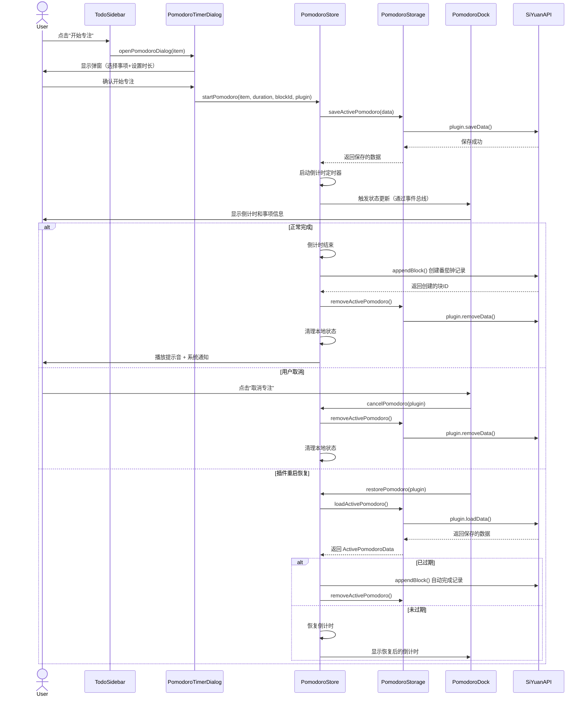
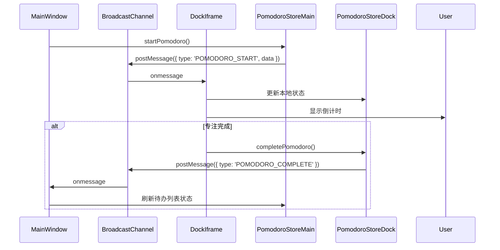

# 番茄钟功能 PRD

## 一、需求

### 1.1 功能概述

番茄钟功能帮助用户追踪专注时间，提供以下能力：

1. **番茄钟记录** - 在笔记中记录已完成的专注时段
2. **统计分析** - 查看今日/总专注时长和番茄数
3. **专注计时** - 在插件中直接开始专注倒计时

### 1.2 用户需求

#### 1.2.1 作为用户，我需要查看专注统计

**验收标准：**
- 显示今日番茄数（今日完成的番茄钟数量）
- 显示今日专注时长（格式：25m 或 1h 30m）
- 显示总番茄数（所有时间累计）
- 显示总专注时长（所有时间累计）
- 按日期分组展示专注记录列表

#### 1.2.2 作为用户，我需要在笔记中记录番茄钟

**验收标准：**
- 支持手动在事项下方添加番茄钟行
- 格式：`🍅YYYY-MM-DD HH:mm:ss~HH:mm:ss 描述`
- 支持列表格式：`- 🍅...` 或 `1. 🍅...`
- 无结束时间时默认按25分钟计算

#### 1.2.3 作为用户，我需要使用专注计时功能

**验收标准：**
- 点击"开始专注"按钮打开弹框
- 弹框分左右两栏：
  - 左侧：选择待办事项（过期事项 + 今天事项）
  - 右侧：设置专注时长（15/25/45/60分钟快捷按钮 + 自定义输入）
- 必须选择一个事项才能开始
- 默认时长25分钟
- 开始专注后 Dock 显示倒计时和事项信息
- 提供"结束专注"和"取消"按钮
- 倒计时结束自动完成，播放提示音，显示系统通知
- 完成时在文档中创建番茄钟记录

#### 1.2.4 作为用户，我需要专注状态持久化

**验收标准：**
- 开始专注后，状态保存到文件
- 插件重启后能恢复专注状态
- 过期的番茄钟自动标记为完成
- 取消专注时删除状态，不在文档中创建记录

### 1.3 数据格式

#### 1.3.1 番茄钟记录格式

**正常完成（无暂停）：**

```markdown
- 工作事项 @2026-03-08
🍅2026-03-08 15:45:32~15:50:32 专注描述
```

**有暂停的专注（记录实际专注时长）：**

```markdown
🍅5,2026-03-08 15:45:32~15:50:32 专注描述（实际专注5分钟）
🍅5，2026-03-08 15:45:32~15:50:32 专注描述（中文逗号）
🍅5, 2026-03-08 15:45:32~15:50:32 专注描述（逗号后空格）
```

| 元素 | 格式 | 说明 |
|------|------|------|
| 标记 | `🍅` | 番茄钟标识 |
| 实际时长 | `N,` 或 `N，` | 实际专注分钟数（可选），支持中英文逗号，逗号后可有空格。用于暂停/继续功能，记录实际专注时间 |
| 日期 | `YYYY-MM-DD` | 番茄钟日期 |
| 开始时间 | `HH:mm:ss` | 专注开始时间 |
| 结束时间 | `HH:mm:ss` | 专注结束时间 |
| 描述 | 任意文本 | 专注内容描述（可选）|

**实际专注时长说明：**
- 当专注过程中有暂停时，系统会记录实际专注时长（不含暂停时间）
- 格式为 `🍅N,` 或 `🍅N，`（N为实际专注分钟数）
- 实际时长后的逗号支持中英文两种，逗号后可以有可选空格
- 无暂停时默认不显示实际时长，只显示时间范围

#### 1.3.2 文件存储格式

**文件路径：** `active-pomodoro.json`（插件数据目录）

```json
{
  "blockId": "事项块ID",
  "itemId": "事项ID",
  "itemContent": "事项内容",
  "startTime": 1741427132000,
  "targetDurationMinutes": 25,
  "accumulatedSeconds": 0,
  "isPaused": false,
  "pauseCount": 0,
  "totalPausedSeconds": 0,
  "projectId": "项目ID",
  "projectName": "项目名称",
  "taskId": "任务ID",
  "taskName": "任务名称",
  "taskLevel": "L1"
}
```

| 字段 | 类型 | 说明 |
|------|------|------|
| `blockId` | string | 事项块ID（完成时在此块下添加番茄钟记录）|
| `itemId` | string | 事项ID |
| `itemContent` | string | 事项内容 |
| `startTime` | number | 开始时间戳（毫秒）|
| `targetDurationMinutes` | number | 目标专注时长（分钟）|
| `accumulatedSeconds` | number | 已累计专注秒数（不含暂停时间）|
| `isPaused` | boolean | 是否处于暂停状态 |
| `pauseCount` | number | 暂停次数（用于统计）|
| `totalPausedSeconds` | number | 总暂停秒数 |
| `currentPauseStartTime` | number? | 当前暂停开始时间戳（如果有）|
| `projectId` | string? | 项目ID |
| `projectName` | string? | 项目名称 |
| `taskId` | string? | 任务ID |
| `taskName` | string? | 任务名称 |
| `taskLevel` | string? | 任务层级（L1/L2/L3）|

## 二、技术实现方案

### 2.1 架构设计

#### 2.1.1 数据流

```
用户点击"开始专注"
    │
    ▼
打开 PomodoroTimerDialog
    │
    ▼
选择事项 + 设置时长
    │
    ▼
调用 pomodoroStore.startPomodoro()
    │
    ├──► 保存到文件 active-pomodoro.json
    └──► 启动倒计时定时器
    │
    ▼
Dock 展示 PomodoroActiveTimer
    │
    ▼
倒计时结束 / 用户结束 / 用户取消
    │
    ├──► 完成：删除文件 + appendBlock 创建番茄钟块
    └──► 取消：删除文件
```

#### 2.1.2 数据流转时序图



#### 2.1.3 跨组件状态同步

由于 Dock 可能在 iframe 中运行，与主窗口不共享内存，使用以下机制同步状态：



#### 2.1.4 状态管理

使用 Pinia Store 管理专注状态：

```typescript
// State
{
  activePomodoro: ActivePomodoro | null;    // 当前专注状态
  timerInterval: number | null;             // 倒计时定时器
  timerStartTimestamp: number | null;       // 计时器启动时的时间戳
  lastAccumulatedSeconds: number;           // 用于计算时间差的基础累计秒数
}

// Getters
- isFocusing: 基于 activePomodoro 是否为 null
- remainingTime: 返回剩余秒数（从 activePomodoro.remainingSeconds 获取）

// Actions
- startPomodoro(item, durationMinutes, parentBlockId, plugin)
  // 开始专注，保存到文件，启动定时器
  
- completePomodoro(plugin)
  // 完成专注，创建番茄钟记录块，删除状态文件，播放提示音，显示通知
  // 根据是否有暂停，决定记录格式（是否包含实际专注时长）
  
- cancelPomodoro(plugin)
  // 取消专注，删除状态文件，清理本地状态
  
- restorePomodoro(plugin)
  // 从文件恢复专注状态，计算剩余时间，如已过期则自动完成
  // 支持恢复暂停状态
  
- pausePomodoro(plugin)
  // 暂停专注，停止定时器，记录暂停开始时间，增加暂停计数
  // 保存状态到文件
  
- resumePomodoro(plugin)
  // 恢复专注，计算本次暂停时长并累加，恢复计时器
  // 保存状态到文件
  
- endPomodoroEarly(plugin)
  // 提前结束专注（与取消相同，不保存记录）
```

#### 2.1.5 计时器实现方案

**基于时间戳的计时方案（解决后台计时不准问题）：**

由于浏览器在页面后台运行时会节流 `setInterval`，导致计时不准确。本方案使用 `Date.now()` 时间戳计算经过时间：

```typescript
// 启动计时器时记录时间戳
startTimer() {
  this.timerStartTimestamp = Date.now();
  this.lastAccumulatedSeconds = this.activePomodoro?.accumulatedSeconds || 0;
  
  this.timerInterval = window.setInterval(() => {
    this.updateTimer();
  }, 1000);
}

// 基于时间戳计算经过时间（不受 setInterval 节流影响）
updateTimer() {
  const elapsedMs = Date.now() - this.timerStartTimestamp!;
  const elapsedSeconds = Math.floor(elapsedMs / 1000);
  
  // 更新累计专注秒数
  this.activePomodoro.accumulatedSeconds = this.lastAccumulatedSeconds + elapsedSeconds;
  
  // 更新剩余时间
  const targetSeconds = this.activePomodoro.targetDurationMinutes * 60;
  this.activePomodoro.remainingSeconds = Math.max(0, targetSeconds - this.activePomodoro.accumulatedSeconds);
  
  // 检查是否达到目标时长
  if (this.activePomodoro.accumulatedSeconds >= targetSeconds) {
    this.completePomodoro();
  }
}
```

#### 2.1.6 页面可见性监听

使用 Page Visibility API 确保页面从后台切换回前台时立即校准时间：

```typescript
setupVisibilityListener() {
  const visibilityHandler = () => {
    if (document.visibilityState === 'visible' && this.activePomodoro && !this.activePomodoro.isPaused) {
      // 页面重新可见，立即校准时间
      this.updateTimer();
    }
  };
  
  document.addEventListener('visibilitychange', visibilityHandler);
}
```

### 2.2 核心模块

#### 2.2.1 文件存储模块 (`src/utils/pomodoroStorage.ts`)

负责番茄钟状态的持久化存储，使用思源笔记的插件数据存储 API。

| 函数 | 功能 | 思源 API | 说明 |
|------|------|----------|------|
| `saveActivePomodoro(plugin, data)` | 保存进行中的番茄钟 | `plugin.saveData()` | 保存到 `active-pomodoro.json` |
| `loadActivePomodoro(plugin)` | 读取进行中的番茄钟 | `plugin.loadData()` | 返回 `ActivePomodoroData \| null` |
| `removeActivePomodoro(plugin)` | 删除进行中的番茄钟 | `plugin.removeData()` | 完成后清理文件 |
| `hasActivePomodoro(plugin)` | 检查是否有进行中的番茄钟 | `plugin.loadData()` | 返回布尔值 |

**存储数据结构：**

```typescript
interface ActivePomodoroData {
  blockId: string;              // 事项块ID（用于创建番茄钟记录）
  itemId: string;               // 事项ID（用于关联待办事项）
  itemContent: string;          // 事项内容（显示在专注界面）
  startTime: number;            // 开始时间戳（毫秒）
  targetDurationMinutes: number;// 目标专注时长（分钟）
  accumulatedSeconds: number;   // 已累计专注秒数（不含暂停时间）
  isPaused: boolean;            // 是否处于暂停状态
  pauseCount: number;           // 暂停次数（用于统计）
  totalPausedSeconds: number;   // 总暂停秒数
  currentPauseStartTime?: number;// 当前暂停开始时间戳（如果有）
  projectId?: string;           // 项目ID（可选）
  projectName?: string;         // 项目名称（可选）
  taskId?: string;              // 任务ID（可选）
  taskName?: string;            // 任务名称（可选）
  taskLevel?: string;           // 任务层级（可选）
}
```

#### 2.2.2 专注状态 Store (`src/stores/pomodoroStore.ts`)

**startPomodoro(item, durationMinutes, parentBlockId, plugin):**
1. 构建番茄钟数据对象（包含项目、任务信息）
2. 调用 `saveActivePomodoro()` 保存到文件
3. 设置本地 `activePomodoro` 状态
4. 启动倒计时定时器（基于时间戳）
5. 触发 `POMODORO_STARTED` 事件

**pausePomodoro(plugin):**
1. 先调用 `updateTimer()` 确保 `accumulatedSeconds` 是最新的
2. 设置暂停状态，`pauseCount++`
3. 记录 `currentPauseStartTime`
4. 停止定时器
5. 保存状态到文件
6. 显示暂停提示

**resumePomodoro(plugin):**
1. 计算本次暂停时长：`Date.now() - currentPauseStartTime`
2. 累加到 `totalPausedSeconds`
3. 清除暂停状态，`currentPauseStartTime = undefined`
4. 重新设置时间戳，`timerStartTimestamp = Date.now()`
5. 重新启动定时器
6. 保存状态到文件

**completePomodoro(plugin):**
1. 计算实际专注分钟数：`Math.floor(accumulatedSeconds / 60)`
2. 判断是否有暂停：`pauseCount > 0 || totalPausedSeconds > 0`
3. 生成番茄钟内容：
   - 有暂停：`🍅${actualMinutes},${dateStr} ${startTimeStr}~${endTimeStr}`
   - 无暂停：`🍅${dateStr} ${startTimeStr}~${endTimeStr}`
4. 调用 `appendBlock()` 在事项下创建块
5. 调用 `removeActivePomodoro()` 删除文件
6. 播放提示音（Web Audio API）
7. 显示系统通知（点击通知可聚焦思源窗口）
8. 清理本地状态
9. 触发 `POMODORO_COMPLETED` 事件

**cancelPomodoro(plugin):**
1. 调用 `removeActivePomodoro()` 删除文件
2. 清理本地状态
3. 触发 `POMODORO_CANCELLED` 事件

**restorePomodoro(plugin):**
1. 调用 `loadActivePomodoro()` 读取文件
2. 计算从上次保存到现在经过的时间（如果是非暂停状态）
3. 计算剩余时间
4. 如果已过期，调用 `markExpiredPomodoroComplete()`
5. 否则恢复专注状态：
   - 如果是暂停状态，不启动定时器，显示暂停提示
   - 如果是运行状态，启动定时器，显示恢复提示
6. 触发 `POMODORO_STARTED` 事件

**markExpiredPomodoroComplete(data, plugin):**
1. 使用目标时长作为实际专注时长
2. 生成番茄钟内容（带实际时长）
3. 调用 `appendBlock()` 创建块
4. 删除状态文件
5. 显示提示消息

#### 2.2.3 UI 组件

| 组件 | 功能 | 位置 | 说明 |
|------|------|------|------|
| `PomodoroTimerDialog.vue` | 开始专注弹框 | `src/components/pomodoro/` | 选择事项、设置时长 |
| `PomodoroActiveTimer.vue` | 专注中展示 | `src/components/pomodoro/` | 显示倒计时、事项信息、控制按钮、时间线、信息卡片 |
| `PomodoroStats.vue` | 统计概览 | `src/components/pomodoro/` | 今日/总番茄数、专注时长 |
| `PomodoroRecordList.vue` | 记录列表 | `src/components/pomodoro/` | 按日期分组展示历史记录 |
| `PomodoroDock.vue` | Dock 主组件 | `src/tabs/` | 番茄钟 Dock 容器 |
| `TomatoIcon.vue` | 番茄图标 | `src/components/icons/` | SVG 图标组件 |

**PomodoroActiveTimer.vue 功能详情：**

1. **圆形进度条**
   - SVG 实现，显示剩余时间比例
   - 使用 `stroke-dasharray` 和 `stroke-dashoffset` 控制进度
   - 暂停时进度条变灰

2. **时间线展示**
   - 显示开始时间和预计结束时间
   - 进度条指示当前专注进度
   - 使用 PlayIcon 和 StopIcon 标记开始和结束

3. **信息卡片**
   - 项目卡片：显示项目名称、复制按钮、项目链接
   - 任务卡片：显示任务名称、任务层级标签、复制按钮、任务链接
   - 事项卡片：显示事项内容、复制按钮、事项链接、可点击跳转

4. **控制按钮**
   - 暂停按钮：暂停专注计时
   - 继续按钮：恢复专注计时
   - 结束专注按钮：完成专注并保存记录

5. **交互功能**
   - 复制功能：支持复制项目名、任务名、事项内容到剪贴板
   - 链接跳转：点击链接在新标签页打开
   - 点击事项卡片：打开事项所在文档

**组件关系图：**

```
PomodoroDock (Dock 容器)
├── PomodoroStats (统计概览)
├── PomodoroActiveTimer (专注中展示) - 条件渲染
├── PomodoroRecordList (记录列表)
└── FloatingTomatoButton (悬浮按钮) - 全局

TodoSidebar (待办列表)
├── 事项项
│   ├── 开始专注图标 - 条件显示 (v-if="!isFocusing")
│   └── 状态 emoji (⏳/⚠️/✅/❌/🍅)
└── 右键菜单
    └── 开始专注选项 - 条件显示

CalendarView (日历视图)
├── 日历事件
│   └── 状态 emoji (⏳/⚠️/✅/❌/🍅)
└── 右键菜单
    └── 开始专注选项 - 条件显示

PomodoroTimerDialog (弹窗)
├── 事项选择列表
├── 时长设置
└── 开始/取消按钮
```

### 2.3 思源 API 使用

| 操作 | API | 用途 | 调用位置 |
|------|-----|------|----------|
| 保存文件 | `plugin.saveData()` | 保存进行中的番茄钟 | `pomodoroStorage.ts` |
| 读取文件 | `plugin.loadData()` | 读取进行中的番茄钟 | `pomodoroStorage.ts` |
| 删除文件 | `plugin.removeData()` | 删除进行中的番茄钟 | `pomodoroStorage.ts` |
| 创建块 | `appendBlock()` | 完成时在文档中创建番茄钟块 | `pomodoroStore.ts` |
| 打开文档 | `openDocumentAtLine()` | 点击事项时打开对应文档 | `TodoSidebar.vue` |
| 更新块 | `updateBlockContent()` | 完成/放弃待办事项 | `TodoSidebar.vue` |
| 显示菜单 | `Menu` | 右键菜单 | `contextMenu.ts` |
| 显示消息 | `showMessage()` | 操作反馈提示 | 各组件 |
| 切换 Dock | `rightDock.toggleModel()` | 激活番茄钟 Dock | `index.ts` |

### 2.4 事件机制

#### 2.4.1 EventBus 事件

用于同上下文组件间的通信：

| 事件名 | 触发位置 | 监听位置 | 说明 |
|--------|----------|----------|------|
| `POMODORO_START` | `pomodoroStore.ts` | `PomodoroDock.vue` | 开始专注时通知 Dock |
| `POMODORO_COMPLETE` | `pomodoroStore.ts` | `TodoSidebar.vue` | 完成专注时刷新列表 |
| `POMODORO_CANCEL` | `pomodoroStore.ts` | `TodoSidebar.vue` | 取消专注时刷新列表 |
| `POMODORO_RESTORE` | `index.ts` | `TodoSidebar.vue`, `CalendarView.vue` | 恢复专注状态时通知各组件 |
| `DATA_REFRESH` | `index.ts` | `TodoSidebar.vue` | 数据刷新事件 |

#### 2.4.2 BroadcastChannel

用于跨上下文（iframe）通信：

```typescript
const DATA_REFRESH_CHANNEL = 'bullet-journal-data-refresh';

// 发送消息
refreshChannel.postMessage({ type: 'DATA_REFRESH', ...data });

// 接收消息
refreshChannel.onmessage = (e) => {
  if (e.data?.type === 'DATA_REFRESH') {
    // 处理刷新
  }
};
```

### 2.5 通知机制

#### 2.5.1 系统通知

使用 Web Notifications API：

```typescript
// 请求权限
Notification.requestPermission()

// 显示通知
new Notification('专注完成 🎉', {
  body: '已完成：事项内容（25分钟）',
  requireInteraction: true
})
```

#### 2.5.2 提示音

使用 Web Audio API：

```typescript
const audioContext = new AudioContext()
const oscillator = audioContext.createOscillator()
oscillator.frequency.value = 800
oscillator.start()
```

### 2.6 状态恢复流程

插件加载时（`PomodoroDock.vue` / `TodoSidebar.vue` / `CalendarView.vue` 的 `onMounted`）：

1. 调用 `pomodoroStore.restorePomodoro(plugin)`
2. 读取 `active-pomodoro.json` 文件
3. 如果文件存在：
   - 计算剩余时间 = 设定时长 - (当前时间 - 开始时间)
   - 如果剩余时间 > 0：恢复倒计时
   - 如果剩余时间 <= 0：自动完成，创建块，删除文件
4. 如果文件不存在：无进行中的番茄钟

### 2.7 文件结构

```
src/
├── components/pomodoro/
│   ├── PomodoroStats.vue          # 统计概览
│   ├── PomodoroRecordList.vue     # 记录列表
│   ├── PomodoroTimerDialog.vue    # 开始专注弹框
│   └── PomodoroActiveTimer.vue    # 专注中展示
├── stores/
│   └── pomodoroStore.ts           # 专注状态管理
├── utils/
│   ├── notification.ts            # 系统通知
│   └── pomodoroStorage.ts         # 文件存储
├── tabs/
│   └── PomodoroDock.vue           # Dock 主组件
└── types/
    └── models.ts                  # 数据模型
```

### 2.8 类型定义

```typescript
// 进行中的番茄钟数据（文件存储）
interface ActivePomodoroData {
  blockId: string;              // 事项块ID
  itemId: string;               // 事项ID
  itemContent: string;          // 事项内容
  startTime: number;            // 开始时间戳（毫秒）
  targetDurationMinutes: number;// 目标专注时长（分钟）
  accumulatedSeconds: number;   // 已累计专注秒数（不含暂停时间）
  isPaused: boolean;            // 是否处于暂停状态
  pauseCount: number;           // 暂停次数
  totalPausedSeconds: number;   // 总暂停秒数
  currentPauseStartTime?: number;// 当前暂停开始时间戳（如果有）
  projectId?: string;           // 项目ID
  projectName?: string;         // 项目名称
  taskId?: string;              // 任务ID
  taskName?: string;            // 任务名称
  taskLevel?: string;           // 任务层级
}

// 运行时专注状态（继承自 ActivePomodoroData）
interface ActivePomodoro extends ActivePomodoroData {
  remainingSeconds: number;     // 剩余秒数
}

// 番茄钟记录（已完成的）
interface PomodoroRecord {
  id: string;
  date: string;                 // 日期 YYYY-MM-DD
  startTime: string;            // 开始时间 HH:mm:ss
  endTime?: string;             // 结束时间 HH:mm:ss
  description?: string;         // 描述
  durationMinutes: number;      // 专注时长（分钟）
  actualDurationMinutes?: number;// 实际专注时长（分钟），用于暂停/继续功能
  blockId?: string;             // 块ID
  projectId?: string;           // 项目ID
  taskId?: string;              // 任务ID
  itemId?: string;              // 事项ID
  status?: PomodoroStatus;      // 专注状态
  itemContent?: string;         // 关联事项内容
}

// 番茄钟状态
type PomodoroStatus = 'running' | 'completed';
```

## 三、使用流程

### 3.1 手动记录番茄钟

1. 在事项下方手动添加番茄钟行
2. 格式：`🍅YYYY-MM-DD HH:mm:ss~HH:mm:ss 描述`
3. 支持记录实际专注时长（用于暂停/继续）：`🍅N,YYYY-MM-DD HH:mm:ss~HH:mm:ss 描述`
4. 查看 Dock 统计和记录列表

### 3.2 使用专注计时

1. 点击 Dock 中的"开始专注"按钮
2. 在弹框中选择一个待办事项
3. 设置专注时长（或保持默认25分钟）
4. 点击"开始专注"
5. 专注过程中 Dock 显示倒计时
6. 专注结束后自动记录到笔记

## 四、注意事项

1. **状态持久化** - 专注状态通过文件保存，重启插件后可恢复
2. **提前结束** - 提前结束会删除状态文件，不会保留记录
3. **专注完成** - 正常完成的番茄钟会保留在笔记中，包含完整的开始和结束时间
4. **系统通知** - 专注完成时显示系统级通知，需要用户授权
