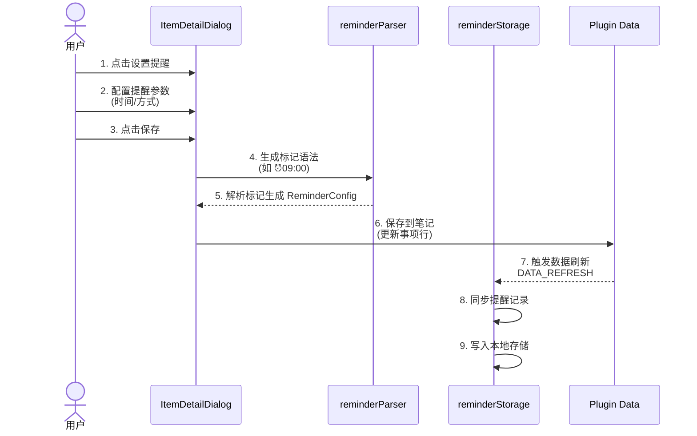
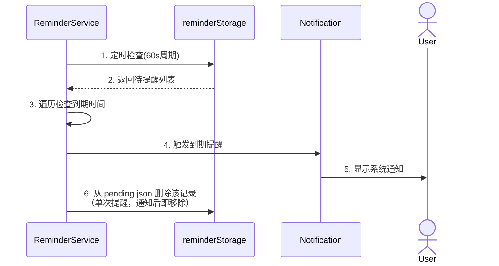
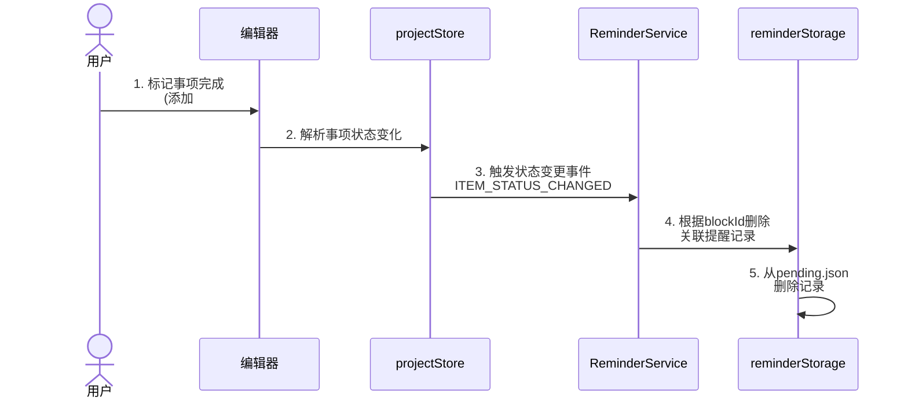
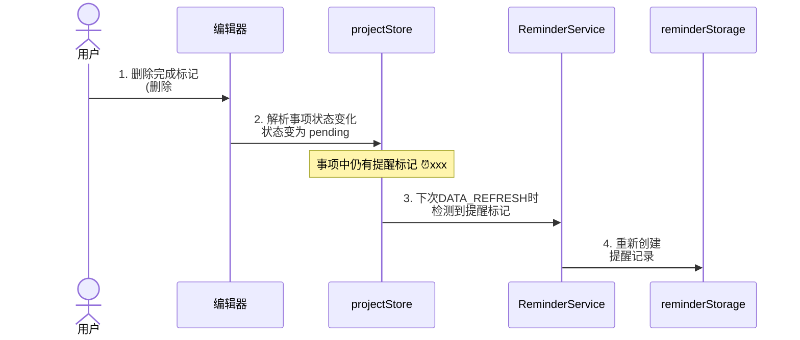
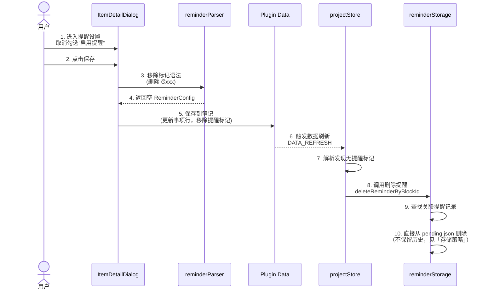
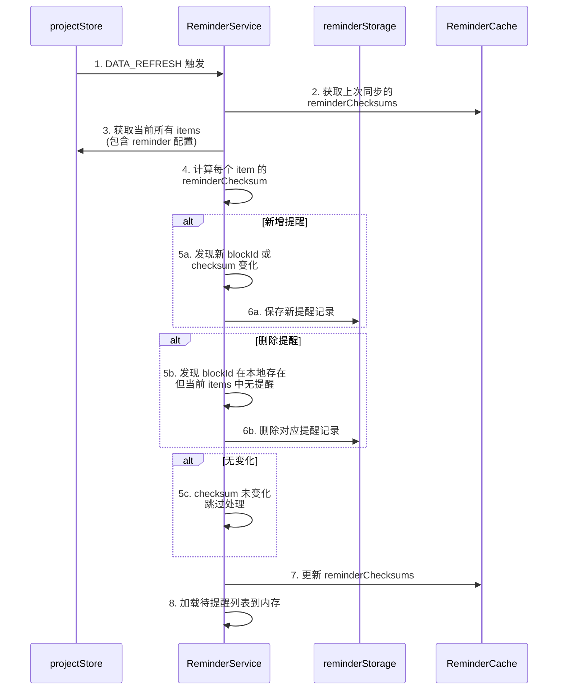

# 提醒功能设计

## 一、功能概述

为任务助手插件增加提醒功能，允许用户为事项设置提醒时间，在指定时间通过系统通知提醒用户。

### 1.1 核心理念

- **记录驱动**: 提醒作为事项的附加属性，不改变现有的记录驱动理念
- **无侵入式**: 使用标准 Markdown 格式扩展，保持数据可迁移性
- **单一提醒**: 一个事项只支持一个提醒时间，简化设计
- **可选功能**: 用户可选择是否为事项设置提醒

---

## 二、提醒标记语法

在现有事项格式基础上，使用 ⏰ 作为提醒标记。

### 交互方式

| 方式 | 触发 | 说明 |
|------|------|------|
| **UI 面板** | 事项详情 → 设置提醒 | 可视化时间选择器，自动生成本地化标记 |
| **右键菜单** | 右键点击事项 | 快捷设置：提前 5/10/30 分钟、1 小时 |
| **斜杠命令** | `/提醒` | 输入 `/提醒` 唤起时间选择器 |
| **手动输入** | 直接编辑 Markdown | 支持 ⏰HH:mm 或 ⏰-Xm 语法 |

### 2.1 基本语法

```markdown
事项内容 @2026-01-15 ⏰10:00              // 在指定日期当天 10:00 提醒
事项内容 @2026-01-15 ⏰10:00:00           // 同上，支持完整时间格式
事项内容 @2026-01-15 14:00:00~16:00:00 ⏰13:50   // 手动指定提醒时间
```

### 2.2 标记规则

- 使用 `⏰HH:mm` 或 `⏰HH:mm:ss` 格式标记提醒时间
- 提醒时间位于日期标记之后
- **一个事项只支持一个提醒时间**，多日期请使用多个事项块

### 2.3 提醒类型

| 类型 | 标记示例 | 说明 |
|------|----------|------|
| 绝对时间 | `⏰10:00` | 在指定日期的当天 10:00 提醒 |

> **注**：相对提醒（如提前10分钟）通过 UI 设置时自动计算为绝对时间存储。如需手动输入相对时间，使用 `⏰-10m` 语法，解析时基于事项日期转换为绝对时间。

> **与重复事项解耦**：提醒仅负责**单次**通知。重复规则（如每月、每周）和结束条件属于**事项层**，由 🔁 标记表达，用于「创建下次」功能。详见「重复事项与提醒解耦」章节。

---

## 三、与复杂日期格式的结合

### 3.1 单个日期 + 提醒

```markdown
事项内容 @2026-03-06 ⏰09:00
```

### 3.2 带时间范围的事项 + 提醒

**相对开始时间**（会前提醒）：
```markdown
周会 @2026-03-06 14:00:00~16:00:00 ⏰-10m   // 13:50 提醒（14:00 提前 10 分钟）
```

**相对结束时间**（会前提醒收尾）：
```markdown
周会 @2026-03-06 14:00:00~16:00:00 ⏰e-10m  // 15:50 提醒（16:00 提前 10 分钟）
```

**手动指定绝对时间**：
```markdown
事项内容 @2026-03-06 14:00:00~16:00:00 ⏰13:50  // 手动指定 13:50 提醒
```

### 3.3 日期范围 + 提醒

**限制**：日期范围事项只支持一个提醒时间，应用于范围内的每一天。如需不同日期不同提醒时间，请拆分为多个事项块。

```markdown
出差 @2026-03-10~03-12 ⏰08:00   // 每天 08:00 提醒
```

### 3.4 标记语法解析规则

**简化设计**：
- 一个事项只支持一个提醒时间
- 多日期用多个事项块（配合「创建下次」功能快速创建）

**解析优先级**：`parseReminderFromItemLine` 匹配顺序为 **relative > absolute**

```typescript
// 提醒标记模式：⏰HH:mm | ⏰-Xm
const REMINDER_PATTERN = /⏰\s*(?:-?\d+[mhd]|\d{2}:\d{2}(?::\d{2})?)/;
```

**内容提取**：在 `parseItemLine` 的 content 清理逻辑中增加 `replace(/\s*⏰[^\s@🔁]+/g, '')`，移除提醒标记避免显示在事项内容中。

---

## 四、重复事项与提醒解耦

### 4.0 设计决策

**重复事项**采用「多个 block」方式：每个 occurrence 为独立事项块，各自有 blockId、子块（链接、番茄钟等）。

**职责划分**：

| 层级 | 职责 | 标记 |
|------|------|------|
| **事项** | 重复规则、结束条件、「创建下次」 | `🔁每月`、`:until:2026-12-31`、`:count:10` |
| **提醒** | 本次何时通知 | `⏰14:00` |

**示例**：
```markdown
月度汇报 @2026-03-17 ⏰14:00 🔁每月:until:2026-12-31
```
- `⏰14:00` → 提醒：本次 14:00 通知
- `🔁每月` → 事项：创建下次时按每月
- `:until:2026-12-31` → 事项：创建下次时检查结束条件

**创建下次**：用户完成事项后，在事项详情中点击「创建下次」，系统根据 `🔁` 和结束条件创建新 block（如 `月度汇报 @2026-04-17 ⏰14:00 🔁每月:until:2026-12-31`），并继承 reminder 配置。

---

## 五、数据模型扩展

> **提醒与重复解耦**：以下为提醒专用模型，不含 repeat、endCondition。重复规则见「重复事项」PRD。

### 5.1 Item 模型扩展

```typescript
// 在 Item 模型中增加提醒字段
interface Item {
  // ... 现有字段
  reminder?: ReminderConfig;  // 单次提醒配置，见 9.1
  // repeatRule、endCondition 为事项层字段，见「重复事项」PRD
}
```

### 5.2 提醒记录

```typescript
// 提醒记录（用于存储到本地），每个 block 一条，单次提醒，见 9.2
interface ReminderRecord {
  id: string;
  blockId: string;         // 关联事项块 ID
  itemContent: string;
  projectName: string;
  taskName?: string;
  reminderTime: string;    // 提醒时间 HH:mm
  alertMode: ReminderAlertMode;
  nextReminderTime: number;  // 本次提醒时间戳（单次，无下次计算）
  notifiedCount: number;     // 通常为 0，通知后删除记录
  createdAt: number;
  updatedAt: number;
}
```

---

## 六、技术实现方案

### 6.1 架构设计

```
┌─────────────────────────────────────────────────────────────┐
│                        提醒功能模块                          │
├─────────────┬─────────────┬─────────────┬───────────────────┤
│   解析层     │   存储层     │   调度层     │     通知层        │
├─────────────┼─────────────┼─────────────┼───────────────────┤
│ • 解析提醒   │ • 本地存储   │ • 定时检查   │ • 系统通知        │
│   标记      │   提醒记录   │ • 提醒队列   │ • 思源消息        │
│ • 生成提醒   │ • 已通知     │ • 时间计算   │ • 声音提醒        │
│   任务      │   缓存      │             │                   │
└─────────────┴─────────────┴─────────────┴───────────────────┘
```

### 6.2 数据流转时序图

#### 6.2.1 提醒创建流程



#### 6.2.2 提醒触发流程



#### 6.2.3 事项状态变更流程

##### 场景 A：标记事项完成/放弃（删除提醒）



##### 场景 B：删除完成/放弃标记（重新创建提醒）



#### 6.2.4 删除提醒流程



#### 6.2.5 增量同步机制（解决频繁 DATA_REFRESH 问题）

##### 场景 A：普通增量同步



### 6.3 各层实现逻辑详解

#### 6.3.1 解析层 (reminderParser.ts)

**职责**：将 Markdown 提醒标记解析为 ReminderConfig（仅单次提醒）

**输入输出**：
- 输入：`string` (如 `"⏰09:00"` 或 `"⏰-10m"`)
- 输出：`ReminderConfig` 对象

**核心逻辑**：
```typescript
// 正则匹配规则（按优先级排序，仅支持单次提醒）
const PATTERNS = {
  // 相对结束时间: ⏰e-5m，基于事项结束时间计算
  relativeToEnd: /⏰e-(\d+)(分钟|m|小时|h|天|d)/i,
  // 相对开始时间: ⏰-5m，基于事项开始时间计算
  relativeToStart: /⏰-(\d+)(分钟|m|小时|h|天|d)/,
  // 绝对时间: ⏰09:00
  absolute: /⏰(\d{2}:\d{2})(?::\d{2})?/
};

// 解析流程
function parseReminderFromItemLine(line: string): ReminderConfig | undefined {
  const reminderMatch = line.match(/⏰[^@🔁]+/);
  if (!reminderMatch) return undefined;
  
  if (PATTERNS.relativeToEnd.test(reminderMatch[0])) {
    return parseRelativeReminder(reminderMatch[0], 'end');
  }
  if (PATTERNS.relativeToStart.test(reminderMatch[0])) {
    return parseRelativeReminder(reminderMatch[0], 'start');
  }
  if (PATTERNS.absolute.test(reminderMatch[0])) {
    return parseAbsoluteReminder(reminderMatch[0]);
  }
  return undefined;
}

// 相对提醒计算
function calculateReminderTime(
  item: Item,
  reminder: ReminderConfig
): number {
  const { date, startTime, endTime } = item;
  
  if (reminder.type === 'relative') {
    const baseTime = reminder.relativeTo === 'end' ? endTime : startTime;
    
    if (baseTime) {
      // 基于时间范围计算：日期 + 时间 - 偏移量
      const baseDateTime = new Date(`${date}T${baseTime}`);
      return baseDateTime.getTime() - reminder.offsetMinutes * 60 * 1000;
    } else {
      // 无时间范围，基于日期 00:00 计算
      const baseDate = new Date(date);
      return baseDate.getTime() - reminder.offsetMinutes * 60 * 1000;
    }
  }
  
  // 绝对时间...
}
```

**相对提醒语义明确化**：
- `⏰-10m`：**基于事项开始时间**提前 10 分钟提醒（默认行为）
- `⏰e-10m`：**基于事项结束时间**提前 10 分钟提醒（需要 e- 前缀）
- 无时间范围时：
  - `⏰-Xm`：相对 **00:00** 计算（前一天）
  - `⏰e-Xm`：相对 **23:59:59** 计算（当天）

#### 6.3.2 存储层 (reminderStorage.ts)

**职责**：管理提醒记录的持久化存储

**存储结构**：
```
插件数据目录/
├── reminders/
│   ├── pending.json      # 待提醒列表（按时间排序）
│   ├── checksums.json    # 增量同步 checksum 缓存
│   └── config.json       # 提醒功能配置
```

**存储策略**：
- **MVP 阶段**：`deleteReminderByBlockId` 直接从 `pending.json` 删除记录，**不保留历史**
- **理由**：简化实现、降低存储膨胀、符合「事项完成即结束」的语义
- **Phase 3+ 预留**：若需「已提醒历史」功能，可增加 `history.json`，保留策略为最近 N 条或最近 7 天

**核心逻辑**：
```typescript
// 数据流转
class ReminderStorage {
  // 保存提醒记录
  async saveReminder(plugin: Plugin, record: ReminderRecord): Promise<void> {
    const reminders = await this.loadPendingReminders(plugin);
    
    // 检查是否已存在（更新时按 id 匹配，新增时插入）
    const existingIndex = record.id
      ? reminders.findIndex(r => r.id === record.id)
      : -1;
    
    if (existingIndex >= 0) {
      // 更新现有记录
      reminders[existingIndex] = { ...reminders[existingIndex], ...record };
    } else {
      // 插入新记录（保持按时间排序）
      const insertIndex = reminders.findIndex(r => r.nextReminderTime > record.nextReminderTime);
      if (insertIndex >= 0) {
        reminders.splice(insertIndex, 0, record);
      } else {
        reminders.push(record);
      }
    }
    
    await plugin.saveData('reminders/pending.json', reminders);
  }
  
  // 获取待提醒列表（已按时间排序，过滤已过期）
  async getPendingReminders(plugin: Plugin): Promise<ReminderRecord[]> {
    const reminders = await plugin.loadData('reminders/pending.json') || [];
    const now = Date.now();
    return reminders.filter(r => r.nextReminderTime > now);
  }
  
  // 通知后删除记录（单次提醒，无下次）
  async deleteAfterNotified(plugin: Plugin, reminderId: string): Promise<void> {
    const reminders = await plugin.loadData('reminders/pending.json') || [];
    const filtered = reminders.filter(r => r.id !== reminderId);
    await plugin.saveData('reminders/pending.json', filtered);
  }
  
  // 删除提醒记录（当用户删除事项中的提醒标记或事项完成/放弃时调用）
  async deleteReminderByBlockId(plugin: Plugin, blockId: string): Promise<void> {
    const reminders = await this.loadAllReminders(plugin);
    const indexesToRemove: number[] = [];
    
    // 查找所有关联的提醒记录
    reminders.forEach((reminder, index) => {
      if (reminder.blockId === blockId) {
        indexesToRemove.push(index);
      }
    });
    
    // 从后往前删除，避免索引错乱
    for (let i = indexesToRemove.length - 1; i >= 0; i--) {
      reminders.splice(indexesToRemove[i], 1);
    }
    
    await plugin.saveData('reminders/pending.json', reminders);
  }
  
  // 根据 blockId 获取提醒记录
  async getRemindersByBlockId(plugin: Plugin, blockId: string): Promise<ReminderRecord[]> {
    const reminders = await this.loadPendingReminders(plugin);
    return reminders.filter(r => r.blockId === blockId);
  }
  
  // 获取所有提醒记录（用于 blockId 变化检测，仅从 pending.json 读取）
  async loadAllReminders(plugin: Plugin): Promise<ReminderRecord[]> {
    return await plugin.loadData('reminders/pending.json') || [];
  }
}
```

#### 6.3.3 调度层 (reminderService.ts)

**职责**：定时检查并触发提醒，实现增量同步避免频繁 DATA_REFRESH 影响性能

**状态流转**（单次提醒）：
```
┌──────────┐    启动服务     ┌──────────┐    检查到期     ┌──────────┐
│  初始化   │───────────────>│  待提醒   │───────────────>│  已通知   │
│          │                │          │                │  (删除)   │
└──────────┘                └──────────┘                └──────────┘
```

**增量同步策略**：

| 策略 | 说明 | 实现方式 |
|------|------|----------|
| Checksum 比对 | 为每个提醒配置生成唯一指纹 | `hash(blockId + date + reminderConfig)` |
| 内存缓存 | 缓存上次同步的 checksums | `Map<blockId, checksum>` |
| 增量更新 | 只处理变化的提醒 | 新增/删除/修改 |
| 防抖处理 | 避免短时间内重复同步 | 300ms 防抖 |

**关键修正**：checksum 必须包含日期字段，否则事项日期修改后提醒时间不会更新。

**核心逻辑**：
```typescript
class ReminderService {
  private checkInterval: NodeJS.Timeout | null = null;
  private reminders: ReminderRecord[] = [];
  private reminderChecksums: Map<string, string> = new Map(); // blockId -> checksum
  private syncDebounceTimer: NodeJS.Timeout | null = null;
  private readonly SYNC_DEBOUNCE_MS = 300;
  private readonly CHECK_INTERVAL_MS = 60000; // 60秒检查一次（优化性能）
  
  start(plugin: Plugin): void {
    // 1. 加载上次同步的 checksums
    this.loadChecksums(plugin);
    
    // 2. 加载待提醒列表
    this.loadReminders(plugin);
    
    // 3. 启动定时检查（60秒）
    this.checkInterval = setInterval(() => {
      this.checkReminders(plugin);
    }, this.CHECK_INTERVAL_MS);
    
    // 4. 请求通知权限
    requestNotificationPermission();
  }
  
  /**
   * 增量同步提醒（带防抖）
   * 解决频繁 DATA_REFRESH 导致的性能问题
   */
  async syncRemindersFromProjects(
    plugin: Plugin,
    items: Item[]
  ): Promise<void> {
    // 清除之前的定时器，实现防抖
    if (this.syncDebounceTimer) {
      clearTimeout(this.syncDebounceTimer);
    }
    
    this.syncDebounceTimer = setTimeout(async () => {
      await this.performIncrementalSync(plugin, items);
    }, this.SYNC_DEBOUNCE_MS);
  }
  
  /**
   * 执行增量同步
   */
  private async performIncrementalSync(
    plugin: Plugin,
    items: Item[]
  ): Promise<void> {
    const currentChecksums = new Map<string, string>();
    const itemsWithReminder = items.filter(item => item.reminder?.enabled);
    
    // 1. 计算当前所有提醒的 checksum（包含日期）
    for (const item of itemsWithReminder) {
      const checksum = this.calculateReminderChecksum(item);
      currentChecksums.set(item.blockId, checksum);
    }
    
    // 2. 找出新增的提醒
    for (const [blockId, checksum] of currentChecksums) {
      const oldChecksum = this.reminderChecksums.get(blockId);
      if (oldChecksum !== checksum) {
        // 新增或修改的提醒
        const item = itemsWithReminder.find(i => i.blockId === blockId);
        if (item) {
          await this.upsertReminder(plugin, item);
        }
      }
    }
    
    // 3. 找出删除的提醒
    for (const [blockId] of this.reminderChecksums) {
      if (!currentChecksums.has(blockId)) {
        // 提醒被删除
        await reminderStorage.deleteReminderByBlockId(plugin, blockId);
      }
    }
    
    // 4. 更新 checksums 缓存
    this.reminderChecksums = currentChecksums;
    await this.saveChecksums(plugin);
    
    // 5. 重新加载待提醒列表到内存
    await this.loadReminders(plugin);
  }
  
  /**
   * 计算提醒配置的 checksum（关键：必须包含日期）
   */
  private calculateReminderChecksum(item: Item): string {
    const reminder = item.reminder!;
    // 重要：checksum 必须包含日期，否则修改日期后提醒时间不更新
    const data = { 
      date: item.date,  // 加入日期字段
      time: reminder.time, 
      alertMode: reminder.alertMode 
    };
    return hashString(JSON.stringify(data));
  }
  
  /**
   * 新增或更新提醒记录
   */
  private async upsertReminder(plugin: Plugin, item: Item): Promise<void> {
    const existing = await reminderStorage.getRemindersByBlockId(plugin, item.blockId);
    
    if (existing.length > 0) {
      for (const reminder of existing) {
        reminder.reminderTime = item.reminder!.time;
        reminder.alertMode = item.reminder!.alertMode;
        reminder.nextReminderTime = this.calculateReminderTime(item);
        await reminderStorage.saveReminder(plugin, reminder);
      }
    } else {
      const newReminder: ReminderRecord = {
        id: generateId(),
        blockId: item.blockId,
        itemContent: item.content,
        projectName: item.projectName,
        taskName: item.taskName,
        reminderTime: item.reminder!.time,
        alertMode: item.reminder!.alertMode,
        nextReminderTime: this.calculateReminderTime(item),
        notifiedCount: 0,
        createdAt: Date.now(),
        updatedAt: Date.now()
      };
      await reminderStorage.saveReminder(plugin, newReminder);
    }
  }
  
  private async checkReminders(plugin: Plugin): Promise<void> {
    const now = Date.now();
    
    for (const reminder of this.reminders) {
      if (reminder.nextReminderTime <= now) {
        await this.triggerNotification(plugin, reminder);
        await reminderStorage.deleteAfterNotified(plugin, reminder.id);
      }
    }
    
    await this.loadReminders(plugin);
  }
  
  // 监听事项状态变化
  async onItemStatusChanged(
    plugin: Plugin,
    blockId: string,
    status: ItemStatus
  ): Promise<void> {
    const reminders = await reminderStorage.getRemindersByBlockId(plugin, blockId);
    
    if (reminders.length === 0) return;
    
    if (status === 'completed' || status === 'abandoned') {
      // 事项完成/放弃，直接删除提醒记录
      await reminderStorage.deleteReminderByBlockId(plugin, blockId);
    }
    // 事项恢复为待办时，不需要处理，因为提醒标记还在事项中
    // 下次 DATA_REFRESH 会自动重新创建提醒记录
    
    // 更新内存中的提醒列表
    await this.loadReminders(plugin);
  }
  
  private async loadChecksums(plugin: Plugin): Promise<void> {
    const data = await plugin.loadData('reminders/checksums.json');
    if (data) {
      this.reminderChecksums = new Map(Object.entries(data));
    }
  }
  
  private async saveChecksums(plugin: Plugin): Promise<void> {
    const data = Object.fromEntries(this.reminderChecksums);
    await plugin.saveData('reminders/checksums.json', data);
  }
  
  private async loadReminders(plugin: Plugin): Promise<void> {
    this.reminders = await reminderStorage.getPendingReminders(plugin);
  }
}
```

#### 6.3.4 通知层 (notification.ts)

**职责**：显示系统通知

**通知类型**：
| 类型 | 触发条件 | 显示内容 |
|------|----------|----------|
| 即时通知 | 提醒到期 | 事项内容 + 项目名称 |
| 点击跳转 | 用户点击通知 | 打开对应笔记位置 |

**核心逻辑**：
```typescript
export function showItemReminderNotification(
  reminder: ReminderRecord,
  onClick: () => void
): Notification | null {
  const title = `⏰ ${reminder.projectName}`;
  const body = reminder.taskName 
    ? `${reminder.taskName}: ${reminder.itemContent}`
    : reminder.itemContent;
  
  return showSystemNotification(title, body, {
    tag: `reminder-${reminder.id}`,
    icon: '/plugins/siyuan-plugin-bullet-journal/icon.png',
    onClick: () => {
      // 跳转到笔记对应位置
      openBlockById(reminder.blockId);
      onClick();
    }
  });
}
```

### 6.4 核心模块 API 摘要

#### 6.4.1 解析模块 (src/parser/reminderParser.ts)

```typescript
/**
 * 从事项行解析提醒信息
 */
export function parseReminderFromItemLine(line: string): ReminderConfig | undefined {
  // 1. 匹配提醒标记 ⏰HH:mm 或 ⏰HH:mm:ss（绝对时间）
  // 2. 匹配相对开始时间 ⏰-Xm (分钟) 或 ⏰-Xh (小时)
  // 3. 匹配相对结束时间 ⏰e-Xm 或 ⏰e-Xh（e = end）
  // 4. 返回 ReminderConfig（单次提醒）
}

/**
 * 计算实际提醒时间
 * @param item 事项对象（包含 date, startTime, endTime）
 * @param reminder 提醒配置
 * @returns 提醒时间戳
 * 
 * 相对提醒计算：
 * - ⏰-10m: 基于 startTime 或日期 00:00 提前 10 分钟
 * - ⏰e-10m: 基于 endTime 或日期 23:59:59 提前 10 分钟
 */
export function calculateReminderTime(
  item: Item,
  reminder: ReminderConfig
): number;
```

#### 6.4.2 存储模块 (src/utils/reminderStorage.ts)

```typescript
/**
 * 保存提醒记录
 */
export async function saveReminder(
  plugin: Plugin,
  reminder: ReminderRecord
): Promise<void>;

/**
 * 获取所有待提醒记录（过滤已过期）
 */
export async function getPendingReminders(
  plugin: Plugin
): Promise<ReminderRecord[]>;

/**
 * 获取所有提醒记录（用于 blockId 变化检测）
 */
export async function loadAllReminders(
  plugin: Plugin
): Promise<ReminderRecord[]>;

/**
 * 通知后删除记录（单次提醒）
 */
export async function deleteAfterNotified(
  plugin: Plugin,
  reminderId: string
): Promise<void>;
```

#### 6.4.3 调度模块 (src/services/reminderService.ts)

```typescript
export class ReminderService {
  private checkInterval: ReturnType<typeof setInterval> | null = null;
  private readonly CHECK_INTERVAL_MS = 60000; // 60秒检查一次（优化性能）

  /**
   * 启动提醒服务
   */
  start(plugin: Plugin): void {
    // 1. 加载所有待提醒事项
    // 2. 启动定时检查（60秒）
    // 3. 请求通知权限
  }

  /**
   * 停止提醒服务
   */
  stop(): void {
    // 清理定时器
  }

  /**
   * 检查并触发提醒
   */
  private async checkReminders(plugin: Plugin): Promise<void> {
    // 1. 获取当前时间
    // 2. 遍历待提醒事项
    // 3. 触发到期提醒，通知后删除记录
  }

  /**
   * 同步项目数据中的提醒
   */
  async syncRemindersFromProjects(
    plugin: Plugin,
    items: Item[]
  ): Promise<void> {
    // 1. 解析所有事项的提醒配置
    // 2. 生成提醒记录（使用 blockId 作为关联键）
    // 3. 保存到存储
  }

  /**
   * 根据事项状态更新提醒
   * 当事项完成或放弃时，直接删除关联提醒记录
   */
  async onItemStatusChanged(
    plugin: Plugin,
    blockId: string,
    status: 'pending' | 'completed' | 'abandoned'
  ): Promise<void> {
    if (status === 'completed' || status === 'abandoned') {
      await reminderStorage.deleteReminderByBlockId(plugin, blockId);
    }
    // 恢复为 pending 时，下次 DATA_REFRESH 会重新创建提醒
  }
}
```

#### 6.4.4 通知模块 (扩展 src/utils/notification.ts)

```typescript
/**
 * 显示事项提醒通知
 */
export function showItemReminderNotification(
  itemContent: string,
  projectName: string,
  taskName?: string,
  onClick?: () => void
): Notification | null;
```

### 6.5 与 performance-optimization 的集成

提醒模块需与 [performance-optimization.md](./performance-optimization.md) 的增量更新架构协同：

| 时机 | 触发源 | 处理方式 |
|------|--------|----------|
| 全量刷新 | `refresh()` 完成 | `DATA_REFRESH` 后，ReminderService 订阅并执行 `syncRemindersFromProjects(projectStore.items)` |
| 定向刷新 | ws-main `rootIDs` | Phase 2.5 实现后，仅对 `rootIDs` 对应文档的 items 做提醒同步 |
| 防抖 | 300ms | ReminderService 内部防抖，取消时立即执行 |

**Checksum 解耦**：`reminderChecksums` 独立存储于 `reminders/checksums.json`，不依赖 `DocumentCache.updated`，仅依赖 items 的 `blockId` + `date` + `reminder` 配置。

**关键修正**：checksum 必须包含 `date` 字段，否则修改事项日期后提醒时间不会重新计算。

---

## 七、集成点

### 7.1 在事项解析中集成 (src/parser/lineParser.ts)

修改 `parseItemLine` 函数，增加提醒解析：

1. **内容清理**：在 content 清理逻辑中增加 `.replace(/\s*⏰[^\s@🔁]+/g, '')` 移除提醒标记
2. **解析提醒**：调用 `parseReminderFromItemLine(line)` 获取 `ReminderConfig`
3. **生成 Item**：为每个日期生成 Item 时包含 `reminder` 字段（**一个事项只支持一个提醒时间**）

### 7.2 在插件主类中集成 (src/index.ts)

```typescript
export default class TaskAssistantPlugin extends Plugin {
  private reminderService: ReminderService;

  async onload() {
    // ... 现有初始化逻辑

    // 初始化提醒服务
    this.reminderService = new ReminderService();
    this.reminderService.start(this);

    // 监听数据刷新，同步提醒
    eventBus.on(Events.DATA_REFRESH, () => {
      const projectStore = useProjectStore(getSharedPinia()!);
      this.reminderService.syncRemindersFromProjects(this, projectStore.items);
    });
  }

  onunload() {
    // ... 现有清理逻辑
    this.reminderService?.stop();
  }
}
```

---

## 八、UI 组件

### 8.1 提醒设置弹框 (src/components/dialog/ReminderSettingDialog.vue)

```vue
<template>
  <div class="reminder-setting-dialog">
    <!-- 启用提醒开关 -->
    <div class="setting-item">
      <div class="setting-label">
        <span>启用提醒</span>
      </div>
      <div class="setting-value">
        <SySwitch v-model="enabled" />
      </div>
    </div>

    <!-- 提醒时间设置 -->
    <div class="setting-item" v-if="enabled">
      <div class="setting-label">
        <span class="emoji">⏰</span>
        <span>提醒时间</span>
      </div>
      <div class="setting-value" @click="showTimePicker = true">
        {{ reminderTime }}
        <SyIcon name="iconRight" />
      </div>
    </div>

    <!-- 提醒方式（提前/准时） -->
    <div class="setting-item" v-if="enabled">
      <div class="setting-label">
        <span>提醒方式</span>
      </div>
      <div class="setting-value" @click="showAlertModePicker = true">
        {{ alertModeLabel }}
        <SyIcon name="iconRight" />
      </div>
    </div>

    <!-- 操作按钮 -->
    <div class="dialog-actions">
      <SyButton type="primary" @click="save">保存</SyButton>
      <SyButton @click="cancel">取消</SyButton>
    </div>
  </div>
</template>
```

### 8.2 提醒方式选择弹框

```vue
<template>
  <div class="alert-mode-picker">
    <div 
      v-for="mode in alertModes" 
      :key="mode.value"
      class="picker-item"
      :class="{ active: selectedMode === mode.value }"
      @click="selectMode(mode.value)"
    >
      <span>{{ mode.label }}</span>
      <SyIcon name="iconCheck" v-if="selectedMode === mode.value" />
    </div>
    
    <!-- 自定义选项 -->
    <div class="picker-item custom" @click="showCustomPicker = true">
      <span>自定义</span>
      <SyIcon name="iconRight" />
    </div>
  </div>
</template>

<script setup>
const alertModes = [
  { value: 'ontime', label: '准时' },
  { value: 'before5m', label: '提前 5 分钟' },
  { value: 'before30m', label: '提前 30 分钟' },
  { value: 'before1h', label: '提前 1 小时' },
  { value: 'before1d', label: '提前 1 天' },
];
</script>
```

### 8.3 事项详情弹框集成提醒入口

```vue
<template>
  <!-- 在 ItemDetailDialog 中添加提醒设置入口 -->
  <div class="item-detail-dialog">
    <!-- 现有内容 -->
    
    <!-- 提醒设置入口 -->
    <div class="reminder-entry" @click="openReminderSetting">
      <div class="entry-left">
        <span class="emoji" :class="{ active: hasReminder }">⏰</span>
        <span>{{ reminderText }}</span>
      </div>
      <SyIcon name="iconRight" />
    </div>
  </div>
</template>
```

---

## 九、数据模型（完整版）

### 9.1 提醒配置模型（单次提醒）

```typescript
// 提醒方式
type ReminderAlertMode = 
  | { type: 'ontime' }
  | { type: 'before'; minutes: number; }
  | { type: 'custom'; minutes: number; };

// 提醒配置（不含 repeat、endCondition，已解耦至事项层）
interface ReminderConfig {
  enabled: boolean;
  type: 'absolute' | 'relative';
  time?: string;                   // 绝对时间 HH:mm（type='absolute' 时使用）
  alertMode?: ReminderAlertMode;   // 提醒方式（type='absolute' 时使用）
  // 相对提醒专用字段
  relativeTo?: 'start' | 'end';    // 相对开始时间还是结束时间
  offsetMinutes?: number;          // 偏移分钟数（正数表示提前）
}

// 扩展 Item 类型
interface Item {
  // ... 现有字段
  reminder?: ReminderConfig;
}
```

### 9.2 提醒记录模型

```typescript
interface ReminderRecord {
  id: string;
  blockId: string;
  itemContent: string;
  projectName: string;
  taskName?: string;
  reminderTime: string;       // HH:mm
  alertMode: ReminderAlertMode;
  nextReminderTime: number;   // 本次提醒时间戳
  notifiedCount: number;
  createdAt: number;
  updatedAt: number;
}
```

---

## 十、标记语法映射（国际化）

将 UI 设置映射到 Markdown 标记，**仅提醒相关**（重复与结束条件见「重复事项」PRD）：

### 10.1 提醒标记

| UI 设置 | 标记 | 示例 |
|---------|------|------|
| 绝对时间 08:00 | `⏰08:00` | `事项 @2026-03-17 ⏰08:00` |
| 相对开始时间提前 5 分钟 | `⏰-5m` | `周会 @2026-03-17 14:00~16:00 ⏰-5m` |
| 相对开始时间提前 30 分钟 | `⏰-30m` | `周会 @2026-03-17 14:00~16:00 ⏰-30m` |
| 相对开始时间提前 1 小时 | `⏰-1h` | `周会 @2026-03-17 14:00~16:00 ⏰-1h` |
| 相对开始时间提前 1 天 | `⏰-1d` | `事项 @2026-03-17 ⏰-1d` |
| 相对结束时间提前 10 分钟 | `⏰e-10m` | `周会 @2026-03-17 14:00~16:00 ⏰e-10m` |
| 相对结束时间提前 30 分钟 | `⏰e-30m` | `周会 @2026-03-17 14:00~16:00 ⏰e-30m` |

### 10.2 交互方式支持

| 方式 | 触发 | 说明 |
|------|------|------|
| **UI 面板** | 事项详情 → 设置提醒 | 可视化时间选择器，自动生成本地化标记 |
| **右键菜单** | 右键点击事项 | 快捷选项：提前 5/10/30 分钟、1 小时 |
| **斜杠命令** | `/提醒` | 输入 `/提醒` 唤起时间选择器 |
| **手动输入** | 直接编辑 Markdown | 支持完整语法 |

### 10.3 相对提醒语义

**默认行为（相对开始时间）**：

| 标记 | 计算基准 | 适用场景 | 示例 |
|------|----------|----------|------|
| `⏰-10m` | 事项开始时间提前 10 分钟 | 有时间范围的事项 | `@2026-03-17 14:00~16:00 ⏰-10m` = 13:50:00 提醒 |
| `⏰-1h` | 事项开始时间提前 1 小时 | 需要准备时间 | `@2026-03-17 14:00~16:00 ⏰-1h` = 13:00:00 提醒 |
| `⏰-1d` | 事项日期 00:00 提前 1 天 | 提前一天准备 | `@2026-03-17 ⏰-1d` = 2026-03-16 00:00:00 提醒 |

**相对结束时间（e- 前缀）**：

| 标记 | 计算基准 | 适用场景 | 示例 |
|------|----------|----------|------|
| `⏰e-10m` | 事项结束时间提前 10 分钟 | 会议结束前提醒 | `@2026-03-17 14:00~16:00 ⏰e-10m` = 15:50:00 提醒 |
| `⏰e-30m` | 事项结束时间提前 30 分钟 | 准备收尾工作 | `@2026-03-17 14:00~16:00 ⏰e-30m` = 15:30:00 提醒 |

**计算规则详细说明**：

```
事项：周会 @2026-03-17 14:00~16:00

⏰-10m  → 14:00 - 10m = 13:50:00（会前准备）
⏰e-10m → 16:00 - 10m = 15:50:00（准备收尾）

事项：跨天会议 @2026-03-17 22:00~2026-03-18 02:00

⏰-10m  → 22:00 - 10m = 21:50:00（3月17日）
⏰e-10m → 02:00 - 10m = 01:50:00（3月18日，基于实际结束时间）

事项：提交报告 @2026-03-17（无时间范围）

⏰-10m  → 基于日期 00:00 - 10m = 前一天 23:50:00
⏰e-10m → 基于日期 23:59:59 - 10m = 当天 23:49:59 → 取整 23:49:00
```

**关键规则**：
- `⏰-Xm`：相对 **startTime** 或 **00:00** 计算
- `⏰e-Xm`：相对 **endTime** 或 **23:59:59** 计算
- **跨天事项正常处理**：基于实际的 endTime 计算（如 02:00-10m=01:50:00）
- **精度统一**：秒数统一为 **00**

**关键规则**：
- `⏰-Xm`：相对 **startTime** 或 **00:00** 计算
- `⏰e-Xm`：相对 **endTime** 或 **23:59:59** 计算
- **跨天事项正常处理**：基于实际的 endTime 计算（如 02:00-10m=01:50）
- **精度统一**：秒数统一为 **00**（如 13:50:00）

**建议**：
- 有时间范围的事项：使用相对提醒更灵活
- 无时间范围的事项：使用绝对时间 `⏰HH:mm` 更清晰
- UI 设置时：根据用户选择自动转换为合适的标记

### 10.3 标记语法顺序约定

```
内容 @日期 [⏰提醒时间] [🔁重复规则] [其他标签]
```

**示例**：
```markdown
月度汇报 @2026-03-17 ⏰14:00 🔁每月:until:2026-12-31
```

---

## 十一、文件结构

```
src/
├── parser/
│   ├── lineParser.ts                  # 扩展：增加提醒标记解析
│   └── reminderParser.ts              # 提醒标记解析（单次）
├── services/
│   └── reminderService.ts             # 提醒调度服务
├── utils/
│   ├── notification.ts                # 扩展现有通知功能
│   └── reminderStorage.ts             # 提醒数据存储
├── components/
│   ├── dialog/
│   │   ├── ItemDetailDialog.vue       # 扩展现有弹框（添加提醒入口）
│   │   └── ReminderSettingDialog.vue  # 提醒设置主弹框
│   └── settings/
│       └── ReminderConfigSection.vue  # 提醒设置面板
└── types/
    └── reminder.ts                    # 提醒相关类型定义
```

---

## 十二、实现步骤

### 阶段一：基础功能（MVP）

1. **类型定义**
   - [ ] 创建 `src/types/reminder.ts` 定义完整提醒类型
   - [ ] 扩展 `Item` 类型，增加 `reminder` 字段

2. **解析功能**
   - [ ] 创建 `src/parser/reminderParser.ts`
   - [ ] 实现 `⏰HH:mm` 和 `⏰-Xm` 格式解析
   - [ ] 在 `lineParser.ts` 中集成提醒解析

3. **存储功能**
   - [ ] 创建 `src/utils/reminderStorage.ts`
   - [ ] 实现提醒记录的 CRUD 操作

4. **调度服务**
   - [ ] 创建 `src/services/reminderService.ts`
   - [ ] 实现定时检查逻辑（60秒间隔）
   - [ ] 集成到插件生命周期

5. **通知功能**
   - [ ] 扩展 `src/utils/notification.ts`
   - [ ] 实现事项提醒通知

### 阶段二：UI 功能

6. **提醒设置弹框**
   - [ ] 创建 `ReminderSettingDialog.vue`
   - [ ] 实现时间选择器
   - [ ] 实现提醒方式选择

7. **事项详情集成**
   - [ ] 扩展 `ItemDetailDialog.vue`
   - [ ] 添加提醒设置入口

8. **设置面板**
    - [ ] 创建 `ReminderConfigSection.vue`
    - [ ] 集成到设置对话框

### 阶段三：增强功能（可选）

9. **国际化**
    - [ ] 添加中文翻译
    - [ ] 添加英文翻译

---

## 十三、注意事项

1. **权限处理**
   - 首次使用提醒功能时请求通知权限
   - 权限被拒绝时提供友好提示（如视觉角标提醒）

2. **性能考虑**
   - 提醒检查间隔设置为 **60秒**（平衡及时性与资源占用）
   - 数据刷新时增量更新提醒记录
   - checksum 必须包含日期字段
   - 定期清理过期提醒记录

3. **数据一致性**
   - 事项修改时同步更新提醒记录
   - 事项删除时清理关联提醒
   - **关键**：修改事项日期后，提醒时间必须重新计算

4. **跨平台兼容**
   - 桌面端使用系统通知
   - 移动端使用思源内置通知
   - 浏览器环境检查 Notification API 支持

5. **事项状态与提醒处理**
   - 事项标记为 `#已完成`/`#done` 或 `#已放弃`/`#abandoned` 后，**直接删除提醒记录**（从 pending.json 移除，不保留历史）
   - **如果删除完成/放弃标记**，事项恢复为待办状态，下次 DATA_REFRESH 时会根据提醒标记重新创建提醒
   - 简化设计：不保留 `disabled` 状态，直接删除/重新创建

6. **简化设计原则**
   - **一个事项只支持一个提醒时间**
   - 多日期事项请拆分为多个事项块
   - 相对提醒建议仅在 UI 层使用，存储时转换为绝对时间

---

## 十四、验收标准

- [ ] 可以使用 `⏰HH:mm` 语法为事项设置提醒
- [ ] 支持相对开始时间 `⏰-Xm`/`⏰-Xh`/`⏰-Xd`
- [ ] 支持相对结束时间 `⏰e-Xm`/`⏰e-Xh`/`⏰e-Xd`
- [ ] 相对结束时间对无时间范围事项相对 23:59:59 计算
- [ ] 相对提醒秒数统一为 00
- [ ] 跨天事项基于实际 endTime 计算
- [ ] 支持 UI 面板、右键菜单、斜杠命令 `/提醒` 设置提醒
- [ ] 相对提醒正确基于事项时间范围计算
- [ ] 到达提醒时间时显示系统通知
- [ ] 点击通知可以跳转到对应事项
- [ ] 在事项详情弹框中可以设置/修改提醒
- [ ] 设置面板可以配置提醒功能开关
- [ ] 国际化支持（中英文）
- [ ] 事项完成或放弃后提醒自动删除
- [ ] 删除完成/放弃标记后提醒自动重新创建
- [ ] 修改事项日期后提醒时间自动重新计算（checksum 包含日期）
- [ ] 定时检查间隔为 60 秒
