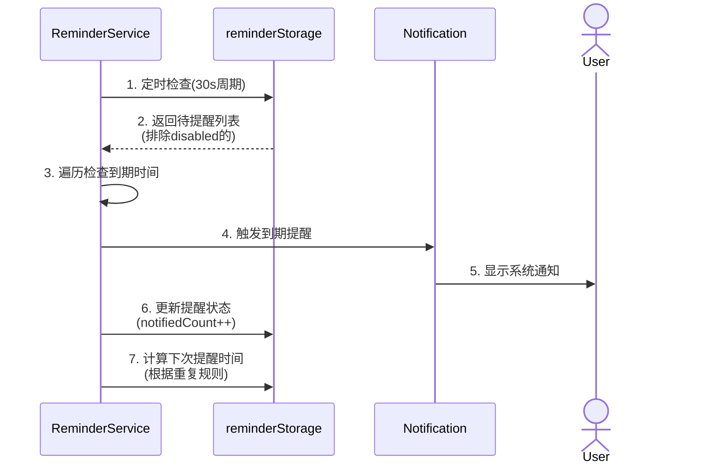
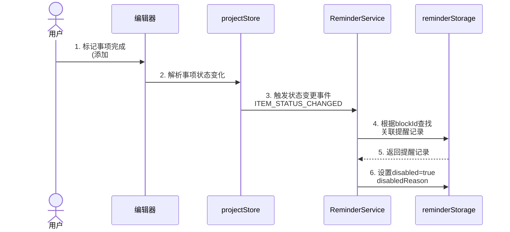
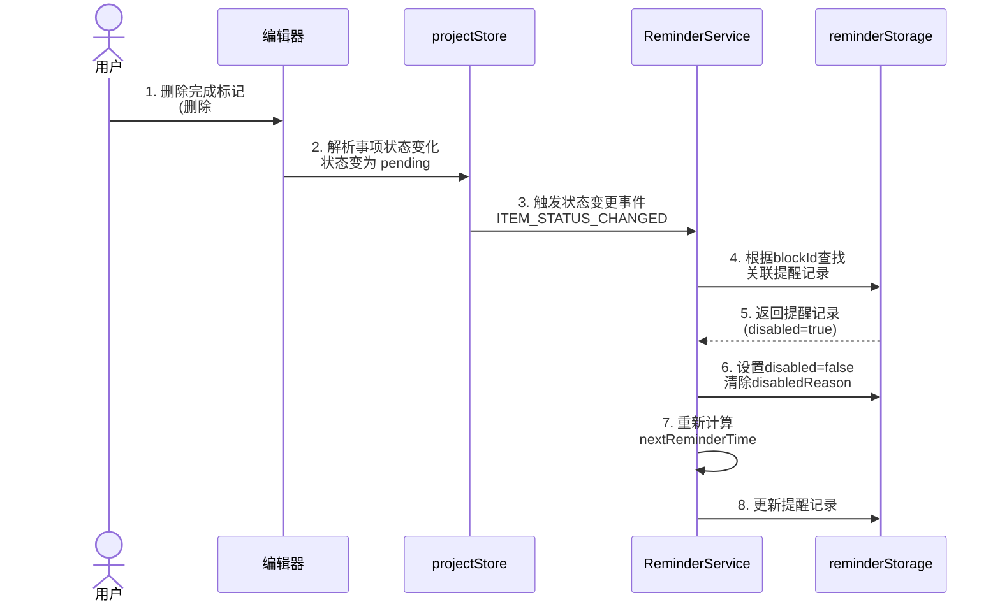
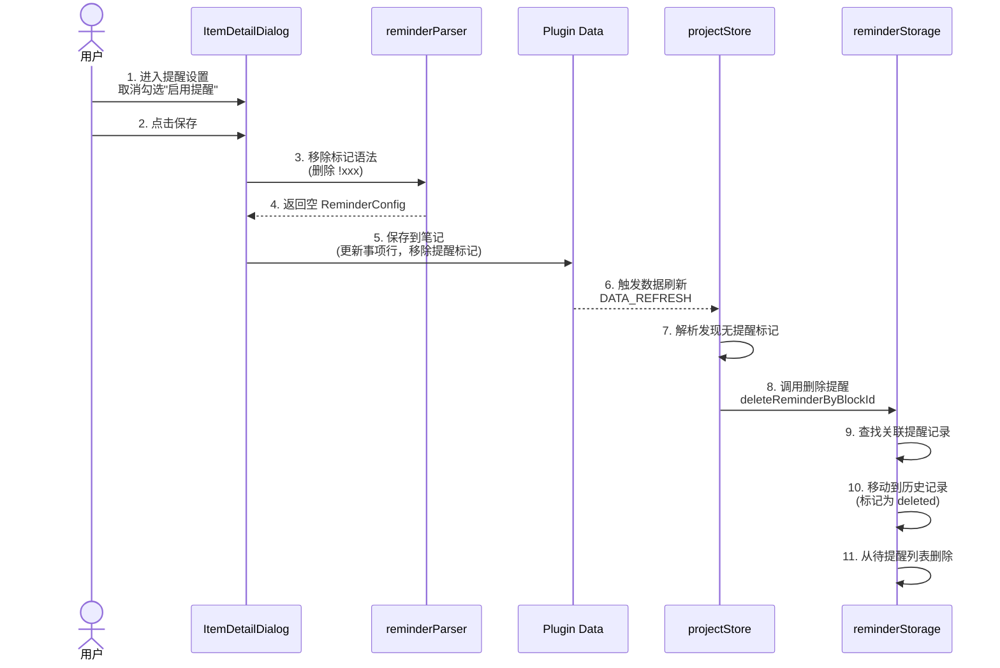
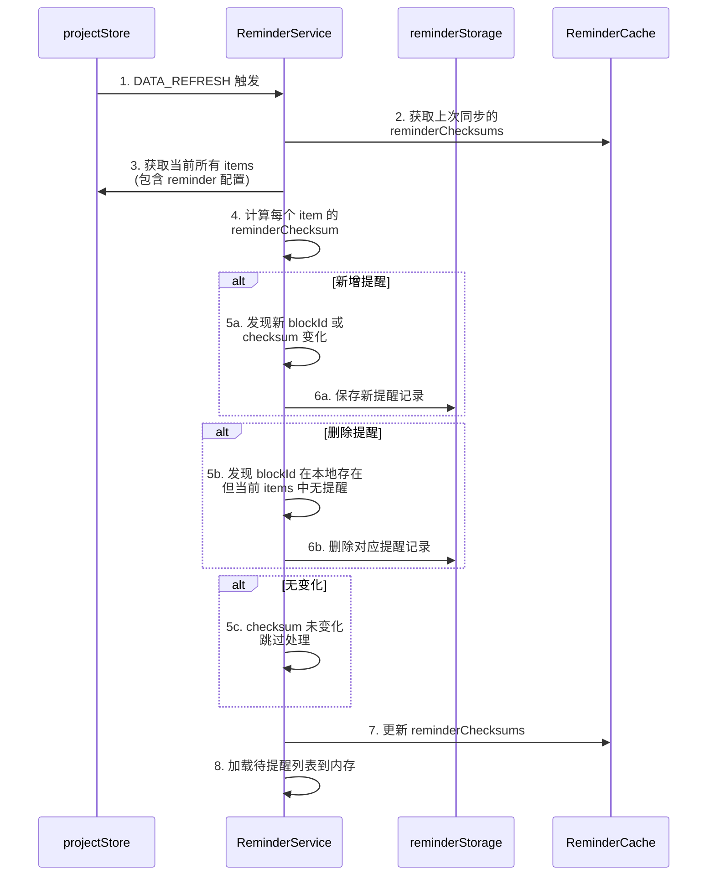
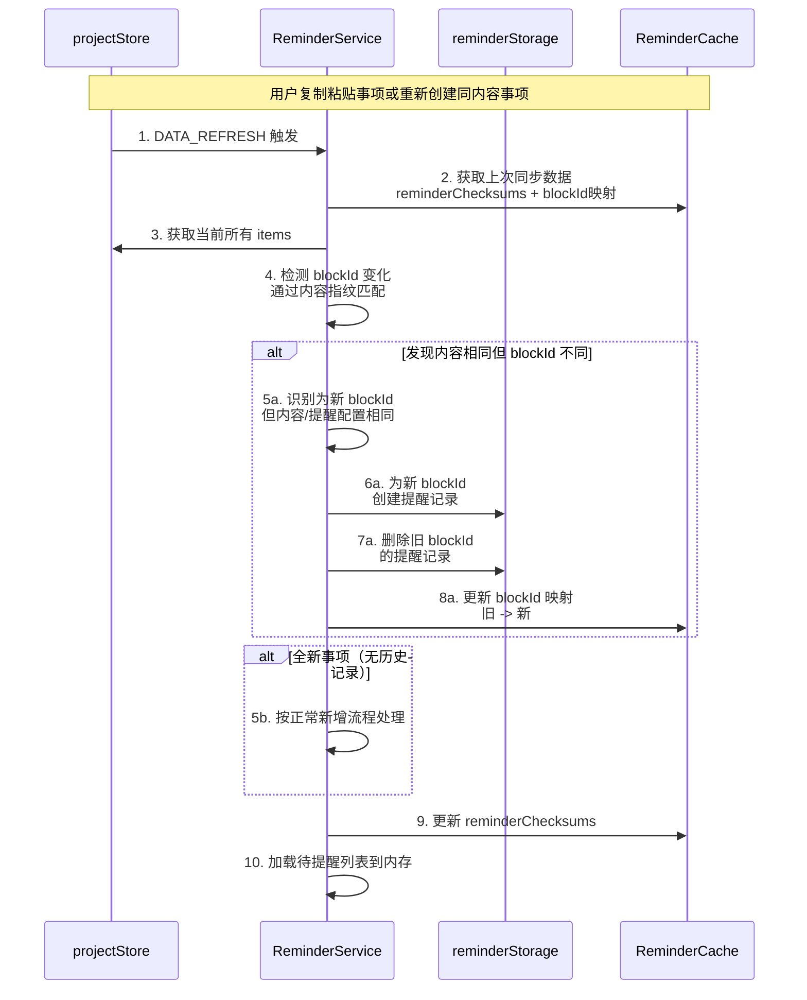

# 提醒功能设计

## 一、功能概述

为任务助手插件增加提醒功能，允许用户为事项设置提醒时间，在指定时间通过系统通知提醒用户。

### 1.1 核心理念

- **记录驱动**: 提醒作为事项的附加属性，不改变现有的记录驱动理念
- **无侵入式**: 使用标准 Markdown 格式扩展，保持数据可迁移性
- **可选功能**: 用户可选择是否为事项设置提醒

## 二、提醒标记语法

在现有事项格式基础上，增加提醒时间标记：

### 2.1 基本语法

```markdown
事项内容 @2026-01-15 !10:00              // 在指定日期当天 10:00 提醒
事项内容 @2026-01-15 !10:00:00           // 同上，支持完整时间格式
事项内容 @2026-01-15 14:00:00~16:00:00 !13:50   // 带时间范围的事项，13:50 提醒
```

### 2.2 标记规则

- 使用 `!HH:mm` 或 `!HH:mm:ss` 格式标记提醒时间
- 提醒时间位于日期标记之后
- 支持相对提醒（如 `!-10m` 表示提前10分钟）

### 2.3 提醒类型

| 类型 | 标记示例 | 说明 |
|------|----------|------|
| 绝对时间 | `!10:00` | 在指定时间的当天 10:00 提醒 |
| 相对时间 | `!-10m` | 提前10分钟提醒（相对于事项开始时间）|
| 重复提醒 | `!daily:09:00` | 每天 9:00 提醒（用于多日期事项）|

## 三、与复杂日期格式的结合

### 3.1 单个日期 + 提醒

```markdown
事项内容 @2026-03-06 !09:00
```

### 3.2 带时间范围的事项 + 提醒（提前10分钟）

```markdown
事项内容 @2026-03-06 14:00:00~16:00:00 !-10m
```

### 3.3 多日期 + 统一提醒时间（每个日期都会提醒）

```markdown
周会 @2026-03-06, 2026-03-13, 2026-03-20 !09:00
```

### 3.4 多日期 + 不同提醒时间（需要分别设置）

```markdown
周会 @2026-03-06 !09:00, 2026-03-13 !14:00
```

### 3.5 日期范围 + 统一提醒

```markdown
出差 @2026-03-10~03-12 !08:00
```

### 3.6 混合模式 + 相对提醒（每个日期都提前10分钟）

```markdown
整理资料 @2026-03-06 09:00:00~09:30:00, 2026-03-10~03-12 14:00:00~15:00:00 !-10m
```

这表示：
- 3月6日 08:50 提醒（09:00 提前10分钟）
- 3月10日、11日、12日 每天 13:50 提醒（14:00 提前10分钟）

### 3.7 提醒标记的位置规则

- 放在日期表达式之后
- 可以紧跟在单个日期后，也可以放在整行末尾
- 相对提醒 `!-Xm` 会基于每个日期的开始时间计算

## 四、数据模型扩展

### 4.1 Item 模型扩展

```typescript
// 在 Item 模型中增加提醒字段
interface Item {
  // ... 现有字段
  reminder?: {
    time: string;                    // 提醒时间 HH:mm:ss
    type: 'absolute' | 'relative';   // 提醒类型
    relativeMinutes?: number;        // 相对提醒的提前分钟数
    enabled: boolean;                // 是否启用
    notified?: boolean;              // 是否已通知（当日有效）
  };
}
```

### 4.2 提醒记录

```typescript
// 提醒记录（用于存储到本地）
interface ReminderRecord {
  id: string;              // 提醒 ID
  itemId: string;          // 关联事项 ID
  itemContent: string;     // 事项内容（快照）
  projectName: string;     // 项目名称
  taskName?: string;       // 任务名称
  reminderTime: number;    // 提醒时间戳
  notified: boolean;       // 是否已通知
  createdAt: number;       // 创建时间
}
```

## 五、技术实现方案

### 5.1 架构设计

```
┌─────────────────────────────────────────────────────────────┐
│                        提醒功能模块                          │
├─────────────┬─────────────┬─────────────┬───────────────────┤
│   解析层     │   存储层     │   调度层     │     通知层        │
├─────────────┼─────────────┼─────────────┼───────────────────┤
│ • 解析提醒   │ • 本地存储   │ • 定时检查   │ • 系统通知        │
│   标记      │   提醒记录   │ • 提醒队列   │ • 思源消息        │
│ • 生成提醒   │ • 已通知     │ • 时间计算   │ • 声音提醒        │
│   任务      │   缓存      │             │                   │
└─────────────┴─────────────┴─────────────┴───────────────────┘
```

### 5.2 数据流转时序图

#### 5.2.1 提醒创建流程


#### 5.2.2 提醒触发流程



#### 5.2.3 事项状态变更流程

##### 场景 A：标记事项完成/放弃（提醒失效）



##### 场景 B：删除完成/放弃标记（提醒恢复）



#### 5.2.4 删除提醒流程



#### 5.2.5 增量同步机制（解决频繁 DATA_REFRESH 问题）

##### 场景 A：普通增量同步



##### 场景 B：blockId 变化（事项被重新创建）



### 5.3 各层实现逻辑详解

#### 5.3.1 解析层 (reminderParser.ts)

**职责**：将 Markdown 标记解析为结构化数据

**输入输出**：
- 输入：`string` (如 `"!每天:09:00"`)
- 输出：`ReminderConfig` 对象

**核心逻辑**：
```typescript
// 正则匹配规则（按优先级排序）
const PATTERNS = {
  // 相对时间: !-5分钟 或 !-5m
  relative: /!-(\d+)(分钟|m|小时|h|天|d)/,
  
  // 重复提醒: !每天:09:00 或 !daily:09:00
  repeat: /!(每天|daily|每周|weekly|每月|monthly|每年|yearly|工作日|workday|节假日|holiday|农历|lunar|记忆|ebbinghaus):(\d{2}:\d{2})/,
  
  // 绝对时间: !09:00
  absolute: /!(\d{2}:\d{2})/
};

// 解析流程
function parseReminderFromItemLine(line: string): ReminderConfig | undefined {
  // 1. 提取提醒标记部分（从 ! 开始到行尾或下一个标记前）
  const reminderMatch = line.match(/![^@#]+/);
  if (!reminderMatch) return undefined;
  
  // 2. 按优先级匹配模式
  if (PATTERNS.relative.test(reminderMatch[0])) {
    return parseRelativeReminder(reminderMatch[0]);
  }
  if (PATTERNS.repeat.test(reminderMatch[0])) {
    return parseRepeatReminder(reminderMatch[0]);
  }
  if (PATTERNS.absolute.test(reminderMatch[0])) {
    return parseAbsoluteReminder(reminderMatch[0]);
  }
  
  return undefined;
}
```

#### 5.3.2 存储层 (reminderStorage.ts)

**职责**：管理提醒记录的持久化存储

**存储结构**：
```
插件数据目录/
├── reminders/
│   ├── pending.json      # 待提醒列表（按时间排序）
│   ├── history.json      # 历史提醒记录
│   └── config.json       # 提醒功能配置
```

**核心逻辑**：
```typescript
// 数据流转
class ReminderStorage {
  // 保存提醒记录
  async saveReminder(plugin: Plugin, record: ReminderRecord): Promise<void> {
    const reminders = await this.loadPendingReminders(plugin);
    
    // 检查是否已存在（根据 blockId + 时间）
    const existingIndex = reminders.findIndex(
      r => r.blockId === record.blockId && r.reminderTime === record.reminderTime
    );
    
    if (existingIndex >= 0) {
      // 更新现有记录
      reminders[existingIndex] = { ...reminders[existingIndex], ...record };
    } else {
      // 插入新记录（保持按时间排序）
      const insertIndex = reminders.findIndex(r => r.nextReminderTime > record.nextReminderTime);
      if (insertIndex >= 0) {
        reminders.splice(insertIndex, 0, record);
      } else {
        reminders.push(record);
      }
    }
    
    await plugin.saveData('reminders/pending.json', reminders);
  }
  
  // 获取待提醒列表（已按时间排序）
  async getPendingReminders(plugin: Plugin): Promise<ReminderRecord[]> {
    const reminders = await plugin.loadData('reminders/pending.json') || [];
    // 过滤掉 disabled 和已过期的
    return reminders.filter(r => 
      !r.disabled && r.nextReminderTime > Date.now()
    );
  }
  
  // 标记为已通知并更新下次提醒时间
  async markNotified(plugin: Plugin, reminderId: string): Promise<void> {
    const reminders = await this.loadPendingReminders(plugin);
    const reminder = reminders.find(r => r.id === reminderId);
    if (!reminder) return;
    
    reminder.notifiedCount++;
    reminder.lastNotifiedTime = Date.now();
    
    // 根据重复规则计算下次提醒时间
    if (reminder.repeat.type !== 'once') {
      reminder.nextReminderTime = calculateNextReminderTime(reminder);
    } else {
      // 一次性提醒，移动到历史记录
      await this.moveToHistory(plugin, reminder);
      reminders.splice(reminders.indexOf(reminder), 1);
    }
    
    await plugin.saveData('reminders/pending.json', reminders);
  }
  
  // 删除提醒记录（当用户删除事项中的提醒标记时调用）
  async deleteReminderByBlockId(plugin: Plugin, blockId: string): Promise<void> {
    const reminders = await this.loadPendingReminders(plugin);
    const indexesToRemove: number[] = [];
    
    // 查找所有关联的提醒记录
    reminders.forEach((reminder, index) => {
      if (reminder.blockId === blockId) {
        indexesToRemove.push(index);
      }
    });
    
    // 从后往前删除，避免索引错乱
    for (let i = indexesToRemove.length - 1; i >= 0; i--) {
      const reminder = reminders[indexesToRemove[i]];
      // 移动到历史记录（标记为已删除）
      await this.moveToHistory(plugin, { 
        ...reminder, 
        disabled: true, 
        disabledReason: 'deleted' 
      });
      reminders.splice(indexesToRemove[i], 1);
    }
    
    await plugin.saveData('reminders/pending.json', reminders);
  }
  
  // 根据 blockId 获取提醒记录
  async getRemindersByBlockId(plugin: Plugin, blockId: string): Promise<ReminderRecord[]> {
    const reminders = await this.loadPendingReminders(plugin);
    return reminders.filter(r => r.blockId === blockId);
  }
  
  // 移动到历史记录
  private async moveToHistory(plugin: Plugin, reminder: ReminderRecord): Promise<void> {
    const history = await plugin.loadData('reminders/history.json') || [];
    history.push({
      ...reminder,
      archivedAt: Date.now()
    });
    await plugin.saveData('reminders/history.json', history);
  }
}
```

#### 5.3.3 调度层 (reminderService.ts)

**职责**：定时检查并触发提醒，实现增量同步避免频繁 DATA_REFRESH 影响性能

**状态流转**：
```
┌──────────┐    启动服务     ┌──────────┐    检查到期     ┌──────────┐
│  初始化   │───────────────>│  待提醒   │───────────────>│  已通知   │
│          │                │          │                │          │
└──────────┘                └──────────┘                └────┬─────┘
                                                              │
                         ┌────────────────────────────────────┘
                         │ 计算下次时间
                         ▼
                    ┌──────────┐
                    │  下次提醒 │
                    │  (循环)   │
                    └──────────┘
```

**增量同步策略**：

| 策略 | 说明 | 实现方式 |
|------|------|----------|
| Checksum 比对 | 为每个提醒配置生成唯一指纹 | `hash(blockId + reminderConfig)` |
| 内存缓存 | 缓存上次同步的 checksums | `Map<blockId, checksum>` |
| 增量更新 | 只处理变化的提醒 | 新增/删除/修改 |
| 防抖处理 | 避免短时间内重复同步 | 300ms 防抖 |

**核心逻辑**：
```typescript
class ReminderService {
  private checkInterval: NodeJS.Timeout | null = null;
  private reminders: ReminderRecord[] = [];
  private reminderChecksums: Map<string, string> = new Map(); // blockId -> checksum
  private syncDebounceTimer: NodeJS.Timeout | null = null;
  private readonly SYNC_DEBOUNCE_MS = 300;
  
  start(plugin: Plugin): void {
    // 1. 加载上次同步的 checksums
    this.loadChecksums(plugin);
    
    // 2. 加载待提醒列表
    this.loadReminders(plugin);
    
    // 3. 启动定时检查（30秒）
    this.checkInterval = setInterval(() => {
      this.checkReminders(plugin);
    }, 30000);
    
    // 4. 请求通知权限
    requestNotificationPermission();
  }
  
  /**
   * 增量同步提醒（带防抖）
   * 解决频繁 DATA_REFRESH 导致的性能问题
   */
  async syncRemindersFromProjects(
    plugin: Plugin,
    items: Item[]
  ): Promise<void> {
    // 清除之前的定时器，实现防抖
    if (this.syncDebounceTimer) {
      clearTimeout(this.syncDebounceTimer);
    }
    
    this.syncDebounceTimer = setTimeout(async () => {
      await this.performIncrementalSync(plugin, items);
    }, this.SYNC_DEBOUNCE_MS);
  }
  
  /**
   * 执行增量同步
   */
  private async performIncrementalSync(
    plugin: Plugin,
    items: Item[]
  ): Promise<void> {
    // 0. 首先检测并处理 blockId 变化（复制粘贴/重新创建事项）
    await this.detectAndHandleBlockIdChanges(plugin, items);
    
    const currentChecksums = new Map<string, string>();
    const itemsWithReminder = items.filter(item => item.reminder?.enabled);
    
    // 1. 计算当前所有提醒的 checksum
    for (const item of itemsWithReminder) {
      const checksum = this.calculateReminderChecksum(item);
      currentChecksums.set(item.blockId, checksum);
    }
    
    // 2. 找出新增的提醒
    for (const [blockId, checksum] of currentChecksums) {
      const oldChecksum = this.reminderChecksums.get(blockId);
      if (oldChecksum !== checksum) {
        // 新增或修改的提醒
        const item = itemsWithReminder.find(i => i.blockId === blockId);
        if (item) {
          await this.upsertReminder(plugin, item);
        }
      }
    }
    
    // 3. 找出删除的提醒
    for (const [blockId] of this.reminderChecksums) {
      if (!currentChecksums.has(blockId)) {
        // 提醒被删除
        await reminderStorage.deleteReminderByBlockId(plugin, blockId);
      }
    }
    
    // 4. 更新 checksums 缓存
    this.reminderChecksums = currentChecksums;
    await this.saveChecksums(plugin);
    
    // 5. 重新加载待提醒列表到内存
    await this.loadReminders(plugin);
  }
  
  /**
   * 计算提醒配置的 checksum
   */
  private calculateReminderChecksum(item: Item): string {
    const reminder = item.reminder!;
    const data = {
      time: reminder.time,
      alertMode: reminder.alertMode,
      repeat: reminder.repeat,
      endCondition: reminder.endCondition
    };
    return hashString(JSON.stringify(data));
  }
  
  /**
   * 新增或更新提醒记录
   */
  private async upsertReminder(plugin: Plugin, item: Item): Promise<void> {
    const existing = await reminderStorage.getRemindersByBlockId(plugin, item.blockId);
    
    if (existing.length > 0) {
      // 更新现有提醒
      for (const reminder of existing) {
        reminder.reminderTime = item.reminder!.time;
        reminder.alertMode = item.reminder!.alertMode;
        reminder.repeat = item.reminder!.repeat;
        reminder.nextReminderTime = this.calculateNextReminderTime(reminder);
        await reminderStorage.saveReminder(plugin, reminder);
      }
    } else {
      // 创建新提醒
      const newReminder: ReminderRecord = {
        id: generateId(),
        blockId: item.blockId,
        itemContent: item.content,
        projectName: item.projectName,
        taskName: item.taskName,
        reminderTime: item.reminder!.time,
        alertMode: item.reminder!.alertMode,
        repeat: item.reminder!.repeat,
        nextReminderTime: this.calculateFirstReminderTime(item),
        notifiedCount: 0,
        disabled: false,
        createdAt: Date.now(),
        updatedAt: Date.now()
      };
      await reminderStorage.saveReminder(plugin, newReminder);
    }
  }
  
  private async checkReminders(plugin: Plugin): Promise<void> {
    const now = Date.now();
    
    for (const reminder of this.reminders) {
      // 跳过已失效的提醒
      if (reminder.disabled) continue;
      
      // 检查是否到期
      if (reminder.nextReminderTime <= now) {
        // 触发通知
        await this.triggerNotification(plugin, reminder);
        
        // 更新状态
        await reminderStorage.markNotified(plugin, reminder.id);
      }
    }
    
    // 重新加载（可能已更新）
    await this.loadReminders(plugin);
  }
  
  // 监听事项状态变化
  async onItemStatusChanged(
    plugin: Plugin,
    blockId: string,
    status: ItemStatus
  ): Promise<void> {
    const reminders = await reminderStorage.getRemindersByBlockId(plugin, blockId);
    
    for (const reminder of reminders) {
      if (status === 'completed' || status === 'abandoned') {
        // 事项完成/放弃，提醒失效
        reminder.disabled = true;
        reminder.disabledReason = status;
      } else if (status === 'pending' && reminder.disabled) {
        // 事项恢复为待办，提醒重新生效
        reminder.disabled = false;
        reminder.disabledReason = undefined;
        // 重新计算下次提醒时间（避免错过已过期的时间）
        reminder.nextReminderTime = this.calculateNextReminderTime(reminder);
      }
      await reminderStorage.saveReminder(plugin, reminder);
    }
    
    // 更新内存中的提醒列表
    await this.loadReminders(plugin);
  }
  
  /**
   * 检测并处理 blockId 变化
   * 当用户复制粘贴事项或重新创建时，blockId 会变化但内容相同
   */
  private async detectAndHandleBlockIdChanges(
    plugin: Plugin,
    items: Item[]
  ): Promise<Map<string, string>> {
    // blockId 映射表：旧 blockId -> 新 blockId
    const blockIdMapping = new Map<string, string>();
    const storedReminders = await reminderStorage.getAllReminders(plugin);
    
    for (const storedReminder of storedReminders) {
      // 检查该 blockId 是否还在当前 items 中
      const stillExists = items.some(item => item.blockId === storedReminder.blockId);
      if (stillExists) continue;
      
      // 查找内容相同的新事项（通过内容指纹匹配）
      const matchingItem = items.find(item => {
        // 匹配条件：内容相同 + 提醒配置相同
        const contentMatch = item.content === storedReminder.itemContent;
        const reminderMatch = item.reminder?.enabled &&
          this.calculateReminderChecksum(item) === 
          this.calculateReminderChecksumFromStored(storedReminder);
        return contentMatch && reminderMatch;
      });
      
      if (matchingItem) {
        // 发现 blockId 变化，建立映射
        blockIdMapping.set(storedReminder.blockId, matchingItem.blockId);
        
        // 迁移提醒记录到新 blockId
        await this.migrateReminder(plugin, storedReminder, matchingItem.blockId);
      }
    }
    
    return blockIdMapping;
  }
  
  /**
   * 迁移提醒记录到新 blockId
   */
  private async migrateReminder(
    plugin: Plugin,
    oldReminder: ReminderRecord,
    newBlockId: string
  ): Promise<void> {
    // 创建新的提醒记录
    const newReminder: ReminderRecord = {
      ...oldReminder,
      id: generateId(),
      blockId: newBlockId,
      createdAt: Date.now(),
      updatedAt: Date.now()
    };
    
    // 保存新记录
    await reminderStorage.saveReminder(plugin, newReminder);
    
    // 删除旧记录（移动到历史记录）
    await reminderStorage.deleteReminderByBlockId(plugin, oldReminder.blockId);
    
    // 更新 checksum 映射
    const checksum = this.reminderChecksums.get(oldReminder.blockId);
    if (checksum) {
      this.reminderChecksums.delete(oldReminder.blockId);
      this.reminderChecksums.set(newBlockId, checksum);
    }
  }
  
  /**
   * 从存储的提醒记录计算 checksum
   */
  private calculateReminderChecksumFromStored(reminder: ReminderRecord): string {
    const data = {
      time: reminder.reminderTime,
      alertMode: reminder.alertMode,
      repeat: reminder.repeat,
      endCondition: reminder.endCondition
    };
    return hashString(JSON.stringify(data));
  }
  
  private async loadChecksums(plugin: Plugin): Promise<void> {
    const data = await plugin.loadData('reminders/checksums.json');
    if (data) {
      this.reminderChecksums = new Map(Object.entries(data));
    }
  }
  
  private async saveChecksums(plugin: Plugin): Promise<void> {
    const data = Object.fromEntries(this.reminderChecksums);
    await plugin.saveData('reminders/checksums.json', data);
  }
  
  private async loadReminders(plugin: Plugin): Promise<void> {
    this.reminders = await reminderStorage.getPendingReminders(plugin);
  }
}
```

#### 5.3.4 通知层 (notification.ts)

**职责**：显示系统通知

**通知类型**：
| 类型 | 触发条件 | 显示内容 |
|------|----------|----------|
| 即时通知 | 提醒到期 | 事项内容 + 项目名称 |
| 点击跳转 | 用户点击通知 | 打开对应笔记位置 |

**核心逻辑**：
```typescript
export function showItemReminderNotification(
  reminder: ReminderRecord,
  onClick: () => void
): Notification | null {
  const title = `⏰ ${reminder.projectName}`;
  const body = reminder.taskName 
    ? `${reminder.taskName}: ${reminder.itemContent}`
    : reminder.itemContent;
  
  return showSystemNotification(title, body, {
    tag: `reminder-${reminder.id}`,
    icon: '/plugins/siyuan-plugin-bullet-journal/icon.png',
    onClick: () => {
      // 跳转到笔记对应位置
      openBlockById(reminder.blockId);
      onClick();
    }
  });
}
```

### 5.2 核心模块

#### 5.2.1 解析模块 (src/parser/reminderParser.ts)

```typescript
/**
 * 从事项行解析提醒信息
 */
export function parseReminderFromItemLine(line: string): ItemReminder | undefined {
  // 1. 匹配提醒标记 !HH:mm 或 !HH:mm:ss
  // 2. 匹配相对提醒标记 !-Xm (分钟) 或 !-Xh (小时)
  // 3. 返回提醒配置
}

/**
 * 计算实际提醒时间
 */
export function calculateReminderTime(
  itemDate: string,
  itemStartTime?: string,
  reminder: ItemReminder
): number {
  // 根据提醒类型计算时间戳
}
```

#### 5.2.2 存储模块 (src/utils/reminderStorage.ts)

```typescript
/**
 * 保存提醒记录
 */
export async function saveReminder(
  plugin: Plugin,
  reminder: ReminderRecord
): Promise<void>;

/**
 * 获取所有待提醒记录（排除 disabled 和已过期的）
 */
export async function getPendingReminders(
  plugin: Plugin
): Promise<ReminderRecord[]>;

/**
 * 获取所有提醒记录（包括 disabled 的，用于 blockId 变化检测）
 */
export async function getAllReminders(
  plugin: Plugin
): Promise<ReminderRecord[]>;

/**
 * 标记提醒为已通知
 */
export async function markReminderNotified(
  plugin: Plugin,
  reminderId: string
): Promise<void>;

/**
 * 清理过期提醒记录
 */
export async function cleanupExpiredReminders(
  plugin: Plugin
): Promise<void>;
```

#### 5.2.3 调度模块 (src/services/reminderService.ts)

```typescript
export class ReminderService {
  private checkInterval: ReturnType<typeof setInterval> | null = null;
  private readonly CHECK_INTERVAL_MS = 30000; // 30秒检查一次

  /**
   * 启动提醒服务
   */
  start(plugin: Plugin): void {
    // 1. 加载所有待提醒事项
    // 2. 启动定时检查
    // 3. 请求通知权限
  }

  /**
   * 停止提醒服务
   */
  stop(): void {
    // 清理定时器
  }

  /**
   * 检查并触发提醒
   */
  private async checkReminders(plugin: Plugin): Promise<void> {
    // 1. 获取当前时间
    // 2. 遍历待提醒事项（排除 disabled 的提醒）
    // 3. 触发到期提醒
  }

  /**
   * 同步项目数据中的提醒
   */
  async syncRemindersFromProjects(
    plugin: Plugin,
    items: Item[]
  ): Promise<void> {
    // 1. 解析所有事项的提醒配置
    // 2. 生成提醒记录（使用 blockId 作为关联键）
    // 3. 保存到存储
  }

  /**
   * 根据事项状态更新提醒失效状态
   * 当事项完成或放弃时，关联的提醒自动失效
   */
  async updateReminderStatusByItem(
    plugin: Plugin,
    blockId: string,
    status: 'pending' | 'completed' | 'abandoned'
  ): Promise<void> {
    // 1. 根据 blockId 查找关联的提醒记录
    // 2. 如果状态为 completed/abandoned，设置 disabled = true
    // 3. 如果状态恢复为 pending，设置 disabled = false
  }
}
```

#### 5.2.4 通知模块 (扩展 src/utils/notification.ts)

```typescript
/**
 * 显示事项提醒通知
 */
export function showItemReminderNotification(
  itemContent: string,
  projectName: string,
  taskName?: string,
  onClick?: () => void
): Notification | null;
```

## 六、集成点

### 6.1 在事项解析中集成 (src/parser/lineParser.ts)

修改 `parseItemLine` 函数，增加提醒解析：

```typescript
export function parseItemLine(
  line: string,
  lineNumber: number,
  links?: Link[]
): Item[] {
  // ... 现有解析逻辑

  // 新增：解析提醒标记
  const reminder = parseReminderFromItemLine(line);

  // 生成 Item 时包含提醒信息
  return items.map(item => ({
    ...item,
    reminder
  }));
}
```

### 6.2 在插件主类中集成 (src/index.ts)

```typescript
export default class TaskAssistantPlugin extends Plugin {
  private reminderService: ReminderService;

  async onload() {
    // ... 现有初始化逻辑

    // 初始化提醒服务
    this.reminderService = new ReminderService();
    this.reminderService.start(this);

    // 监听数据刷新，同步提醒
    eventBus.on(Events.DATA_REFRESH, () => {
      const projectStore = useProjectStore(getSharedPinia()!);
      this.reminderService.syncRemindersFromProjects(this, projectStore.items);
    });
  }

  onunload() {
    // ... 现有清理逻辑
    this.reminderService?.stop();
  }
}
```

## 七、UI 组件

### 7.1 提醒设置弹框 (src/components/dialog/ReminderSettingDialog.vue)

完整的提醒设置界面，参考截图中的功能：

```vue
<template>
  <div class="reminder-setting-dialog">
    <!-- 提醒时间设置 -->
    <div class="setting-item">
      <div class="setting-label">
        <SyIcon name="iconClock" />
        <span>提醒时间</span>
      </div>
      <div class="setting-value" @click="showTimePicker = true">
        {{ reminderTime }}
        <SyIcon name="iconRight" />
      </div>
    </div>

    <!-- 提醒方式（提前/准时） -->
    <div class="setting-item">
      <div class="setting-label">
        <SyIcon name="iconAlarm" />
        <span>提醒方式</span>
      </div>
      <div class="setting-value" @click="showAlertModePicker = true">
        {{ alertModeLabel }}
        <SyIcon name="iconRight" />
      </div>
    </div>

    <!-- 重复规则 -->
    <div class="setting-item">
      <div class="setting-label">
        <SyIcon name="iconRefresh" />
        <span>重复</span>
      </div>
      <div class="setting-value" @click="showRepeatPicker = true">
        {{ repeatLabel }}
        <SyIcon name="iconClose" v-if="repeat !== 'once'" @click.stop="clearRepeat" />
        <SyIcon name="iconRight" v-else />
      </div>
    </div>

    <!-- 结束条件 -->
    <div class="setting-item" v-if="repeat !== 'once'">
      <div class="setting-label">
        <SyIcon name="iconRepeat" />
        <span>结束</span>
      </div>
      <div class="setting-value" @click="showEndConditionPicker = true">
        {{ endConditionLabel }}
        <SyIcon name="iconRight" />
      </div>
    </div>

    <!-- 操作按钮 -->
    <div class="dialog-actions">
      <SyButton type="primary" @click="save">保存</SyButton>
      <SyButton @click="cancel">取消</SyButton>
    </div>
  </div>
</template>
```

### 7.2 提醒方式选择弹框

```vue
<template>
  <div class="alert-mode-picker">
    <div 
      v-for="mode in alertModes" 
      :key="mode.value"
      class="picker-item"
      :class="{ active: selectedMode === mode.value }"
      @click="selectMode(mode.value)"
    >
      <span>{{ mode.label }}</span>
      <SyIcon name="iconCheck" v-if="selectedMode === mode.value" />
    </div>
    
    <!-- 自定义选项 -->
    <div class="picker-item custom" @click="showCustomPicker = true">
      <span>自定义</span>
      <SyIcon name="iconRight" />
    </div>
  </div>
</template>

<script setup>
const alertModes = [
  { value: 'ontime', label: '准时' },
  { value: 'before5m', label: '提前 5 分钟' },
  { value: 'before30m', label: '提前 30 分钟' },
  { value: 'before1h', label: '提前 1 小时' },
  { value: 'before1d', label: '提前 1 天' },
];
</script>
```

### 7.3 重复规则选择弹框

```vue
<template>
  <div class="repeat-picker">
    <!-- 基础重复选项 -->
    <div class="picker-section">
      <div 
        v-for="option in repeatOptions" 
        :key="option.value"
        class="picker-item"
        :class="{ active: selectedRepeat === option.value }"
        @click="selectRepeat(option.value)"
      >
        <span>{{ option.label }}</span>
        <SyIcon name="iconCheck" v-if="selectedRepeat === option.value" />
      </div>
    </div>

    <!-- 高级重复选项 -->
    <div class="picker-section advanced">
      <div class="section-title">高级选项</div>
      <div 
        v-for="option in advancedRepeatOptions" 
        :key="option.value"
        class="picker-item"
        :class="{ active: selectedRepeat === option.value }"
        @click="selectRepeat(option.value)"
      >
        <span>{{ option.label }}</span>
        <SyIcon name="iconRight" />
      </div>
    </div>
  </div>
</template>

<script setup>
const repeatOptions = [
  { value: 'once', label: '仅一次' },
  { value: 'daily', label: '每天' },
  { value: 'weekly', label: '每周（周二）' },
  { value: 'monthly', label: '每月（17日）' },
  { value: 'yearly', label: '每年（3月17日）' },
];

const advancedRepeatOptions = [
  { value: 'workday', label: '工作日' },
  { value: 'holiday', label: '节假日' },
  { value: 'lunar', label: '农历重复' },
  { value: 'ebbinghaus', label: '艾宾浩斯记忆法' },
  { value: 'custom', label: '自定义' },
];
</script>
```

### 7.4 结束条件选择弹框

```vue
<template>
  <div class="end-condition-picker">
    <div 
      v-for="condition in endConditions" 
      :key="condition.value"
      class="picker-item"
      :class="{ active: selectedEnd === condition.value }"
      @click="selectEnd(condition.value)"
    >
      <span>{{ condition.label }}</span>
      <SyIcon name="iconCheck" v-if="selectedEnd === condition.value" />
    </div>
  </div>
</template>

<script setup>
const endConditions = [
  { value: 'never', label: '永不结束' },
  { value: 'date', label: '按日期结束' },
  { value: 'count', label: '按次数结束' },
];
</script>
```

### 7.5 事项详情弹框集成提醒入口

```vue
<template>
  <!-- 在 ItemDetailDialog 中添加提醒设置入口 -->
  <div class="item-detail-dialog">
    <!-- 现有内容 -->
    
    <!-- 提醒设置入口 -->
    <div class="reminder-entry" @click="openReminderSetting">
      <div class="entry-left">
        <SyIcon name="iconBell" :class="{ active: hasReminder }" />
        <span>{{ reminderText }}</span>
      </div>
      <SyIcon name="iconRight" />
    </div>
  </div>
</template>
```

## 八、数据模型（完整版）

### 8.1 提醒配置模型

```typescript
// 提醒方式
interface ReminderAlertMode {
  type: 'ontime' | 'before' | 'custom';
  minutes?: number;  // 提前分钟数（type为before时使用）
}

// 重复规则
interface ReminderRepeatRule {
  type: 'once' | 'daily' | 'weekly' | 'monthly' | 'yearly' | 
        'workday' | 'holiday' | 'lunar' | 'ebbinghaus' | 'custom';
  // 每周/每月/每年的具体设置
  weekDay?: number;      // 每周几（0-6）
  monthDay?: number;     // 每月几号（1-31）
  month?: number;        // 每年几月（0-11）
  // 自定义规则
  interval?: number;     // 间隔（每N天/周/月）
  intervalUnit?: 'day' | 'week' | 'month' | 'year';
  // 艾宾浩斯记忆曲线
  ebbinghausDays?: number[];  // [1, 2, 4, 7, 15, 30]
}

// 结束条件
interface ReminderEndCondition {
  type: 'never' | 'date' | 'count';
  endDate?: string;      // 结束日期（YYYY-MM-DD）
  maxCount?: number;     // 最大提醒次数
}

// 完整提醒配置
interface ReminderConfig {
  enabled: boolean;
  time: string;                    // 提醒时间 HH:mm
  alertMode: ReminderAlertMode;    // 提醒方式
  repeat: ReminderRepeatRule;      // 重复规则
  endCondition: ReminderEndCondition;  // 结束条件
}

// 扩展 Item 类型
interface Item {
  // ... 现有字段
  reminder?: ReminderConfig;
}
```

### 8.2 提醒记录模型

```typescript
interface ReminderRecord {
  id: string;              // 提醒 ID
  blockId: string;         // 关联事项块 ID（思源笔记中的唯一标识）
  itemContent: string;     // 事项内容（快照）
  projectName: string;     // 项目名称
  taskName?: string;       // 任务名称
  
  // 提醒配置快照
  reminderTime: string;    // 提醒时间 HH:mm
  alertMode: ReminderAlertMode;
  repeat: ReminderRepeatRule;
  
  // 运行时状态
  nextReminderTime: number;  // 下次提醒时间戳
  notifiedCount: number;     // 已提醒次数
  lastNotifiedTime?: number; // 上次提醒时间
  disabled: boolean;         // 是否已失效（事项完成/放弃时设为true）
  disabledReason?: 'completed' | 'abandoned';  // 失效原因
  
  createdAt: number;
  updatedAt: number;
}
```

## 九、标记语法映射（国际化）

将 UI 设置映射到 Markdown 标记，支持中英文两种标记方式：

### 9.1 基础提醒标记

| UI 设置 | 中文标记 | 英文标记 | 示例 |
|---------|----------|----------|------|
| 时间 08:00 | `!08:00` | `!08:00` | `事项 @2026-03-17 !08:00` |
| 提前5分钟 | `!-5分钟` / `!-5m` | `!-5m` | `事项 @2026-03-17 09:00~10:00 !-5m` |
| 提前30分钟 | `!-30分钟` / `!-30m` | `!-30m` | `事项 @2026-03-17 09:00~10:00 !-30m` |
| 提前1小时 | `!-1小时` / `!-1h` | `!-1h` | `事项 @2026-03-17 09:00~10:00 !-1h` |
| 提前1天 | `!-1天` / `!-1d` | `!-1d` | `事项 @2026-03-17 09:00~10:00 !-1d` |

### 9.2 重复规则标记

| UI 设置 | 中文标记 | 英文标记 | 示例 |
|---------|----------|----------|------|
| 每天 | `!每天:08:00` / `!daily:08:00` | `!daily:08:00` | `事项 @2026-03-17 !每天:08:00` |
| 每周二 | `!每周:2:08:00` / `!weekly:2:08:00` | `!weekly:2:08:00` | `事项 @2026-03-17 !每周:2:08:00` |
| 每月17日 | `!每月:17:08:00` / `!monthly:17:08:00` | `!monthly:17:08:00` | `事项 @2026-03-17 !每月:17:08:00` |
| 每年3月17日 | `!每年:3-17:08:00` / `!yearly:3-17:08:00` | `!yearly:3-17:08:00` | `事项 @2026-03-17 !每年:3-17:08:00` |
| 工作日 | `!工作日:08:00` / `!workday:08:00` | `!workday:08:00` | `事项 @2026-03-17 !工作日:08:00` |
| 节假日 | `!节假日:08:00` / `!holiday:08:00` | `!holiday:08:00` | `事项 @2026-03-17 !节假日:08:00` |
| 农历重复 | `!农历:08:00` / `!lunar:08:00` | `!lunar:08:00` | `事项 @2026-03-17 !农历:08:00` |
| 艾宾浩斯 | `!记忆:08:00` / `!ebbinghaus:08:00` | `!ebbinghaus:08:00` | `事项 @2026-03-17 !记忆:08:00` |

### 9.3 结束条件标记

结束条件作为重复规则的附加参数：

| UI 设置 | 中文标记 | 英文标记 | 示例 |
|---------|----------|----------|------|
| 永不结束 | （无参数） | （无参数） | `!每天:08:00` |
| 按日期结束 | `:结束于2026-12-31` / `:until:2026-12-31` | `:until:2026-12-31` | `!每天:08:00:结束于2026-12-31` |
| 按次数结束 | `:共10次` / `:count:10` | `:count:10` | `!每天:08:00:共10次` |

### 9.4 完整示例

```markdown
; 中文标记示例
晨会 @2026-03-17 09:00:00~10:00:00 !-15分钟
周会 @2026-03-17 !每周:2:09:00
月度汇报 @2026-03-17 !每月:1:14:00:结束于2026-12-31
背单词 @2026-03-17 !记忆:08:00

; 英文标记示例（与中文等价）
晨会 @2026-03-17 09:00:00~10:00:00 !-15m
周会 @2026-03-17 !weekly:2:09:00
月度汇报 @2026-03-17 !monthly:1:14:00:until:2026-12-31
背单词 @2026-03-17 !ebbinghaus:08:00
```

### 9.5 解析规则

1. **时间单位缩写**（中英文通用）：
   - `m` / `分钟` = 分钟
   - `h` / `小时` = 小时
   - `d` / `天` = 天

2. **重复类型映射**：
   - `每天` / `daily` = 每天
   - `每周` / `weekly` = 每周
   - `每月` / `monthly` = 每月
   - `每年` / `yearly` = 每年
   - `工作日` / `workday` = 工作日
   - `节假日` / `holiday` = 节假日
   - `农历` / `lunar` = 农历重复
   - `记忆` / `ebbinghaus` = 艾宾浩斯记忆法

3. **结束条件参数**：
   - `结束于` / `until` = 按日期结束
   - `共N次` / `count:N` = 按次数结束

## 十、文件结构

```
src/
├── parser/
│   └── reminderParser.ts              # 提醒标记解析
├── services/
│   └── reminderService.ts             # 提醒调度服务
├── utils/
│   ├── notification.ts                # 扩展现有通知功能
│   └── reminderStorage.ts             # 提醒数据存储
├── components/
│   ├── dialog/
│   │   ├── ItemDetailDialog.vue       # 扩展现有弹框（添加提醒入口）
│   │   ├── ReminderSettingDialog.vue  # 提醒设置主弹框
│   │   ├── AlertModePicker.vue        # 提醒方式选择
│   │   ├── RepeatPicker.vue           # 重复规则选择
│   │   └── EndConditionPicker.vue     # 结束条件选择
│   └── settings/
│       └── ReminderConfigSection.vue  # 提醒设置面板
├── types/
│   └── reminder.ts                    # 提醒相关类型定义
└── stores/
    └── reminderStore.ts               # 提醒状态管理
```

## 十一、实现步骤

### 阶段一：基础功能（MVP）

1. **类型定义**
   - [ ] 创建 `src/types/reminder.ts` 定义完整提醒类型
   - [ ] 扩展 `Item` 类型，增加 `reminder` 字段

2. **解析功能**
   - [ ] 创建 `src/parser/reminderParser.ts`
   - [ ] 实现 `!HH:mm` 和 `!-Xm` 格式解析
   - [ ] 在 `lineParser.ts` 中集成提醒解析

3. **存储功能**
   - [ ] 创建 `src/utils/reminderStorage.ts`
   - [ ] 实现提醒记录的 CRUD 操作

4. **调度服务**
   - [ ] 创建 `src/services/reminderService.ts`
   - [ ] 实现定时检查逻辑
   - [ ] 集成到插件生命周期

5. **通知功能**
   - [ ] 扩展 `src/utils/notification.ts`
   - [ ] 实现事项提醒通知

### 阶段二：UI 功能

6. **提醒设置弹框**
   - [ ] 创建 `ReminderSettingDialog.vue`
   - [ ] 实现时间选择器
   - [ ] 实现提醒方式选择

7. **重复规则选择**
   - [ ] 创建 `RepeatPicker.vue`
   - [ ] 实现基础重复选项（每天/每周/每月/每年）
   - [ ] 实现高级选项（工作日/节假日/农历/艾宾浩斯）

8. **结束条件选择**
   - [ ] 创建 `EndConditionPicker.vue`
   - [ ] 实现永不结束/按日期结束/按次数结束

9. **事项详情集成**
   - [ ] 扩展 `ItemDetailDialog.vue`
   - [ ] 添加提醒设置入口

10. **设置面板**
    - [ ] 创建 `ReminderConfigSection.vue`
    - [ ] 集成到设置对话框

### 阶段三：增强功能

11. **艾宾浩斯记忆曲线**
    - [ ] 实现艾宾浩斯提醒算法
    - [ ] 支持自定义间隔天数

12. **农历重复**
    - [ ] 集成农历计算库
    - [ ] 支持农历日期提醒

13. **国际化**
    - [ ] 添加中文翻译
    - [ ] 添加英文翻译

## 十二、注意事项

1. **权限处理**
   - 首次使用提醒功能时请求通知权限
   - 权限被拒绝时提供友好提示

2. **性能考虑**
   - 提醒检查间隔设置为 30 秒
   - 数据刷新时增量更新提醒记录
   - 定期清理过期提醒记录

3. **数据一致性**
   - 事项修改时同步更新提醒记录
   - 事项删除时清理关联提醒

4. **跨平台兼容**
   - 桌面端使用系统通知
   - 移动端使用思源内置通知
   - 浏览器环境检查 Notification API 支持

5. **重复提醒计算**
   - 根据重复规则计算下次提醒时间
   - 考虑结束条件，避免无限生成提醒
   - 艾宾浩斯曲线需要特殊处理

6. **事项状态与提醒失效/恢复**
   - 事项标记为 `#已完成`/`#done` 或 `#已放弃`/`#abandoned` 后，提醒自动失效
   - 失效的提醒不再触发通知
   - 已失效的提醒记录保留，但标记为 `disabled`
   - **如果删除完成/放弃标记，事项恢复为待办状态，提醒自动恢复生效**
   - 提醒恢复时重新计算下次提醒时间，避免错过已过期的时间

7. **blockId 变化处理**
   - 当用户复制粘贴事项或重新创建同内容事项时，blockId 会变化
   - 通过内容指纹匹配检测 blockId 变化
   - 自动将旧 blockId 的提醒记录迁移到新 blockId
   - 迁移后删除旧 blockId 的提醒记录

## 十三、验收标准

- [ ] 可以使用 `!HH:mm` 语法为事项设置提醒
- [ ] 支持提前提醒（5分钟/30分钟/1小时/1天/自定义）
- [ ] 支持重复提醒（每天/每周/每月/每年）
- [ ] 支持高级重复（工作日/节假日/农历/艾宾浩斯）
- [ ] 支持结束条件设置（永不/按日期/按次数）
- [ ] 到达提醒时间时显示系统通知
- [ ] 点击通知可以跳转到对应事项
- [ ] 在事项详情弹框中可以设置/修改提醒
- [ ] 设置面板可以配置提醒功能开关
- [ ] 支持多日期事项的提醒
- [ ] 国际化支持（中英文）
- [ ] 事项完成或放弃后提醒自动失效
- [ ] 删除完成/放弃标记后提醒自动恢复
- [ ] blockId 变化时提醒记录自动迁移
