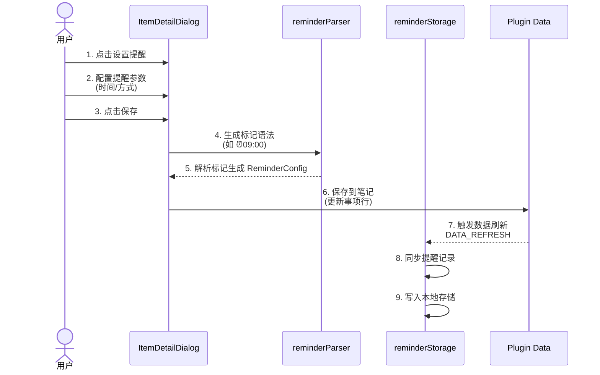
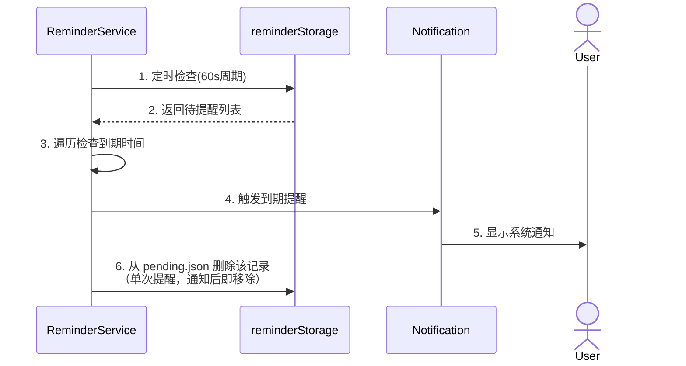
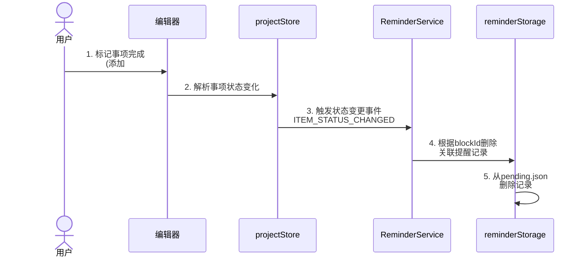
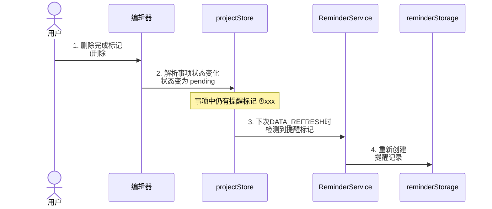
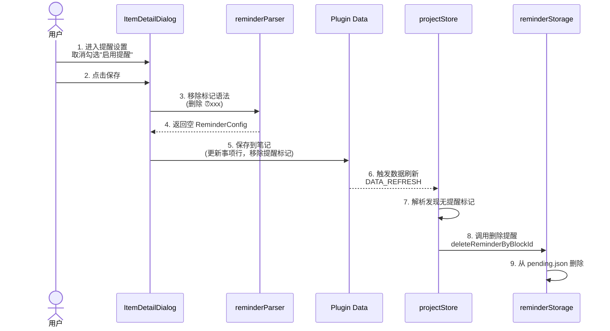

# 提醒功能设计

## 一、功能概述

为任务助手插件增加提醒功能，允许用户为事项设置提醒时间，在指定时间通过系统通知提醒用户。

### 1.1 核心理念

- **记录驱动**: 提醒作为事项的附加属性，不改变现有的记录驱动理念
- **无侵入式**: 使用标准 Markdown 格式扩展，保持数据可迁移性
- **单一提醒**: 一个事项只支持一个提醒时间，简化设计
- **可选功能**: 用户可选择是否为事项设置提醒

---

## 二、提醒标记语法

在现有事项格式基础上，使用 ⏰ 作为提醒标记。

### 交互方式

| 方式 | 触发 | 说明 |
|------|------|------|
| **UI 面板** | 事项详情 → 设置提醒 | 可视化时间选择器，自动生成本地化标记 |
| **右键菜单** | 右键点击事项 | 点击后打开**设置提醒弹框**，用户再选择时间 |
| **斜杠命令** | `/提醒` | 输入 `/提醒` 唤起**设置提醒弹框** |
| **手动输入** | 直接编辑 Markdown | 支持 ⏰HH:mm 或 ⏰提前N分钟 语法 |

**右键菜单选项**：
- 设置提醒...（打开弹框）
- ──────────
- 提前 5 分钟（快捷设置）
- 提前 15 分钟（快捷设置）
- 提前 30 分钟（快捷设置）
- 提前 1 小时（快捷设置）

### 2.1 基本语法（人类可读格式）

```markdown
事项内容 @2026-01-15 ⏰10:00              // 在指定日期当天 10:00 提醒
事项内容 @2026-01-15 ⏰提前10分钟         // 在事项开始前 10 分钟提醒
事项内容 @2026-01-15 14:00~16:00 ⏰结束前30分钟   // 在事项结束前 30 分钟提醒
```

### 2.2 标记规则

- 支持中英文两种语言的可读格式
- 提醒标记位于日期标记之后
- **一个事项只支持一个提醒时间**，多日期请使用多个事项块

### 2.3 提醒类型

| 类型 | 中文格式 | 英文格式 | 说明 |
|------|----------|----------|------|
| 绝对时间 | `⏰10:00` | `⏰10:00` | 在指定日期的当天 10:00 提醒 |
| 相对开始 | `⏰提前5分钟` | `⏰5 minutes before` | 基于事项开始时间提前提醒 |
| 相对结束 | `⏰结束前30分钟` | `⏰30 minutes before end` | 基于事项结束时间提前提醒 |

> **相对提醒单位**：支持分钟（分钟/minutes）、小时（小时/hours）、天（天/days）

> **与重复事项解耦**：提醒仅负责**单次**通知。重复规则（如每月、每周）和结束条件属于**事项层**，由 🔁 标记表达，用于「创建下次」功能。详见「重复事项与提醒解耦」章节。

---

## 三、与复杂日期格式的结合

### 3.1 单个日期 + 提醒

```markdown
事项内容 @2026-03-06 ⏰09:00
```

### 3.2 带时间范围的事项 + 提醒

**相对开始时间**（会前提醒）：
```markdown
周会 @2026-03-06 14:00:00~16:00:00 ⏰提前10分钟   // 13:50 提醒（14:00 提前 10 分钟）
```

**相对结束时间**（会前提醒收尾）：
```markdown
周会 @2026-03-06 14:00:00~16:00:00 ⏰结束前10分钟  // 15:50 提醒（16:00 提前 10 分钟）
```

**手动指定绝对时间**：
```markdown
事项内容 @2026-03-06 14:00:00~16:00:00 ⏰13:50  // 手动指定 13:50 提醒
```

### 3.3 日期范围 + 提醒

**限制**：日期范围事项只支持一个提醒时间，应用于范围内的每一天。如需不同日期不同提醒时间，请拆分为多个事项块。

```markdown
出差 @2026-03-10~03-12 ⏰08:00   // 每天 08:00 提醒
```

### 3.4 标记语法解析规则

**简化设计**：
- 一个事项只支持一个提醒时间
- 多日期用多个事项块（配合「创建下次」功能快速创建）

---

## 四、重复事项与提醒解耦

### 4.0 设计决策

**重复事项**采用「多个 block」方式：每个 occurrence 为独立事项块，各自有 blockId、子块（链接、番茄钟等）。

**职责划分**：

| 层级 | 职责 | 标记 |
|------|------|------|
| **事项** | 重复规则、结束条件、「创建下次」 | `🔁每月`、`截止到2026-12-31`、`剩余10次` |
| **提醒** | 本次何时通知 | `⏰14:00` |

**示例**：
```markdown
月度汇报 @2026-03-17 ⏰14:00 🔁每月 截止到2026-12-31
```
- `⏰14:00` → 提醒：本次 14:00 通知
- `🔁每月` → 事项：创建下次时按每月
- `截止到2026-12-31` → 事项：创建下次时检查结束条件

**创建下次**：用户完成事项后，在事项详情中点击「创建下次」，系统根据 `🔁` 和结束条件创建新 block（如 `月度汇报 @2026-04-17 ⏰14:00 🔁每月 截止到2026-12-31`），并继承 reminder 配置。

---

## 五、数据模型扩展

> **提醒与重复解耦**：以下为提醒专用模型，不含 repeat、endCondition。重复规则见「重复事项」PRD。

### 5.1 Item 模型扩展

```typescript
// 在 Item 模型中增加提醒字段
interface Item {
  // ... 现有字段
  reminder?: ReminderConfig;  // 单次提醒配置
  // repeatRule、endCondition 为事项层字段，见「重复事项」PRD
}
```

### 5.2 提醒配置

```typescript
type ReminderAlertMode =
  | { type: 'ontime' }
  | { type: 'before'; minutes: number; }
  | { type: 'custom'; minutes: number; };

interface ReminderConfig {
  enabled: boolean;
  type: 'absolute' | 'relative';
  time?: string;                   // 绝对时间 HH:mm（type='absolute' 时使用）
  alertMode?: ReminderAlertMode;   // 提醒方式（type='absolute' 时使用）
  // 相对提醒专用字段
  relativeTo?: 'start' | 'end';    // 相对开始时间还是结束时间
  offsetMinutes?: number;          // 偏移分钟数（正数表示提前）
}
```

### 5.3 提醒记录

```typescript
interface ReminderRecord {
  id: string;
  blockId: string;
  itemContent: string;
  projectName: string;
  taskName?: string;
  reminderTime: string;       // HH:mm
  alertMode: ReminderAlertMode;
  nextReminderTime: number;   // 本次提醒时间戳
  notifiedCount: number;
  createdAt: number;
  updatedAt: number;
}
```

---

## 六、架构设计

```
┌─────────────────────────────────────────────────────────────┐
│                        提醒功能模块                          │
├─────────────┬─────────────┬─────────────┬───────────────────┤
│   解析层     │   存储层     │   调度层     │     通知层        │
├─────────────┼─────────────┼─────────────┼───────────────────┤
│ • 解析提醒   │ • 本地存储   │ • 定时检查   │ • 系统通知        │
│   标记      │   提醒记录   │ • 提醒队列   │ • 思源消息        │
│ • 生成提醒   │ • 已通知     │ • 时间计算   │ • 声音提醒        │
│   任务      │   缓存      │             │                   │
└─────────────┴─────────────┴─────────────┴───────────────────┘
```

### 6.1 数据流转时序图

#### 6.1.1 提醒创建流程



#### 6.1.2 提醒触发流程



#### 6.1.3 事项状态变更流程

##### 场景 A：标记事项完成/放弃（删除提醒）



##### 场景 B：删除完成/放弃标记（重新创建提醒）



#### 6.1.4 删除提醒流程



### 6.2 增量同步机制

| 策略 | 说明 |
|------|------|
| Checksum 比对 | 为每个提醒配置生成唯一指纹（hash(blockId + date + reminderConfig)） |
| 内存缓存 | 缓存上次同步的 checksums（Map<blockId, checksum>） |
| 增量更新 | 只处理变化的提醒（新增/删除/修改） |
| 防抖处理 | 300ms 防抖，避免短时间内重复同步 |

**关键**：checksum 必须包含日期字段，否则事项日期修改后提醒时间不会更新。

### 6.3 核心模块 API 摘要

#### 解析模块 (src/parser/reminderParser.ts)

- `parseReminderFromLine(line)` — 从事项行解析提醒信息，返回 ReminderConfig
- `calculateReminderTime(itemDate, startDateTime, endDateTime, startTime, endTime, reminder)` — 计算实际提醒时间戳
- `stripReminderMarker(content)` — 移除提醒标记
- `generateReminderMarker(reminder)` — 生成提醒标记

#### 存储模块 (src/utils/reminderStorage.ts)

- `saveReminder(plugin, record)` — 保存提醒记录
- `getPendingReminders(plugin)` — 获取所有待提醒记录（过滤已过期）
- `loadAllReminders(plugin)` — 获取所有提醒记录
- `deleteAfterNotified(plugin, reminderId)` — 通知后删除记录
- `deleteReminderByBlockId(plugin, blockId)` — 根据 blockId 删除提醒

#### 调度模块 (src/services/reminderService.ts)

- `start(plugin)` — 启动提醒服务（加载提醒列表、启动 60s 定时检查）
- `stop()` — 停止提醒服务
- `syncRemindersFromProjects(plugin, items)` — 同步项目数据中的提醒（带 300ms 防抖）
- `onItemStatusChanged(plugin, blockId, status)` — 事项状态变更时更新提醒

#### 通知模块 (src/utils/notification.ts)

- `showItemReminderNotification(reminder, onClick)` — 显示事项提醒通知

---

## 七、集成点

### 7.1 在事项解析中集成 (src/parser/lineParser.ts)

1. **内容清理**：在 content 清理逻辑中增加移除提醒标记
2. **解析提醒**：调用 `parseReminderFromLine(line)` 获取 `ReminderConfig`
3. **生成 Item**：为每个日期生成 Item 时包含 `reminder` 字段

### 7.2 在插件主类中集成 (src/index.ts)

- 初始化提醒服务 `ReminderService`
- 监听 `DATA_REFRESH` 事件同步提醒
- 插件卸载时停止提醒服务

---

## 八、UI 组件

### 8.1 提醒设置弹框 (ReminderSettingDialog.vue)

- 启用提醒开关
- 提醒时间选择器
- 提醒方式选择（准时/提前N分钟）
- 保存/取消按钮

### 8.2 事项详情弹框集成提醒入口

- ItemDetailDialog 中添加提醒设置入口
- 显示当前提醒状态（⏰ 图标高亮）
- 点击打开 ReminderSettingDialog

---

## 九、标记语法映射（国际化）

### 9.1 提醒标记

| UI 设置 | 标记 | 示例 |
|---------|------|------|
| 绝对时间 08:00 | `⏰08:00` | `事项 @2026-03-17 ⏰08:00` |
| 相对开始时间提前 5 分钟 | `⏰提前5分钟` | `周会 @2026-03-17 14:00~16:00 ⏰提前5分钟` |
| 相对开始时间提前 30 分钟 | `⏰提前30分钟` | `周会 @2026-03-17 14:00~16:00 ⏰提前30分钟` |
| 相对开始时间提前 1 小时 | `⏰提前1小时` | `周会 @2026-03-17 14:00~16:00 ⏰提前1小时` |
| 相对开始时间提前 1 天 | `⏰提前1天` | `事项 @2026-03-17 ⏰提前1天` |
| 相对结束时间提前 10 分钟 | `⏰结束前10分钟` | `周会 @2026-03-17 14:00~16:00 ⏰结束前10分钟` |
| 相对结束时间提前 30 分钟 | `⏰结束前30分钟` | `周会 @2026-03-17 14:00~16:00 ⏰结束前30分钟` |
| （英文）提前 5 分钟 | `⏰5 minutes before` | `meeting @2026-03-17 ⏰5 minutes before` |
| （英文）结束前 30 分钟 | `⏰30 minutes before end` | `meeting @2026-03-17 ⏰30 minutes before end` |

### 9.2 相对提醒语义

**默认行为（相对开始时间）**：

| 标记 | 计算基准 | 示例 |
|------|----------|------|
| `⏰提前10分钟` | 事项开始时间提前 10 分钟 | `@2026-03-17 14:00~16:00 ⏰提前10分钟` = 13:50:00 提醒 |
| `⏰提前1小时` | 事项开始时间提前 1 小时 | `@2026-03-17 14:00~16:00 ⏰提前1小时` = 13:00:00 提醒 |
| `⏰提前1天` | 事项日期 00:00 提前 1 天 | `@2026-03-17 ⏰提前1天` = 2026-03-16 00:00:00 提醒 |

**相对结束时间**：

| 标记 | 计算基准 | 示例 |
|------|----------|------|
| `⏰结束前10分钟` | 事项结束时间提前 10 分钟 | `@2026-03-17 14:00~16:00 ⏰结束前10分钟` = 15:50:00 提醒 |
| `⏰结束前30分钟` | 事项结束时间提前 30 分钟 | `@2026-03-17 14:00~16:00 ⏰结束前30分钟` = 15:30:00 提醒 |

**计算规则**：
- `⏰提前X分钟/小时/天`：相对 **startTime** 或 **00:00** 计算
- `⏰结束前X分钟/小时/天`：相对 **endTime** 或 **23:59:00** 计算
- 无时间范围时：`⏰提前X分钟` 基于 00:00 计算，`⏰结束前X分钟` 基于 23:59:00 计算
- 精度统一为秒数 **00**

### 9.3 标记语法顺序约定

```
内容 @日期 [⏰提醒时间] [🔁重复规则] [其他标签]
```

**示例**：
```markdown
月度汇报 @2026-03-17 ⏰14:00 🔁每月 截止到2026-12-31
```

---

## 十、存储结构

```
插件数据目录/
├── reminders/
│   ├── pending.json      # 待提醒列表（按时间排序）
│   ├── checksums.json    # 增量同步 checksum 缓存
│   └── config.json       # 提醒功能配置
```

**存储策略**：
- **MVP 阶段**：`deleteReminderByBlockId` 直接从 `pending.json` 删除记录，不保留历史
- **理由**：简化实现、降低存储膨胀、符合「事项完成即结束」的语义

---

## 十一、文件结构

```
src/
├── parser/
│   ├── lineParser.ts                  # 扩展：增加提醒标记解析
│   └── reminderParser.ts              # 提醒标记解析（单次）
├── services/
│   └── reminderService.ts             # 提醒调度服务
├── utils/
│   ├── notification.ts                # 扩展现有通知功能
│   └── reminderStorage.ts             # 提醒数据存储
├── components/
│   ├── dialog/
│   │   ├── ItemDetailDialog.vue       # 扩展现有弹框（添加提醒入口）
│   │   └── ReminderSettingDialog.vue  # 提醒设置主弹框
│   └── settings/
│       └── ReminderConfigSection.vue  # 提醒设置面板
└── types/
    └── reminder.ts                    # 提醒相关类型定义
```

---

## 十二、实现步骤

### 阶段一：基础功能（MVP）

1. **类型定义** — 创建提醒类型，扩展 Item 类型
2. **解析功能** — 创建 reminderParser，集成到 lineParser
3. **存储功能** — 创建 reminderStorage，实现 CRUD
4. **调度服务** — 创建 reminderService，60s 定时检查
5. **通知功能** — 扩展 notification

### 阶段二：UI 功能

6. **提醒设置弹框** — ReminderSettingDialog
7. **事项详情集成** — 扩展 ItemDetailDialog
8. **设置面板** — ReminderConfigSection

### 阶段三：增强功能（可选）

9. **国际化** — 中英文翻译

---

## 十三、注意事项

1. **权限处理** — 首次使用时请求通知权限，被拒绝时提供友好提示
2. **性能考虑** — 60s 检查间隔，增量更新，checksum 包含日期字段
3. **数据一致性** — 事项修改时同步更新提醒，删除时清理关联提醒
4. **跨平台兼容** — 桌面端系统通知，移动端思源内置通知
5. **事项状态与提醒** — 完成/放弃后直接删除提醒记录，恢复待办时下次 DATA_REFRESH 重新创建
6. **简化设计** — 一个事项只一个提醒时间，多日期事项拆分

---

## 十四、验收标准

- [ ] 可以使用 `⏰HH:mm` 语法为事项设置提醒
- [ ] 支持 `⏰提前N分钟/小时/天` 相对开始时间
- [ ] 支持 `⏰结束前N分钟/小时/天` 相对结束时间
- [ ] 支持英文格式 `⏰N minutes before` / `⏰N minutes before end`
- [ ] 时区使用思源笔记本地时区（系统时区）
- [ ] 支持 UI 面板、右键菜单、斜杠命令 `/提醒` 设置提醒
- [ ] 到达提醒时间时显示系统通知
- [ ] 点击通知可以跳转到对应事项
- [ ] 在事项详情弹框中可以设置/修改提醒
- [ ] 事项完成或放弃后提醒自动删除
- [ ] 删除完成/放弃标记后提醒自动重新创建
- [ ] 修改事项日期后提醒时间自动重新计算（checksum 包含日期）
- [ ] 定时检查间隔为 60 秒
