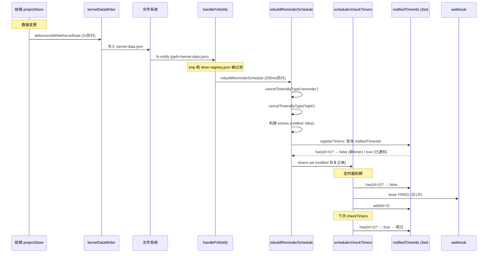
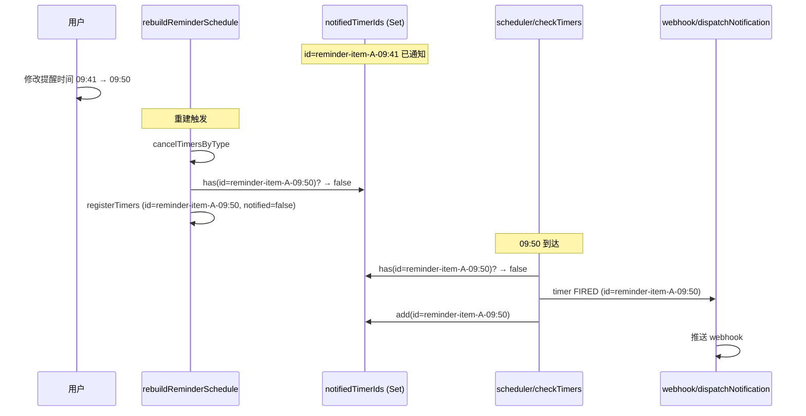

# Webhook 提醒重复推送修复设计（v2 — 架构优化版）

## 问题

同一个提醒（同一 item + 同一时间点）被 webhook 重复推送多次。日志中观察到同一提醒在 760ms 内被推送 7 次。

## 根因分析

经过 3 轮修复失败后，深度审查发现 4 个叠加的根因：

### 根因 A（主因）：多个 `setInterval` 定时器并发运行

`scheduler.ts:136` 的 `initScheduler()` 没有防护：

```typescript
checkInterval = setInterval(checkTimers, 1000)  // 无防护！
```

如果 `onrunning` 被调用 N 次（插件热重载、工作区切换等），就创建 N 个 `setInterval`，而 `checkInterval` 变量只保存最后一个引用，前 N-1 个全部泄漏。

**日志证据**：同一秒内 7 次 `timer FIRED`，时间戳间隔 20-256ms：

```
now=1779945600.136  ← Fire 1
now=1779945600.240  ← Fire 2  (间隔 104ms)
now=1779945600.335  ← Fire 3  (间隔 95ms)
now=1779945600.591  ← Fire 4  (间隔 256ms)
now=1779945600.611  ← Fire 5  (间隔 20ms)
now=1779945600.720  ← Fire 6  (间隔 109ms)
now=1779945600.896  ← Fire 7  (间隔 176ms)
```

单个 `setInterval(checkTimers, 1000)` 不可能产生这种行为。SiYuan 的 Go 运行时可能以不同 goroutine 并发执行 `setInterval` 回调，导致 `entry.notified = true` 的内存可见性问题。

### 根因 B：`checkTimers` 检查 `!entry.notified` 而非 `notifiedTimerIds`

```typescript
if (!entry.notified && now >= entry.endTime) {  // ← 检查 entry.notified
```

即使 `notifiedTimerIds` 中已有该 id，`checkTimers` 仍只看 `entry.notified`。如果 `entry.notified` 因并发执行或重新注册而与 `notifiedTimerIds` 不同步，就会导致重复触发。

### 根因 C：前端 RPC 传入 `notified=undefined`

`pomodoro.ts:handleRegisterTimers` 直接透传前端数据，不补充 `notified` 字段：

```typescript
registerTimers(params.entries)  // entries 没有 notified → undefined
```

对比 `handleRegisterTimer`（单条）会手动设 `notified: false`。

### 根因 D（架构问题）：双路径注册冲突

reminder/habit 定时器有两条注册路径：

1. **Kernel 内部**：`rebuildReminderSchedule()` → `cancelTimersByType` + `registerTimers`（`notified: false`）
2. **前端 RPC**：`rebuildScheduleKernel()` → `cancelTimersByType` + `registerTimers`（`notified: undefined`）

两条路径互相 cancel + re-register，造成状态冲突。而前端路径完全冗余——前端已通过 `debouncedWriteKernelData()` 写入 `kernel-data.json`，kernel 通过 fs-notify 自动感知变更并重建。

## 修复方案

### 核心思路

1. **防护 `initScheduler()`**：防止多个 `setInterval` 定时器
2. **`notifiedTimerIds` 作为唯一去重源**：`checkTimers` 检查 `notifiedTimerIds.has(id)` 而非 `!entry.notified`
3. **统一注册路径**：移除前端 `rebuildScheduleKernel()`，kernel 独占 reminder/habit 定时器注册

### 修复后时序图



### 提醒时间修改场景



## 修改清单

### 1. `src/kernel/scheduler.ts`

#### 1.1 防护 `initScheduler()` 多次调用

```typescript
export function initScheduler(): void {
  if (checkInterval) {
    clearInterval(checkInterval)
    checkInterval = null
  }
  lastKnownDate = formatDate(new Date())
  // ... 原有 missed timer 处理 ...
  checkInterval = setInterval(checkTimers, 1000)
}
```

#### 1.2 `notifiedTimerIds` 作为唯一去重源

`checkTimers` 和 `initScheduler` 中的条件判断从 `!entry.notified` 改为 `!notifiedTimerIds.has(entry.id)`：

```typescript
// checkTimers:
if (!notifiedTimerIds.has(entry.id) && now >= entry.endTime) {
  entry.notified = true
  notifiedTimerIds.add(entry.id)
  // ...
}

// initScheduler:
if (!notifiedTimerIds.has(entry.id) && entry.endTime <= now) {
  entry.notified = true
  notifiedTimerIds.add(entry.id)
  // ...
}
```

### 2. `src/kernel/pomodoro.ts`

补充 `notified: false`：

```typescript
export function handleRegisterTimers(params: { entries: TimerEntry[] }): any {
  for (var i = 0; i < params.entries.length; i++) {
    if (params.entries[i].notified === undefined) {
      params.entries[i].notified = false
    }
  }
  registerTimers(params.entries)
  return { ok: true }
}
```

### 3. `src/kernel/reminder.ts`

过滤 `timer-registry.json` 的 fs-notify 事件：

```typescript
export function handleFsNotify(event: { type: string, detail: any }): void {
  if (event.type !== 'fs-notify') return
  var path = event.detail.path.replace(/\\/g, '/')
  if (path.endsWith('.tmp')) return
  if (path === 'timer-registry.json') return  // 新增
  // ... 原有逻辑 ...
}
```

### 4. `src/services/reminderService.ts`（前端 — 核心架构变更）

#### 4.1 移除 `rebuildScheduleKernel()` 方法

此方法通过 RPC 注册 reminder/habit 定时器，与 kernel 内部的 `rebuildReminderSchedule()` 冲突。前端已通过 `debouncedWriteKernelData()` 写入 `kernel-data.json`，kernel 通过 fs-notify 自动重建，无需前端再通过 RPC 注册。

#### 4.2 简化 `rebuildSchedule()`

```typescript
private rebuildSchedule(): void {
  if (!this.projectStore) return;

  if (kernelAvailable.value) {
    // Kernel 通过 fs-notify 自行管理 reminder/habit 定时器
    // 前端只需确保 kernel-data.json 是最新的（由 projectStore 的 debouncedWriteKernelData 处理）
    return;
  }

  // kernel 不可用时，使用 croner 本地调度
  // ... 原有的 croner 逻辑不变 ...
}
```

#### 4.3 简化 `kernelAvailable` watch 回调

```typescript
this.kernelAvailableUnwatch = watch(kernelAvailable, (available) => {
  if (available) {
    this.setupKernelListeners();
    this.clearAllJobs();
    // 不再调用 rebuildSchedule()
    // kernel-data.json 由 projectStore 维护，kernel 通过 fs-notify 自行重建
  }
});
```

### 5. 不需要修改的文件

- `webhook.ts`：`dispatchNotification` 逻辑正确，无需修改
- `index.ts`：生命周期绑定不变，无需修改
- `kernelDataWriter.ts`：`writeKernelData` 已正确写入 `kernel-data.json`，无需修改

## 数据流对比

```
修改前（双路径冲突）：
  前端数据变更 → debouncedWriteKernelData → kernel-data.json
                                              ↓ fs-notify
                                          kernel rebuildReminderSchedule → registerTimers (notified:false)
  前端数据变更 → rebuildScheduleKernel → RPC cancelTimersByType → RPC registerTimers (notified:undefined)
                                           ↑ 冲突！互相覆盖

修改后（单路径）：
  前端数据变更 → debouncedWriteKernelData → kernel-data.json
                                              ↓ fs-notify
                                          kernel rebuildReminderSchedule → registerTimers (notified:false)
  前端 pomodoro/break → RPC registerTimer (notified:false) ← 仅番茄钟相关
```

## 验证标准

1. 同一提醒（同一 item + 同一时间点）只推送 1 次 webhook
2. 修改提醒时间后，按新时间正常推送
3. `kernel-data.json` 频繁变更时，不会触发重复推送
4. `notifiedTimerIds` 随过期 timer 同步清理，不会无限增长
5. `initScheduler()` 多次调用不会创建多个 `setInterval`
6. 前端离线时，kernel 仍可基于 `kernel-data.json` 正常推送
7. `timer-registry.json` 变更不再触发 fs-notify 日志噪音
