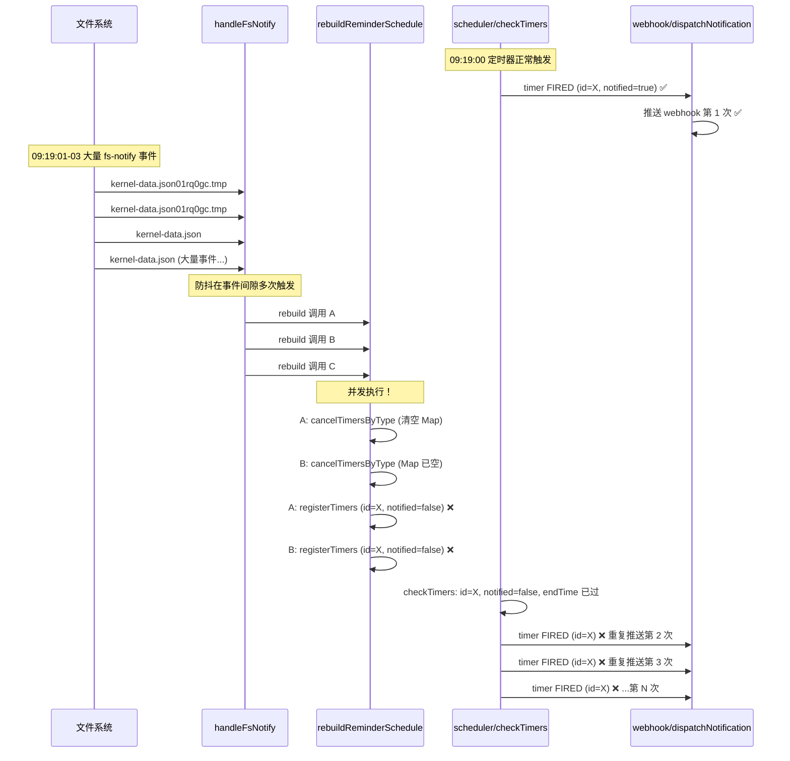
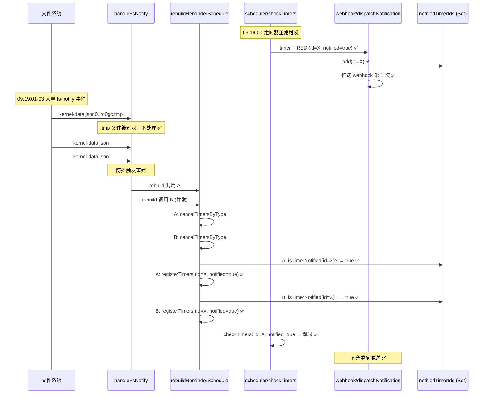
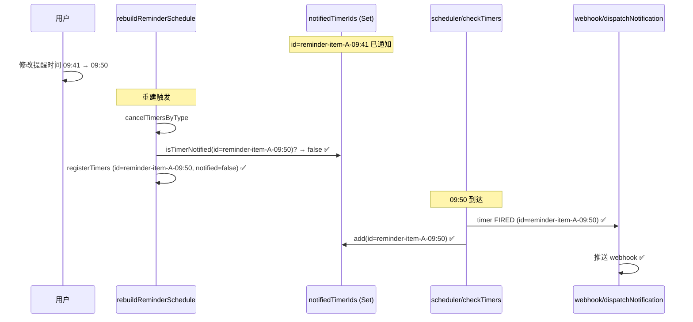

# Webhook 提醒重复推送修复设计

## 问题

同一个提醒（同一 item + 同一时间点）被 webhook 重复推送多次。日志中观察到同一提醒被推送 14 次。

## 根因分析

两个 Bug 叠加导致：

### Bug 1：`rebuildReminderSchedule` 并发调用

`handleFsNotify` 的防抖只有 200ms，但 `kernel-data.json` 写入时（原子写入：先写 `.tmp` 再 rename）会产生大量 fs-notify 事件，持续 2+ 秒。防抖在事件间隙多次触发 `rebuildReminderSchedule()`，这些 async 调用并发执行，互相干扰。

### Bug 2：重建时 `notified` 状态丢失

`rebuildReminderSchedule` 的流程是 `cancelTimersByType` → `registerTimers`。cancel 阶段将所有 timers 从 Map 中删除，register 阶段创建的新 `TimerEntry` 始终设 `notified: false`。即使某个定时器已触发过通知，重建后状态被重置，scheduler 的 `checkTimers` 会再次触发。

### Bug 3（加剧因素）：`.tmp` 文件触发防抖重置

`kernel-data.json01rq0gc.tmp` 等临时文件的 fs-notify 事件不断重置防抖计时器，导致防抖无法及时收敛。

## 故障时序图（修复前）



## 修复方案

### 核心思路：持久化 `notifiedTimerIds` 集合

用一个独立于 timers Map 的 `Set<string>` 追踪已通知的 timer id。此 Set 不受 `cancelTimersByType` 影响，在 `rebuildReminderSchedule` 注册新 entries 时查询此 Set 恢复 `notified` 状态。

### 修复后时序图



### 提醒时间修改场景



## 修改清单

### 1. `src/kernel/scheduler.ts`

新增 `notifiedTimerIds` 集合及查询函数：

```typescript
var notifiedTimerIds = new Set<string>()

export function isTimerNotified(id: string): boolean {
  return notifiedTimerIds.has(id)
}
```

在 `checkTimers` 中，timer 触发时记录到 `notifiedTimerIds`：

```typescript
function checkTimers(): void {
  timers.forEach(function (entry) {
    if (!entry.notified && now >= entry.endTime) {
      entry.notified = true
      notifiedTimerIds.add(entry.id)  // 新增
      dispatchNotification(entry)
    }
  })
  // purge 逻辑中同步清理
  timers.forEach(function (entry, key) {
    if (entry.notified && (now - entry.endTime) > PURGE_THRESHOLD_S) {
      toDelete.push(key)
      notifiedTimerIds.delete(key)  // 新增
    }
  })
}
```

在 `initScheduler` 中，missed timer 也要记录：

```typescript
export function initScheduler(): void {
  timers.forEach(function (entry) {
    if (!entry.notified && entry.endTime <= now) {
      if (diffMs <= MISSED_THRESHOLD_MS) {
        entry.notified = true
        notifiedTimerIds.add(entry.id)  // 新增
        dispatchNotification(entry)
      } else {
        entry.notified = true
        notifiedTimerIds.add(entry.id)  // 新增：stale timer 也标记
      }
    }
  })
}
```

### 2. `src/kernel/reminder.ts`

在 `rebuildReminderSchedule` 中，注册前恢复 `notified` 状态：

```typescript
import { registerTimers, cancelTimersByType, isTimerNotified } from './scheduler'

export async function rebuildReminderSchedule(): Promise<void> {
  // ... cancel + build entries（原有逻辑不变）...

  // 注册前，从持久化集合恢复 notified 状态
  for (var i = 0; i < entries.length; i++) {
    if (isTimerNotified(entries[i].id)) {
      entries[i].notified = true
    }
  }

  if (entries.length > 0) {
    registerTimers(entries)
  }
}
```

在 `handleFsNotify` 中过滤 `.tmp` 文件：

```typescript
export function handleFsNotify(event: { type: string, detail: any }): void {
  if (event.type !== 'fs-notify') return
  var path = event.detail.path.replace(/\\/g, '/')
  if (path.endsWith('.tmp')) return  // 新增：忽略临时文件
  // ... 原有逻辑不变 ...
}
```

### 3. 不需要修改的文件

- `webhook.ts`：`dispatchNotification` 逻辑正确，无需修改
- `index.ts`：生命周期绑定不变，无需修改

## 验证标准

1. 同一提醒（同一 item + 同一时间点）只推送 1 次 webhook
2. 修改提醒时间后，按新时间正常推送
3. `kernel-data.json` 频繁变更时，不会触发重复推送
4. `notifiedTimerIds` 随过期 timer 同步清理，不会无限增长
