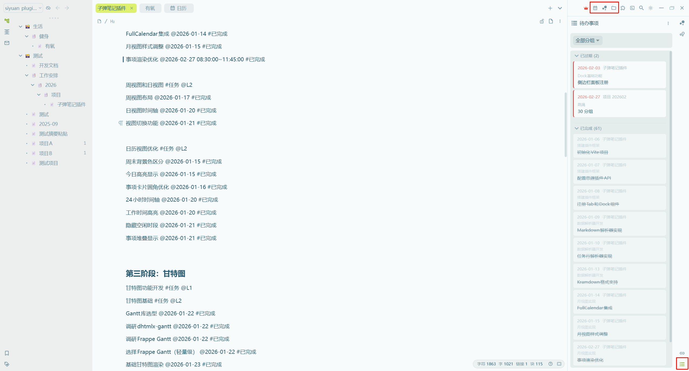

# 快速开始

本指南将帮助您在 5 分钟内完成插件的安装和基础配置，开始使用子弹笔记管理工作任务。

## 第一步：安装插件

选择以下任一方式安装：

### 方式 A：从集市安装（推荐）

1. 打开思源设置 → 集市 → 插件
2. 搜索「子弹笔记」
3. 点击安装

### 方式 B：手动安装

1. 从 [GitHub Releases](https://github.com/MoonBottle/siyuan-plugin-bullet-journal/releases) 下载最新的 `package.zip`
2. 解压到思源数据目录：`data/plugins/siyuan-plugin-bullet-journal`
3. 重启思源笔记，在设置 → 插件中启用插件

> 💡 **提示**：安装完成后，顶栏工具栏会出现日历、甘特图和项目列表的新图标。



## 第二步：创建项目文档

在思源笔记中创建文档来记录项目任务。插件会扫描指定目录中的项目文件。

**推荐的目录结构：**

```
工作安排/
└── 2026/
    └── 项目/
        ├── 项目A.sy.md
        ├── 项目B.sy.md
        └── 项目C.sy.md
```

> ⚠️ **注意**：您可以使用任何喜欢的目录结构，插件通过路径模式来查找项目文件。

## 第三步：编写任务格式

插件通过解析 Markdown 内容来识别任务。项目文档包含三个区域：

```markdown
## 项目名称
> 项目描述
[项目链接](https://project.url)

### 工作任务

任务名称 #任务 @L1
[任务链接](https://task-link)
工作事项 @2024-01-01 10:00:00~11:00:00
另一个事项 @2024-01-02

子任务名称 #任务 @L2
子任务事项 @2024-01-03
```

**关键标记说明：**
- `#任务` - 标记该行为任务
- `@L1`、`@L2`、`@L3` - 任务层级（L1 = 父任务，L2/L3 = 子任务）
- `@YYYY-MM-DD` - 工作事项的日期标记
- `@YYYY-MM-DD HH:mm:ss~HH:mm:ss` - 带时间范围的日期

> 💡 **提示**：任务本身不带日期，日期是分配给任务下的工作事项的。这样可以让一个任务跨越多天，每天有不同的工作事项。

更多格式详情请参阅 [数据格式](./data-format.md)。

## 第四步：配置插件

1. 打开思源设置 → 插件 → 子弹笔记
2. 在「目录配置」中添加要扫描的路径（如 `工作安排/2026/项目`）
3. 可选：在「分组管理」中创建分组来组织项目
4. 保存设置 - 插件会自动扫描项目文件

> ⚠️ **常见问题**：如果数据没有显示，请检查：
> - 目录路径是否与实际文件夹结构匹配
> - 项目文档是否包含 `#任务` 标记
> - 工作事项是否有有效的日期格式（`@YYYY-MM-DD`）

更多配置详情请参阅 [配置说明](./configuration.md)。

## 第五步：查看与管理

配置完成后，通过多个视图访问您的任务：

| 视图 | 访问方式 | 适用场景 |
|------|----------|----------|
| **日历** | 点击顶栏 📅 日历图标 | 日/周计划概览 |
| **甘特图** | 点击顶栏 📊 甘特图图标 | 项目时间线可视化 |
| **项目列表** | 点击顶栏 📁 文件夹图标 | 按项目查看所有任务 |
| **待办 Dock** | 右键顶栏 → 关闭的面板 → 待办事项 | 快速访问即将到来的任务 |

> 💡 **专业提示**：点击日历或甘特图中的任意任务，可直接跳转到笔记中该任务的位置。

更多视图详情请参阅 [视图功能](./views.md)。

## 下一步

- 了解 [设计思想](./design-philosophy.md)，理解插件的理念
- 深入学习 [数据格式](./data-format.md)，掌握所有标记语法
- 查看 [完整示例](./examples.md)，学习实际项目如何组织
