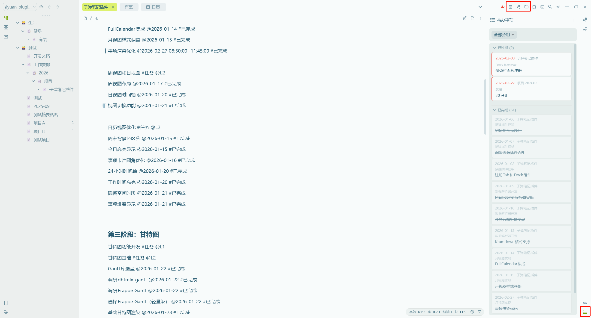

# 快速开始

本指南将帮助您在 5 分钟内完成插件的安装和基础配置，开始使用任务助手管理工作任务。

## 第一步：安装插件

选择以下任一方式安装：

### 方式 A：从集市安装（推荐）

1. 打开思源设置 → 集市 → 插件
2. 搜索「任务助手」
3. 点击安装

### 方式 B：手动安装

1. 从 [GitHub Releases](https://github.com/MoonBottle/siyuan-plugin-bullet-journal/releases) 下载最新的 `package.zip`
2. 解压到思源数据目录：`data/plugins/siyuan-plugin-bullet-journal`
3. 重启思源笔记，在设置 → 插件中启用插件

> 💡 **提示**：安装完成后，顶栏工具栏会出现日历、甘特图和项目列表的新图标。



## 第二步：创建项目文档

在思源笔记中创建文档来记录项目任务。插件会扫描指定目录中的项目文件。

**推荐的目录结构：**

```
工作安排/
└── 2026/
    └── 项目/
        ├── 项目A.sy.md
        ├── 项目B.sy.md
        └── 项目C.sy.md
```

> ⚠️ **注意**：您可以使用任何喜欢的目录结构，插件通过路径模式来查找项目文件。

## 第三步：编写任务格式

插件通过解析 Markdown 内容来识别任务。项目文档包含项目信息区、任务区与事项区。例如：

```markdown
## 网站重构项目（项目名称）

> 公司官网全面改版，提升用户体验（项目描述）

[设计稿](https://figma.com/design/xxx)

首页改版（任务名称） #任务 @L1

[需求文档](https://doc.example.com/homepage)

确定设计风格（事项内容） @2026-03-09

完成首页原型设计（已完成事项） @2026-03-09 10:00:00~12:00:00 #已完成

评审会议（已放弃事项） @2026-03-08 14:00:00~15:00:00 #已放弃
```

**关键标记说明：**
- `#任务` 或 `📋` - 标记该行为任务（支持 Emoji）
- `@L1`、`@L2`、`@L3` - 任务层级（L1 = 父任务，L2/L3 = 子任务）
- `@YYYY-MM-DD` 或 `📅YYYY-MM-DD` - 工作事项的日期标记（支持 Emoji）
- `@YYYY-MM-DD HH:mm:ss~HH:mm:ss` - 带时间范围的日期
- `#已完成` / `#done` / `✅`、`#已放弃` / `#abandoned` / `❌` - 事项状态（可选，支持 Emoji）
- `🔥` / `🌱` / `🍃` - 优先级标记：高/中/低（可选）
- `⏰HH:mm` / `⏰提前N分钟` - 提醒设置（可选）
- `🔁每天` / `🔁每周` / `🔁每月` - 重复规则（可选）

> 💡 **提示**：任务本身不带日期，日期是分配给任务下的工作事项的。这样可以让一个任务跨越多天，每天有不同的工作事项。

更多格式详情请参阅 [数据格式](./data-format.md)。

## 第四步：配置插件

1. 打开思源设置 → 插件 → 任务助手
2. 在「目录配置」中添加要扫描的路径（如 `工作安排/2026/项目`）
3. 可选：在「分组管理」中创建分组来组织项目
4. 保存设置 - 插件会自动扫描项目文件

> ⚠️ **常见问题**：如果数据没有显示，请检查：
> - 目录路径是否与实际文件夹结构匹配
> - 项目文档是否包含 `#任务` 标记
> - 工作事项是否有有效的日期格式（`@YYYY-MM-DD`）

更多配置详情请参阅 [配置说明](./configuration.md)。

## 第五步：查看与管理

配置完成后，通过多个视图访问您的任务：

| 视图 | 访问方式 | 适用场景 |
|------|----------|----------|
| **日历** | 点击顶栏 📅 日历图标 | 日/周计划概览 |
| **甘特图** | 点击顶栏 📊 甘特图图标 | 项目时间线可视化 |
| **项目列表** | 点击顶栏 📁 文件夹图标 | 按项目查看所有任务 |
| **待办 Dock** | 右键顶栏 → 关闭的面板 → 待办事项 | 快速访问即将到来的任务 |
| **习惯打卡** | 右键顶栏 → 关闭的面板 → 习惯打卡 | 日常习惯追踪与打卡 |
| **番茄专注** | 右键顶栏 → 关闭的面板 → 番茄专注 | 番茄钟计时与专注记录 |

> 💡 **专业提示**：点击日历或甘特图中的任意任务，可直接跳转到笔记中该任务的位置。在笔记中编辑时，右键事项块选择「查看详情」，或 Ctrl+点击 事项内容，可快速打开事项详情弹框。

### 使用斜杠命令提高效率

在编辑器中输入 `/` 可唤起斜杠命令面板，快速执行常用操作：

| 命令 | 功能 |
|------|------|
| `/today` 或 `/jt` | 标记为今日事项 |
| `/tomorrow` 或 `/mt` | 标记为明日事项 |
| `/done` 或 `/wc` | 标记为已完成 |
| `/calendar` 或 `/rl` | 打开日历视图 |
| `/focus` 或 `/zz` | 开始番茄专注 |

更多斜杠命令详见 [数据格式 - 斜杠命令](./data-format.md#斜杠命令)。

更多视图详情请参阅 [视图功能](./views.md)。

## 下一步

- 深入学习 [数据格式](./data-format.md)，掌握所有标记语法
- 使用 [习惯打卡](./habit-checkin.md) 追踪日常习惯
- 使用 [番茄钟](./pomodoro.md) 进行专注计时
- 配置 [MCP AI 助手](./mcp.md)，让 AI 查询任务与番茄数据
- 查看 [完整示例](./examples.md)，学习实际项目如何组织
